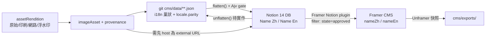
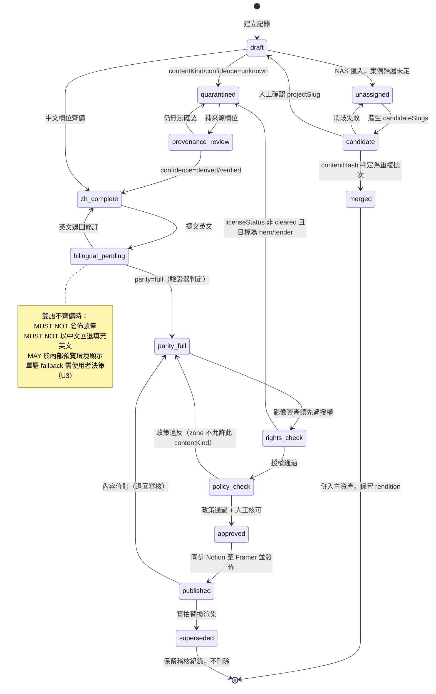

# data-architect 分析 — HQ Design 官網重置

**Session**: WFS-hq-website-reset｜**角色**: data-architect｜**日期**: 2026-09-03
**唯一權威前提**: `.brainstorming/guidance-specification.md`（未推翻任何 CONFIRMED 決策）
**主責功能點**: F-003（欄位層雙語）、F-008（content-migration-cutover）、F-005（影像來源可稽核）；協力 F-001（token 資料格式）
**修訂**: r2 — 併入 NAS 目錄數精確複驗、DJI 判定糾正、ux-expert 的 A 群修正、captureDate／year 分離要求

**保密聲明**：`cms/data/` 全部檔案中**未發現**報價、合約金額、薪資或績效資料。發現四項須處置者：
(1) `cms/data/globals.json` 內兩組 Formspree endpoint 屬設定憑證，MUST NOT 進入公開 CMS；
(2) `profile.txt` P11 組織圖含具名高階主管，屬人事資訊，本文不引用姓名；
(3) **NAS 多個目錄的檔名內嵌第三方攝影師姓名與行動電話號碼**（實測見於 `中保總部 2026/大檔案印刷用`、`中保總部 2026/小檔案網路用`、`匙碗湯/`、`金普頓/金埔頓拍照/小檔案電腦看圖` 等）——該欄位含第三方個人資料，已依政策略過具體內容，MUST 於匯入時剝除（§5）；
(4) **NAS 影像 EXIF 的 `Artist` 欄位亦含第三方姓名**（實測於 `中保無限家生活館大安店` 樣本），MUST 於衍生檔產生時移除，不得隨影像上線。

---

## 1. 既有資產的真實盤點

### 1.1 六個 schema（`cms/schemas/`）

| 檔案 | 定義內容 | 巢狀深度 | 雙語支援 |
|---|---|---|---|
| `globals.json` | 品牌名／tagline／聯絡／統編／6 張認證／social／Formspree／Maps | 3 | **已支援**（10 個 `*En`） |
| `projects.json` | slug／name／category enum(5)／year／area／scope／hero／specs[]／highlights[]／gallery[] 與 gallerySections[]（互斥）／relatedSlugs | **4** | **已支援**（18 對 `*Zh/*En`） |
| `services.json` | 10 項服務 + 5 步 process（內嵌，非獨立集合） | 3 | 已支援 |
| `careers.json` | positions／values／perks 三子集合同檔 | 4 | 已支援 |
| `homepage.json` | hero(含 stats[])／logosBar／featuredProjects[]／taiwanWedge／approach／testimonials[] | 4 | 已支援 |
| `about.json` | stats[]／story／team.cells[]／teamMembers[]／certifications[]／timeline[] | 3 | 部分（`paragraphEn` 單段 vs `paragraphsZh[]` 兩段，結構不對等） |

**事實糾正**：`cms/schemas/README.md` Mapping rule 1 明文規定「every visible string has `*Zh`/`*En` siblings」——**六個 schema 結構上皆已支援欄位層雙語**。缺的不是結構，是資料值。

### 1.2 21 個案例檔的欄位完整度（`cms/data/projects/`，逐檔實際計數）

- **21/21 有值**：`slug`／`nameZh`／`category`／`categoryLabel`／`designBuildLabel`／`year`／`yearLabel`／`locationZh`／`heroImage`／`specs`
- **近乎普遍**：`descriptionZh` 20/21（缺 `secom-nangang-complex`）、`scopeZh` 20/21、`gallery` 19/21
- **部分**：`client` 8/21、`featured` 5/21、`gallerySections` **1/21**（僅 `zhongbao-nangang`）
- **存在但為空字串**：`nameEn` **21/21 皆為 `""`**
- **schema 有定義但 21 檔全缺**：`subtitleZh`／`subtitleEn`／`descriptionEn`／`scopeEn`／`clientEn`／`location`(英)／`areaPing`／`areaSqm`／`thumbnail`／`order`／`metaTitle`／`metaDescription`／`highlights`／`relatedSlugs` — **14 欄 × 21 筆 = 294 個空位**
- **巢狀層**：`specs` 共 **113 列**，僅有 `labelZh`+`value`，`labelEn`／`valueEn` **各 0 列**；label 詞彙未受控（15 種 distinct：`客戶`18/`業主`1、`坪數`19/`總坪數`1、`案件規模`2/`樓層範圍`1…）。`gallery` 共 **217 列**，僅 `image`+`alt`，`captionZh/En` **0 列**；`gallerySections` 5 組共 **39 列**，`titleEn`／`summaryZh`／`summaryEn` 全 null。

**其他資料檔的 `En` 欄位（總數/非空）**：`globals` 10/10、`about` 17/17、`homepage` 7/7、`services` 16/**0**、`careers` 10/**0**、`projects` 21/**0**。且 `homepage.json` 的 `headlineZh`、四個 `stats[].labelZh`、`logosBar.labelZh` 皆為空 → **首頁是英文單語、內頁是中文單語的鏡像斷裂**。
另：`careers.json` 兩筆 perks slug 為中文（`ai工具培訓`、`31-年穩定經營`），違反 schema `^[a-z0-9-]+$`，遷移前 MUST 修正。

**與 ux-expert 交叉一致**：現況英文覆蓋率實質為 **0**（21/21 `nameEn` 空、10/10 `titleEn` 空）。F-003 的性質是**從零建立英文內容**，不是同步既有雙語。

### 1.3 21 案例實際分佈 → 產業垂直 IA **不成立**

| 維度 | 實測 |
|---|---|
| `category` | office **17**、fb 3、hospitality 1（enum 的 exhibition／retail 各 0） |
| `year` | 2022×1、2023×2、2024×3、**2025×14**、2026×1 |
| 面積 | 15–756 坪（≈50–2,499 ㎡），20/21 有值 |
| `designBuildLabel` | **21/21 皆 `HQ Interior`** — 零區辨資訊，schema 原意（Design-Only vs Full-Build）從未填入 |
| 分類軸重複 | `categoryLabel`(7 種)／`scopeZh`(8 種)／specs `類型`(8 種) 三重重複且互不一致 |

81% 是辦公空間、67% 集中 2025 年 → 任何以產業或年代為主軸的 IA 都會塌成單一大類。**實際可用的三個區辨軸**（皆與 AI 流程敘事契合）：①交付複雜度（多租戶／多樓層同步：`zhongbao-nangang` 5 區、`secom` 6 空間 7F–14F vs 單一空間）②營運不中斷（`profile.txt` P12「分區施工／維持企業日常營運」，機構型客戶真正的採購判準）③規模級距（15–60／76–257／756 坪）。**另見 §6.0：NAS 盤點後案例庫策略應改為「以有實拍者優先」，此軸優先於上述三軸。**

### 1.4 既有工具鏈可重用度

| 檔案 | 可重用度 | 依據 |
|---|---|---|
| `parse-*.ts`（5+5 測試）、`extract-html.ts` | **低（歸檔）** | 職責是從舊 HTML 抽取，已完成；CONFIRMED 不得重新抽取＝不需再跑。保留作 provenance 追溯 |
| `validate-schemas.ts`（39 行） | **高（MUST 擴充）** | Ajv 2020 + ajv-formats + fast-glob 骨架完全可用；擴充為 provenance 政策與雙語齊備的 CI gate |
| `push-to-notion.ts`（34KB） | **中高（骨架高、mapper 重寫）** | `ThrottledNotion`（`RATE_LIMIT_MS` 實測預設 **350ms**、429/502/503/504 指數退避最多 5 次、上限 60s）、`P.*` builder（rich_text 2000 字截斷）、upsert-by-title + pass-2 relation 回填皆可沿用；14 支 `map*()` 需重寫 |
| `cms/notion-manifest.json` | **高** | 14 個 DB 的 databaseId/dataSourceId、5 條 relation 皆 `status: applied` |

**既有已知限制（MUST 正面解決）**：所有 file/image 欄位**一律跳過**（Notion `files` 需 external URL）；`specs`／`highlights` 被壓成 JSON 字串塞入 rich_text（無法查詢、無法驗證、受 2000 字截斷）；services／positions enum 需 remap。

---

## 2. 新舊 schema 對映策略

CONFIRMED：結構可重建、內容值 MUST 沿用 → 策略為**內容值不動、結構重投影（re-projection，非 re-extraction）**。

### 2.1 新內容型別（20 型）

**沿用重塑（9）**：`project`、`service`、`position`、`careerValue`、`careerPerk`、`clientLogo`、`certification`、`globals`、`pageSeo`（新獨立）

**AI 流程敘事新型別（7）**

| 型別 | 來源 | 關鍵欄位 |
|---|---|---|
| `processPhase` | P05 五段 ＋ 使用者流程鏈（site survey→AI PM） | order、stageGroup、title、oneLiner、**clientBenefit**（§1.3 業主可感知效益）、deliverables[]、diagramAssetId |
| `capability` | P04 四項 | order、title、summary、relatedProcessPhases[] |
| `deliveryStep` | P09 六步驟 | order、title、detail、evidenceAssetId |
| `aiAdvantageClaim` | P06/07/08 的 WHY IT MATTERS | claim、clientBenefit、**evidenceType**(case/diagram/metric)、evidenceRef、visualAssetId |
| `comparisonRow` | P06 對照表（3 列） | order、group、conventional、hqIntegrated |
| `milestone` | P03 八節點（1995→2026.4） | year、month、codeName、title、detail |
| `orgUnit` | P11 五部門＋14 子項 | parentId、name、isAiDivision（人員姓名欄位 MUST 預設不輸出） |

**資料治理新型別（4）**：`imageAsset`（第一級，見 §4）、`assetRendition`（多尺寸版本，見 §4.6）、`redirectRule`（§6.4）、`glossaryTerm`（parametric／BIM 等術語中英對照，§2 術語規則的資料化）

### 2.2 舊→新對映表

| 舊欄位 | 新位置 | 判定 | 說明 |
|---|---|---|---|
| `slug`／`year`／`category`／`featured`／`heroImage` | 同名／`facts.*` | **可自動** | 直接複製 |
| `nameZh`／`descriptionZh`／`scopeZh`／`locationZh` | `i18n.<f>.zh` | **可自動** | 巢狀化（§3） |
| `nameEn`（21 筆空） | `i18n.name.en` | **需人工** | 21 筆；P13/P14 已提供 5 筆英文名可半自動 |
| `specs[].labelZh`（15 種） | `specKey` enum + `glossaryTerm` | **需轉換** | 建 15 條字典一次映射 113 列，`labelEn` 自動產生 |
| `specs[].value` | `facts.*` 結構化 | **需轉換** | `"250 坪"`→`areaPing:250`+`areaSqm:826`（×3.30579）；`"7F–14F"`→`floorRange`；`"6 個獨立空間"`→`unitCount:6` |
| `specs[].value` 敘述型（施工範圍／特色工法） | `i18n.specNote` | **需人工 en** | ≈30 列 |
| `categoryLabel`／`scopeZh`／specs `類型` | `deliveryModel` enum + `sectorTag[]` | **需轉換** | 三重重複去重為單一受控軸 |
| `designBuildLabel` | — | **應廢棄** | 21 筆同值；以真實 `deliveryModel` 人工填入取代 |
| `gallery[]`／`gallerySections[]` | `projectMedia` → `imageAsset` | **需轉換** | 257 列展平為 rows，同時解除「Framer 無陣列」與 Notion property 上限雙重壓力 |
| `gallery[].alt`（217 列樣板） | `imageAsset.i18n.alt` ＋ **provenance 推導訊號** | **需轉換＋人工** | 「空間效果圖」160／「完工實景」37／「平面配置圖」14 — 資訊量近零，**但是 provenance 可用訊號**（§4.3） |
| `homepage.hero.stats[]`／`about.stats[]`／`globals.projectsDelivered` | `statMetric` 單一型別 | **需轉換** | 同組數據散落三處，且 `about` 31+ 年 vs P01 30+ **值不一致，需確認** |
| `homepage` hero/wedge/testimonials 固定 slot | 改為引用 `processPhase`／`aiAdvantageClaim`／`statMetric` | **應廢棄結構** | `testimonials` 資料為空，且涉客戶具名，MUST 經授權才建 |
| `careers` perks emoji `icon` | `iconToken`（→Token 3.0） | **需轉換** | emoji 違反視覺 DNA |
| `about.story.paragraphsZh[2]` vs `paragraphEn`(1) | `i18n.story.zh[]/.en[]` | **需人工** | 英文需擴寫一段 |

### 2.3 需人工補充量估計（供 product-manager 估工）

| 型別 | 筆數 | 欄/筆 | 人工值 |
|---|---|---|---|
| `project` 英文文案（name／subtitle zh+en／description／scope／location／client） | 21 | 7 | **147** |
| `project` SEO（metaTitle/Description × zh/en） | 21 | 4 | **84** |
| `project` 交付軸（deliveryModel／complexityTier／continuityFlag） | 21 | 3 | **63** |
| `specs` 結構化 | 113 | 1 | **113**（≈83 可規則化、≈30 需翻譯） |
| **NAS 新增案例**（§6.0，18 個備選，估採 10 個） | 10 | ≈14 | **≈140** |
| `imageAsset` 雙語 alt/caption | ≈650（257 站內 + 391 NAS 唯一） | 2 | **≈1,300** |
| `imageAsset` provenance 核可 | ≈650 | 1 | **≈650**（可批次降至 ≈45 組） |
| 新敘事型別（7 型 ≈47 筆） | 47 | 8 | **≈376** |
| `service`／`careers` 英文 | 26 | 2.5 | **≈65** |

**原始合計 ≈2,938**。**壓縮後 ≈1,300**（alt MUST NOT 逐張人工撰寫；SHOULD 以「案例名＋空間類型＋來源類別」樣板自動生成雙語 alt，僅 hero 與精選約 60 張人工精修；provenance 按 contentKind 組批次核可）。

---

## 3. 欄位層雙語模型（F-003）

### 3.1 設計原則（RFC 2119）

- git JSON MUST 為 single source of truth；`LocalizedText` MUST 為 `{ "zh": string, "en": string }`。
- 任一語言缺漏 MUST 以空字串 `""` 明確表示，**MUST NOT 省略 key**（省略無法與「尚未撰寫」區分）。
- 每筆記錄 MUST 帶 `locale{ primary, parity, missing[] }`；`parity` ∈ `full|partial|zh-only|en-only` MUST 由驗證器計算並回寫，MUST NOT 人工填寫。
- 扁平化命名 MUST 為 `<Title Case Field> Zh|En`（沿用既有 `"Name Zh"` 慣例，向後相容 14 個既有 Notion DB）。
- **主從關係釐清（規格 §5.3 未解事項）**：`locale.primary = "zh"` 為**編輯權威**（撰寫語言、衝突以中文為準）；`parity = "full"` 為**發佈門檻**（英文須齊備才可發佈）。二者不衝突，同時滿足 DESIGN.md §0.6 與規格 §1.4。

### 3.2 git 正規形式（實際範例）

```json
{
  "$type": "project",
  "slug": "aiontech",
  "i18n": {
    "name":        { "zh": "博訊科技", "en": "AIONTECH" },
    "subtitle":    { "zh": "科技辦公空間", "en": "Technology Workplace" },
    "description": { "zh": "博訊科技台北南港辦公室…", "en": "" }
  },
  "locale": { "primary": "zh", "parity": "partial", "missing": ["description.en"] },
  "facts": {
    "completionYear": 2025,
    "completionDate": null,
    "areaPing": 250, "areaSqm": 826,
    "locationCode": "TW-TPE-NANGANG",
    "deliveryModel": "full-design-build",
    "complexityTier": "single-tenant",
    "sourceOfTruth": { "area": "cms/data/projects/aiontech.json#specs[坪數]" }
  },
  "media": [
    { "assetId": "img_aiontech_r01", "role": "hero", "order": 1 },
    { "assetId": "img_aiontech_r02", "role": "gallery", "order": 2, "sectionKey": null }
  ],
  "mediaComposition": { "photoVerified": 0, "render": 20, "plan": 1,
                        "unknown": 0, "asBuiltVerifiedRatio": 0.0 },
  "publish": { "state": "draft", "zonesRequested": ["project-detail-gallery"] }
}
```

### 3.3 三端如何表示同一筆雙語資料

| 端 | 表示法 | 產生方式 |
|---|---|---|
| **git**（權威） | `i18n.name = {zh,en}` 巢狀 | 人工／腳本編輯，Ajv 驗證 |
| **Notion**（authoring） | 兩個 property：`Name Zh`（title/rich_text）、`Name En`（rich_text） | `flatten(i18n)` 由 `push-to-notion.ts` 產生；反向 `unflatten()` **為新增需求——目前只有單向 push，MUST 補 pull 才能宣稱 Notion 是 authoring 介面** |
| **Framer CMS**（消費） | 兩個 field `nameZh`／`nameEn`，頁面以 locale 條件綁定 | Notion plugin 同步。`template-cms-diff.md` §6 open question 1 建議 in-page binding，本分析同意——Framer Locale 是**頁面級**機制，與「欄位層並存」牴觸 |



### 3.4 最脆弱的一端：**Framer CMS（消費端）**

1. `template-cms-diff.md` §1 rule 1 明載「Framer CMS does not support `image[]` as a single field」，須以 `Image 1…Image N` 固定 slot。
2. 同檔 §2.2 假設「8 slots covers 90%（**max found = 8 images**）」——**與實況矛盾**：實測 `aiontech` 21 張、`polytron` 18、`zhongbao-showroom` 18、`hq-office` 17、`zhongbao-nangang` 39（5 組）。以 8 slot 上限計僅能承載約 108/257 張，**遺失約 149 張**。
3. **雙語化使問題乘法惡化**：21 slot ×（image + captionZh/En + altZh/En）= **105 欄位**，僅 gallery 一項即可能超過任何 CMS 實務上限。
4. **唯一無法程式驗證的一端**：規格 §6.5 已驗證 Framer MCP 未連線，欄位上限／locale 行為／reference 陣列上限**全無實測值**（需確認：MCP 連線後 `getCMSCollections` 讀實際 schema，並建 30-slot 測試 collection 探邊界）。

**次脆弱：Notion**。ADR-001 已記錄 gallery sections 需拆 relation DB；**雙語化後惡化**（每字串→2 property）。新 `project` 扁平後估 `18 對 ×2 + 20 facts/flags + 6 relation ≈ 62 property`；若 gallery 留在 parent 則 +105 → 167。

**解方（三點，同時適用兩端）**
1. **可重複結構一律外移為 child DB/collection，不做固定 slot**：`imageAsset`／`assetRendition`／`projectMedia`／`specRow`／`comparisonRow`／`processPhase` 皆為獨立 rows，parent 僅持 relation。`project` property 數壓在 **≈62** 且**不隨影像數成長**。
2. **雙語留在同一列，不拆語言列**：每個 `imageAsset` row 同持 `Alt Zh`／`Alt En`。此設計才符合「欄位層並存」，且 parity 檢查可在單列內完成。
3. **Notion property 硬上限需確認**（方法：對既有 `projects` DB 以 API 增量加 property 至報錯）。確認前，任何 parent DB MUST 保守控制在 60 property 以內。

### 3.5 F-001 Token 3.0 資料格式（協力）

- MUST 以 **DTCG JSON** 存於 git（`design/tokens/*.tokens.json`），**MUST NOT 進入 Notion 或 Framer CMS**——token 是設計系統資產而非可編輯內容，放進 CMS 會讓非工程師可改破全站樣式。
- 三消費端皆為建置衍生物：`tokens.css`（CSS custom properties）／`tokens.ts`（Framer code component import）／Figma Variables（plugin 匯入）。
- MUST 保留 `--font-family-zh`／`--font-family-en`（Noto Sans TC／Satoshi）兩族，並分別定義行高與字級階——欄位層雙語會讓同一畫面並列兩種文字系統。

---

## 4. 影像來源可稽核欄位（F-005）

### 4.1 實測事實（兩批資產）

**A. 網站現有 `assets/images/projects/`，347 張**

| 前綴 | 張數 | 實測像素尺寸 | ICC profile | 判定 |
|---|---|---|---|---|
| `render-*` | 174 | 1626×1125（145）／2001×1125（29） | sRGB | 高度 **100% 為 1125px** |
| `page-*` | 125 | 1626×1125（123）／2001×1125（2） | — | 同上 |
| `floorplan.jpg` | 10 | 1626×1125（8）／2001×1125（2） | — | 同上 |
| `photo-*` | 38 | **12 種相機原生尺寸**（8688×5792、5792×8688、8400×5600、7452×5355、2000×1333…） | **Adobe RGB (1998)** | 相機原檔 |

→ `render`/`page`/`floorplan` 共 **309 張全部**落在兩種尺寸、高度恆為 1125px（2001×1125 = 16:9 投影片），是**簡報／PDF 頁面匯出特徵，不是渲染引擎原生輸出尺寸**。三前綴共用同一容器來源、僅內容不同。
→ 引用狀況：**257 張**被 `cms/data` 引用（render 170／page 39／photo 38／floorplan 10），**90 張未引用**（page 86 + render 4），0 張引用缺檔。
→ alt 文字分佈：「空間效果圖 N」160／「完工實景 N」37／「平面配置圖」14 —— **已內含 provenance 訊號**。

**B. NAS `作品集-更新版`（已親自複驗，含 r2 修正）**

| 項目 | 實測 | 備註 |
|---|---|---|
| **頂層目錄數** | **34**（`find -mindepth 1 -maxdepth 1 -type d` = 34；無隱藏目錄；depth-1 唯一非目錄項為 `.DS_Store`） | **r2 修正**：我 r1 報 33 為目視漏數，product-manager 的 34 正確。33 個目錄含影像，`照片` 目錄含 0 張影像 |
| JPEG 總數 | **898** | 與協調者一致 |
| **distinct basename** | **391**｜**135 個 basename 出現 >1 次** | 唯一影像上界 391，非 898 |
| 明確 rendition 子目錄內的檔案 | **480**（大檔案印刷用 239／小檔案電腦看圖 153／小檔案網路用 77／JPEG 11） | 53% 的檔案是同一影像的另一版本 |
| `中保總部 2026` | `大檔案印刷用` **77**（8688×5792）＋`小檔案網路用` **77**（2000×1333），**basename 100% 重疊** | = **77 張唯一照片 × 2 版本**（非 154 張） |
| 含 `Exif` 標記 | **739（82%）** | 與協調者一致 |
| 相機品牌（**限 EXIF APP1 前 4KB**） | **Canon 646、SONY 31、Panasonic 25、Apple 7、NIKON 0、FUJIFILM 0、DJI 0** | **r2 重大修正，見下** |
| 樣本相機／鏡頭 | Canon EOS 5DS（5,060 萬像素，對應 8688×5792 master）＋ **TS-E17mm f/4L 移軸鏡** | 移軸鏡是建築攝影的專用工具，強化「真實專業建築攝影」判定 |
| `加浮水印` | **4** 張（`金普頓/確認照片/加浮水印`） | 校對用途，授權狀態最需確認 |
| **目錄名誤置** | `匙碗湯/起家雞攝影原始檔` **24 張** | 起家雞照片放在匙碗湯目錄下 |
| `照片` 目錄 | **本機 0 張影像**（僅 `.DS_Store` + 546KB `Thumbs.db`） | 協調者報表的「照片 25 張」在本機無法複現，**需確認** |

**r2 修正一：DJI／空拍素材判定推翻。**
我 r1 記 5、product-manager 記 10、我以「整檔前 96KB 搜尋」重算得 11——**三個數字全部錯誤，正確值為 0**。
證據鏈：
1. 將品牌字串搜尋**限制在 EXIF APP1 區（前 4KB，Make/Model 實際所在）**後，`DJI` 命中數為 **0**；同一方法下 Canon 646／SONY 31／Panasonic 25／Apple 7 與協調者數字完全一致 → 方法本身有效。
2. 逐一檢視 11 個「疑似 DJI」檔案：**無一檔的 `Make` 欄位以 DJI／FC 開頭**；其中 **6 檔同時命中 `Canon`**；尺寸全為 3:2（1000×667／700×467／2000×1333／1333×2000），而 DJI 機型輸出為 4:3 或 16:9（如 5472×3648、4000×3000）。
3. 取 `中保無限家生活館大安店/IMG_0455.jpg` 定位：`DJI` 出現在 **byte offset 59727**，前後為 `RM_I`、`/E=d`、`Q!F` 等壓縮掃描資料雜訊；該檔真實 EXIF 為 `Canon` / `Canon EOS 550D` / `Adobe Photoshop CS5.1 Windows` / 拍攝 2017。
→ 結論：`DJI` 為**壓縮影像資料中的 3 位元組偶然巧合**。此 NAS 批次**不含任何可確認的空拍素材**，盤點報告的「含空拍素材」敘述 MUST 移除。
→ 方法論後果：見 §4.3 規則 **R0**。

**→ 對協調者盤點數字的修正總表**

| 項目 | 協調者報表 | 實測正確值 |
|---|---|---|
| 頂層目錄數 | 33（我 r1）／34（PM） | **34** |
| 影像「規模」 | 898 張 | 898 **檔案**，唯一影像上界 **391** |
| `中保總部 2026` | 154 張 | **77 張唯一 × 2 rendition** |
| DJI 空拍 | 5（我 r1）／10（PM） | **0（無空拍素材）** |
| 待歸屬 | 57 張（照片 25＋其他 19＋新增資料夾 13） | **32 張**（其他 19＋新增資料夾 13；`照片` 本機 0 張） |

### 4.2 欄位結構：雙軸模型 ＋ 三段日期分離

規格 §7.4 的三分類不足以描述實況。採 `contentKind`（如何產生）×`asBuiltFidelity`（是否對應已完工實況）雙軸——**第二軸才承載 §8.2 紅線**，因為「真實案件的渲染圖」既非造假、也不是實拍，只有雙軸能準確表達。

**r2 新增：日期語意 MUST 三段分離（回應 ux-expert）**
實測 `中保總部 2026`：77/77 張的 EXIF 後製日期為 **2026-01**（樣本 2026:01:21），而 **DateTimeOriginal 為 2025-12-19**，且兩筆網站紀錄（`secom-nangang-complex`、`zhongbao-nangang`）皆記完工年 **2025**。
→ 目錄名「2026」反映的是**交付／後製年**，既非拍攝年（2025-12）亦非完工年（2025）。三者為三個不同事實。

| 欄位 | 型別位置 | 語意 | 約束 |
|---|---|---|---|
| `facts.completionYear` / `facts.completionDate` | `project` | 案件完工 | 權威來源為合約／驗收，MUST NOT 由影像日期推導 |
| `provenance.captureDate` | `imageAsset` | 影像拍攝日（EXIF DateTimeOriginal） | MUST NOT 覆寫或推導 `completionYear` |
| `provenance.processedDate` | `imageAsset` | 後製／交付日（EXIF ModifyDate、Photoshop 標記） | 僅供稽核與批次識別，**MUST NOT 用於任何對外年份標示** |

**MUST 約束**：
- 三個日期 MUST 為獨立欄位，MUST NOT 互相 fallback。
- 驗證器 MUST 對「`captureDate` 早於 `completionDate`」發出警示而非錯誤（施工中攝影為正常情形），但 MUST 對「`captureDate` 晚於 `completionDate` 超過 24 個月」發出錯誤（可能歸屬錯案）。
- NAS 目錄名中的年份（如「2026」）MUST NOT 作為任何日期欄位的來源，僅可存入 `provenance.sourceBatchLabel` 作為批次識別字串。

```json
{
  "$type": "imageAsset",
  "id": "img_secom_p001",
  "projectSlug": "secom-nangang-complex",
  "contentHash": "sha256:…",
  "provenance": {
    "contentKind": "photo-original",
    "container": "camera-original",
    "asBuiltFidelity": "as-built-verified",
    "confidence": "derived",
    "derivedFrom": ["exif-app1:make=Canon", "exif-app1:model=Canon EOS 5DS",
                    "exif-app1:lens=TS-E17mm", "aspect:3:2",
                    "resolution:8688x5792", "path:大檔案印刷用"],
    "captureDate": "2025-12-19",
    "processedDate": "2026-01-21",
    "sourceBatchLabel": "中保總部 2026",
    "credit": { "photographerRef": "vault:photog_001", "displayCredit": "" },
    "rights": { "licenseStatus": "unverified", "scope": [], "expiresAt": null,
                "watermarked": false, "evidenceRef": null },
    "sourceDocument": { "name": null, "page": null },
    "tooling": { "status": "not-applicable", "tool": null, "model": null,
                 "promptRef": null, "promptSha256": null, "seed": null },
    "baseAssetId": null, "supersededBy": null,
    "verifiedBy": null, "verifiedAt": null,
    "remediation": { "owner": null, "dueDate": null }
  },
  "privacy": { "containsNaturalPersonName": false, "requiresDeidentification": false,
               "exifArtistStripped": true, "filenamePiiStripped": true },
  "disclosure": { "required": false, "labelKey": null },
  "i18n": { "alt": { "zh": "", "en": "" }, "caption": { "zh": "", "en": "" } },
  "publish": { "state": "quarantined", "zonesApproved": [] }
}
```

**`contentKind` enum（9 值）與必填差異**

| contentKind | 中文 | MUST 必填 | MUST NOT |
|---|---|---|---|
| `photo-original` | 實拍原始 | `captureDate`、`credit`、`rights.licenseStatus` | `tooling.tool` 非 null |
| `photo-retouched` | 實拍修復／調色 | `baseAssetId`、`retouchScope[]`（color／perspective／object-removal／stitching） | `baseAssetId` 為 null |
| `design-render` | 設計階段渲染（3D／參數化） | `designStage`、`asBuiltFidelity = design-intent` | 標為 `as-built-verified` |
| `ai-generated` | AI 生成 | `tooling.tool`＋`model`＋`promptRef`＋`promptSha256` | `disclosure.required = false` |
| `ai-enhanced-photo` | 以實拍為底的 AI 增強 | 上列全部 ＋ `baseAssetId`（MUST 指向 `photo-original`） | `baseAssetId` 為 null |
| `deck-page` | 簡報頁／版面頁截圖 | `sourceDocument.name`＋`page` | 預設進入公開區（預設 `quarantined`） |
| `floor-plan` | 平面／圖說 | `drawingScale`（可為 `not-to-scale`） | — |
| `diagram` | 敘事圖解 | `authoredIn` | 標為任何 as-built 值 |
| `unknown` | 來源未知／待補 | `remediation.owner`＋`dueDate` | 出現於 hero／trust／tender 區 |

`asBuiltFidelity`：`as-built-verified`／`as-built-unverified`／`design-intent`／`not-applicable`
`confidence`：`unknown`（無訊號）／`derived`（自動推導）／`verified`（人工核可，MUST 有 `verifiedBy`＋`verifiedAt`）

### 4.3 檔名前綴 vs metadata、與自動推導規則

**權威原則**：**metadata 為單一權威；檔名保留語意前綴作為人類可讀便利與遷移推導訊號，但 MUST NOT 被任何程式作為 provenance 判斷依據。**
反證（實測）：4 張 `render-*` 的 alt 是「平面配置圖」、6 張 `page-*` 的 alt 是「空間效果圖」——前綴只描述「內容看起來像什麼」，且 309 張 render/page/floorplan 共用同一容器來源，前綴無法承載工具／提示詞／核可狀態。

**規則 R0（r2 新增，最高優先）— EXIF 字串搜尋 MUST 限制在 APP1 區段**
```
偵測相機品牌／型號／日期 MUST 只掃描 JPEG 的 EXIF APP1 segment
（實務上為檔案前 4KB，或正確解析 FFE1 marker 後的 TIFF header 區）。
MUST NOT 對整檔或前 96KB 做字串比對——壓縮掃描資料會產生偶然命中。
反證：DJI 在整檔搜尋下命中 11 檔（全為誤判，其中 6 檔同時命中 Canon、
      1 檔定位於 byte 59727 的壓縮資料內），限 APP1 後命中 0 檔。
驗證方式：同一實作對 Canon/SONY/Panasonic/Apple 應分別得 646/31/25/7。
```

```
R1  APP1 有相機品牌 ∧ 長寬比≈3:2 ∧ 長邊≥2000
    → photo-original,  confidence=derived,  信心【高】
R2  APP1 有相機品牌 ∧ 長邊<2000（1000×667、700×467 等）
    → photo-original,  container=web-rendition,  信心【高】
R3  無 APP1 EXIF ∧ 高度=1125（1626×1125 / 2001×1125）
    → container=deck-page-extract,  信心【高】，再依 alt 細分：
      alt≈"空間效果圖"  → design-render （實測 166 張：160 render + 6 page）
      alt≈"平面配置圖"  → floor-plan    （實測 15 張：10 floorplan + 4 render + 1 page）
      alt 為具體空間名  → design-render （實測 6 張）
      無 cms/data 引用  → deck-page, publish=quarantined（實測 86 張）
R4  無 EXIF ∧ 無檔名線索 ∧ 無 alt
    → unknown,  confidence=unknown,  信心【無】→ MUST 人工
R5  路徑含 "加浮水印"
    → rights.watermarked=true, licenseStatus=proof-only, MUST NOT 發佈
R6  ICC=Adobe RGB(1998) → 支持 photo（站內 38 張 photo 皆為此）
    ICC=sRGB           → 支持 render／匯出（站內 render 為此）
R7  同 contentHash 家族內任一 rendition 的 APP1 有相機品牌
    → 整個家族繼承 photo-original（解決縮圖流程剝除 EXIF 的誤判）
```

**實測覆蓋率**：站內 347 張中 **345 張（99.4%）** 可由 R1/R3 產生 derived 值；NAS 898 檔中 **739（82%）** 有 EXIF 可套 R1/R2，其中 **709** 可辨識品牌、**30** 有 EXIF 但無可辨識 Make；**159 檔（18%）** 無 EXIF 落入 R4 需人工。

**失效情境（MUST 明示，不得當作事實）**
1. **整檔字串搜尋會偽陽性** → R0 已處理（DJI 案例為活生生反例）。
2. **匯出流程剝除 EXIF 的實拍會被誤判** → R7 家族繼承處理。
3. **AI 生成圖可被人為寫入偽造 EXIF** → `confidence` MUST NOT 因 EXIF 存在而升為 `verified`；`verified` 只能由人工核可產生。
4. **3:2 長寬比非實拍專屬** → R1 MUST 同時要求 APP1 相機品牌，不可僅靠比例。
5. **NAS 目錄名不可信** → 實測 24 張起家雞照片位於 `匙碗湯/` 下；**路徑 MUST NOT 作為 `projectSlug` 的自動判定依據**，僅可作候選建議。
6. **目錄名年份不可信** → `中保總部 2026` 實為 2025-12 拍攝、2026-01 後製、2025 完工（§4.2）。

### 4.4 提示詞與個資：MUST NOT 存於公開 CMS

- 公開端（`cms/data`／Notion／Framer）**只存 `promptRef` 與 `promptSha256`**，MUST NOT 存原文。
- 原文存於 git-ignored／私有的 `provenance-vault/<assetId>.json`（或 NAS）。
- 稽核性由**雜湊比對**維持：外部質疑時公司提出 vault 原文，其 SHA-256 須與公開欄位一致 → **不洩漏內部流程即可證明可追溯**。
- 前端 MUST NOT 存在任何可讀取 `promptRef` 內容的 API。
- **同一機制承載第三方個人資料**：攝影師姓名與聯絡方式（實測見於多個目錄的檔名、以及 EXIF `Artist` 欄位）MUST 存於 vault 的 `credit.photographerRef`；公開端只放 `displayCredit`（如「專業商業攝影」或經同意的具名）。衍生檔產生時 MUST 剝除 EXIF 個資欄位（`Artist`／`Copyright`／GPS），並以 `privacy.exifArtistStripped`／`filenamePiiStripped` 兩旗標記錄已處理。

### 4.5 資料層強制分區政策（與 product-manager 的介面）

政策 MUST 資料化為 `cms/policy/image-provenance-policy.json`，MUST NOT 僅靠人工紀律：

```json
{ "version": 1, "zones": {
  "hero":                   { "allow": ["photo-original","photo-retouched"],
                              "requireFidelity": ["as-built-verified"],
                              "requireConfidence": ["verified"],
                              "requireRights": ["cleared"] },
  "trust-bar":              { "allow": ["photo-original","photo-retouched"],
                              "requireFidelity": ["as-built-verified"] },
  "project-detail-gallery": { "allow": ["photo-original","photo-retouched","design-render",
                                        "ai-generated","floor-plan"],
                              "requireDisclosure": ["design-render","ai-generated","ai-enhanced-photo"] },
  "process-diagram":        { "allow": ["diagram","design-render","ai-generated"] },
  "tender-pack":            { "allow": ["photo-original"],
                              "requireFidelity": ["as-built-verified"],
                              "requireConfidence": ["verified"],
                              "requireRights": ["cleared"] },
  "excluded":               { "allow": ["deck-page","unknown"] }
} }
```

**三層強制**
1. **git CI（唯一硬 gate）**：`scripts/validate-image-policy.ts`（擴充 `validate-schemas.ts` 骨架）檢查每筆 `zonesApproved[]` ⊆ 政策允許集合、`rights.licenseStatus`、`privacy.*` 旗標；違反即 `exit(1)`，PR 無法合併。
2. **Notion（僅諮詢性）**：Notion 無法以 property 表達跨欄位條件式驗證，只能以 view filter／formula 呈現警示。**MUST 明確承認 Notion 不是強制層**。
3. **Framer（只收已核可列）**：Notion→Framer 同步 MUST 以 `publish.state = approved` 為 filter，未核可列不進入 Framer，故不可能被誤綁至 hero。

**`unknown` 的網站端呈現（MUST，回應「不得預設實拍、不得預設安全」）**
- `contentKind = unknown` 或 `confidence = unknown` MUST 只允許 `excluded` zone，即**不出現在網站任何位置**。
- MUST NOT 有任何預設值把 `unknown` 靜默升級為 `photo-*`；「`contentKind` 未填卻請求非 excluded zone」MUST 直接驗證失敗。
- MUST NOT 反向假設 `unknown` 安全：`publish.state` 預設 `quarantined`。
- 每筆 MUST 有 `remediation.owner`＋`dueDate`；初始待補清單＝174 張 render 的 tooling 欄位 + 86 張未引用 `page-*` + NAS 159 檔無 EXIF + 32 檔待歸屬。

### 4.6 多版本關係模型（`assetRendition`）——避免重複計數

實測依據：`中保總部 2026` 的 77 個 basename 在 `大檔案印刷用`（8688×5792）與 `小檔案網路用`（2000×1333）**100% 重疊**；全 NAS 898 檔僅 391 distinct basename、135 個重複；480 檔位於明確 rendition 子目錄內。

```
imageAsset  (1)  ──<  assetRendition  (n)
  唯一鍵：contentHash（原始檔）或 perceptualHash 家族
  provenance / rights / privacy / i18n 一律掛在 imageAsset（唯一一份）

assetRendition:
  { assetId, purpose, pixelWidth, pixelHeight, bytes, path, hasExif, isDerived }
  purpose enum: "master-print"（大檔案印刷用）| "web"（小檔案網路用）
               | "screen-review"（小檔案電腦看圖）| "proof-watermarked"（加浮水印）
               | "delivery"（原始檔）| "site-derived"（建置產生的尺寸階）
```

**去重與計數規則（MUST）**
1. 唯一性 MUST 以 **`contentHash`（sha256）為主鍵**；basename ＋ 母目錄僅為候選分組線索（basename 跨案例可能碰撞——實測 `518980.jpg` 出現於 5 個不同目錄）。
2. 同 basename 但不同尺寸 MUST 歸為同一 `imageAsset` 的不同 rendition，**MUST NOT 建成兩筆資產**。
3. `master-print` MUST 為 `provenance` 與 EXIF 的權威來源；`web`／`screen-review` 繼承（規則 R7）。
4. `proof-watermarked` MUST 標 `rights.licenseStatus = proof-only` 且 MUST NOT 進入任何非 `excluded` zone。
5. 統計與工作量 MUST 以 `imageAsset` 計數，MUST NOT 以檔案數計數。**站內 257 + NAS ≤391 ≈ 648 筆唯一資產上界**（NAS 需以 contentHash 複驗，實際可能更低）。
6. 網站尺寸階（`site-derived`）由建置產生，MUST NOT 進 CMS 為獨立資產。

### 4.7 著作權與授權欄位

專業商業攝影的使用授權可能不在原委任範圍。`rights` 子物件 MUST 存在，且：
- `licenseStatus` enum：`cleared`（已確認可網站使用）／`unverified`（**預設**）／`proof-only`／`restricted`／`expired`
- `scope[]`：`website`／`social`／`tender`／`print`／`internal`
- `evidenceRef`：授權書或委任合約的 vault 指標（**合約金額 MUST NOT 記錄**，只記文件存在性）
- **強制**：`hero`／`trust-bar`／`tender-pack` MUST 要求 `licenseStatus = cleared`。故在授權釐清前，NAS 全部 ≈391 筆 MUST 停在 `unverified`，**MUST NOT 上線 hero**——這是本次最可能被忽略的上線阻斷點。
- 佐證：實測樣本 EXIF 含 `Artist` 具名欄位與 Photoshop 後製標記，說明有明確的第三方著作人，授權範圍不可推定。

---

## 5. 資產命名與組織

**命名規範**
```
<projectSlug>--<sectionKey|main>--<contentKind>-<seq>--<purpose>-<w>w.<ext>
例：secom-nangang-complex--lobby--photo-003--master-print.jpg
    aiontech--main--render-01--web-1600w.avif
    process--bim-coordination--diagram-01--web-1200w.svg
```
- 分隔符 `--` 區隔語意段、`-` 區隔段內詞，使機器可無歧義拆解（既有單一 `-` 無法區分 `epicstech-10f` 的 slug 與序號）。
- `contentKind` 入檔名僅為人類便利；**權威仍在 metadata**（§4.3）。
- 檔名 MUST 全小寫 ASCII、MUST NOT 含中文（`careers.json` 中文 slug 已證會破壞驗證）。
- **MUST 於 intake 時剝除既有檔名中的第三方個人資料**：實測多個 NAS 目錄的檔名內嵌攝影師姓名與行動電話（見於 `中保總部 2026/大檔案印刷用`、`.../小檔案網路用`、`匙碗湯/`、`金普頓/金埔頓拍照/小檔案電腦看圖` 等，合計逾 150 檔；該欄位含個人資料，已依政策略過具體內容）。此類姓名與號碼 MUST 移入 vault 的 `credit.photographerRef`，MUST NOT 出現在檔名、`cms/data`、Notion、Framer 或任何前端可達路徑。
- **MUST 同時剝除 EXIF 內的個資欄位**（`Artist`／`Copyright`／GPS），並以 `privacy.exifArtistStripped` 記錄。
- **住宅類案例 MUST 去識別化**：`privacy.containsNaturalPersonName` 與 `requiresDeidentification` 兩旗標 MUST 存在；案例名稱欄位 MUST NOT 含自然人姓氏（schema 層以 pattern 排除「〈姓〉宅」構詞並要求人工核可）。NAS `台北市林宅` 9 張 MUST 標 `requiresDeidentification = true`，改名前 MUST NOT 進入任何 zone。

**目錄結構**
```
assets/
  images/projects/<slug>/          # 站內既有原檔
  images/narrative/<type>/         # processPhase / aiAdvantageClaim 圖解
  images/brand/                    # logo / pattern / shader 貼圖
  derived/<assetId>/<w>w.<ext>     # 尺寸階（建置產生，git-ignored）
  incoming/nas/<batchId>/          # NAS 匯入落地區（git-ignored）
provenance-vault/<assetId>.json    # 提示詞原文、攝影師個資、授權證明（私有）
cms/policy/image-provenance-policy.json
```
**尺寸階**：`400w / 800w / 1200w / 1600w / 2400w`，AVIF（主）+ WebP（備）+ JPEG（備援）。
**與容量的關係**：站內原檔平均 1.5MB、最大單檔 **32MB**（`kimpton/photo-02.jpg`，8688×5792）；NAS 7.3GB 中 `master-print` 級為 8688×5792（Canon EOS 5DS）。原檔 MUST NOT 直接進 Framer／Notion，MUST 先產衍生階。粗估 648 筆 × 5 階 AVIF 平均 120KB ≈ **389MB 衍生物**（Framer 額度需與 system-architect 確認）。
**多語言替代文字**：alt 不入檔名，存於 `imageAsset.i18n.alt.{zh,en}`。
**案例關聯**：由 `projectMedia` relation 承載，不靠目錄路徑推斷（實測目錄誤置與同圖多案引用皆存在）。
**未引用資產**：站內 90 張（86 page + 4 render）MUST 建 `deck-page`／`unknown` 記錄置於 `excluded`，**MUST NOT 直接刪除**（可能是唯一保存的設計記錄）。

---

## 6. 內容遷移與切換（F-008）

### 6.0 案例庫策略反轉（NAS 盤點的直接後果，含 r2 A 群修正）

NAS 盤點證實：**問題不是缺乏實拍，而是實拍從未上線**。故 F-008 的範圍 MUST 從「遷移既有 21 案」擴大為「重新選擇展示案例」。

**r2 修正二：A 群的「渲染→實景對照」潛力被我 r1 高估。ux-expert 的修正正確，本節據此重寫。**
逐案核對站內檔案前綴的實測結果：

| A 群案例 | 站內現有影像（實測前綴） | NAS 實拍 | 是否具備「渲染 vs 實拍」對照條件 |
|---|---|---|---|
| `zhongbao-showroom` | **render 17 + page 1** | 27 | **是（唯一以 `render-*` 持有渲染者）** |
| `zhongbao-nangang` | **page 115（引用 39，其中 38 張 alt 為「…效果圖」）** | 見 U4 歸屬 | **內容上是**（渲染內容以 `page-*` 命名），但受 U4 併案裁決阻斷 |
| `kimpton` | photo 10、render **0** | 281 檔 | 否——網站原本即為實拍案 |
| `secom-nangang-complex` | photo 1、render **0**、gallery **0** | 154 檔（=77 唯一） | 否——原本即實拍，但**幾乎沒有影像可用**（gallery 為 0） |
| `popeyes` | photo 5、render **0** | 62 檔 | 否 |
| `soup-spoon-101` | photo 3、render **0** | 69 檔（含 station） | 否 |
| `soup-spoon-station` | photo 11、render **0** | 同上 | 否 |
| `qijia` | photo 8、render **0** | 50 檔 | 否 |

**結論（採納 ux-expert 修正並補一項）**：
- 以**檔名前綴 `render-*`** 為準，A 群中**只有 `zhongbao-showroom`** 同時持有渲染與實拍 → ux-expert 的修正**與我的資料完全一致**。
- 但以**內容**（alt 文字，即 §4.3 R3 的判定）為準，`zhongbao-nangang` 的 39 張引用影像中 **38 張為渲染內容**（alt 為「〈租戶〉NF 效果圖 NN」），僅 1 張為平面配置圖 → 它**在內容上同樣具備對照條件**，只是被命名為 `page-*` 而非 `render-*`。這正是 §8-8「容器與內容不一致」的實例，也再次證明前綴不可作為權威。
- 故「渲染→實景對照」的敘事素材：**確定 1 案（`zhongbao-showroom`）＋ 待 U4 裁決後可能 2 案**。ui-designer／ux-expert 若要以此作為 AI 敘事的視覺證據，MUST 以此為規模上限規劃，MUST NOT 假設 7 案。
- A 群其餘 6 案的價值不是「對照」，而是**補足影像量**——尤其 `secom-nangang-complex`（簡介 PDF 主打 Case Study 01）站內 gallery 為 **0**，NAS 的 77 張唯一照片是直接填補旗艦案缺口。

**分群總表（r2）**

| 分群 | 案例數 | 影像狀態 | 處置 |
|---|---|---|---|
| A. 站內既有 ＋ NAS 有實拍 | **7** | 6 案原本即實拍（僅缺量）；1 案（`zhongbao-showroom`）持渲染可對照 | 優先；以實拍補量，對照敘事僅適用 1（–2）案 |
| B. 站內既有、NAS 無實拍 | **13**（aiontech／csun／liwei／epicstech-10f／polytron／baohua／xinlan／lijie／ledaojia／hq-office／zhongbao-baojing／zhongbao-jingzhen／zhongbao-tianhe） | 100% 渲染 | 依 §4.5 揭露，或降級為列表項不做詳頁 |
| C. **NAS 有實拍、站內無案例** | **≤18**（≈255 檔）含航空貴賓室系列（復興航棧 34＋泰航 9＋復航 6 = 49） | 實拍 | **新增案例**；schema MUST 支援新增而非僅遷移 |
| D. 待歸屬 | — | **32 檔**（其他 19＋新增資料夾 13） | `unknown` + `unassigned` 狀態 |

**IA 影響（需回饋 ux-expert）**：航空貴賓室 49 檔對「服務外商來台落地」定位有直接說服力，且與現有 17/21 辦公室的單調分佈互補——此為比 §1.3 三軸更強的 IA 素材，但需 §4.7 授權確認後才可用。

### 6.1 遷移順序

| 波次 | 內容 | 理由 |
|---|---|---|
| **W0** | `glossaryTerm`、`statMetric`、Token 3.0 | 被所有型別引用；數據目前三處不一致 MUST 先收斂 |
| **W1** | `imageAsset` + `assetRendition` + provenance（站內 347 檔 + NAS 898 檔 → ≈648 筆唯一）＋政策檔 | 規格 §10 明載「資產管線 MUST 先於內容遷移」；§4.5 gate 必須先存在 |
| **W1.5** | NAS 消歧與授權釐清（§6.5） | A/C 群案例能否上線的前提 |
| **W2** | `project`（21 既有 + 新增）＋`projectMedia`＋`specRow`（113） | 依賴 W1 的 assetId |
| **W3** | 7 個敘事型別（≈47 筆） | 無舊值依賴，可與 W2 並行撰寫 |
| **W4** | `service`(10)／`processPhase`(5)／`careers`(16)／`certification`(6)／`clientLogo`(7)／`globals`／`pageSeo` | 量小依賴少 |
| **W5** | relation 回填（既有 5 條 + 新增） | 沿用 `push-to-notion.ts` pass-2 |
| **W6** | `redirectRule` ＋ 舊站封存 | 切換最後一步 |

### 6.2 Notion rate limit：既有 350ms + 5 次退避已足夠

實測既有 `RATE_LIMIT_MS = 350`（≈2.86 req/s < 3 req/s），非 ADR-001 所寫的 200ms；**ADR 敘述 MUST 更新為 350ms**。

**雙語化的量化評估**：雙語增加**每列的 property 數**，不增加**列數**，故不增加請求數。每列 upsert = 1 query + 1 create/update = 2 requests：

| 波次 | 列數 | 請求 | @350ms |
|---|---|---|---|
| W1 `imageAsset`+`assetRendition` | ≈648 + ≈900 | ≈3,100 | ≈18 分 |
| W2 project+media+spec | ≈31+650+113 = 794 | ≈1,590 | ≈9 分 |
| W3–W5 | ≈150 | ≈300+relation | ≈2.5 分 |
| **合計** | ≈2,490 | **≈5,000** | **≈29 分鐘** |

**結論**：即使納入 NAS 全量與雙語化，**rate limit 仍不是瓶頸**。真正瓶頸有三：(1) 影像 file 欄位需 external URL（`push-to-notion.ts` 目前**全部跳過**）；(2) 人工雙語撰寫（≈1,300 個值）；(3) **§4.7 授權釐清**。
**MUST 強化（為可重跑性，非為 rate limit）**：每波次寫 `logs/migration-<wave>.jsonl` checkpoint（slug→pageId），中斷後續跑而非全量重推。

### 6.3 驗證機制（無漏、無錯、雙語齊備）

MUST 全部進 CI，任一失敗即阻斷：
1. **完整性**：git／Notion／Framer 三向逐 slug 集合 diff（非僅計數）。
2. **正確性**：每列算 `sha256(正規化 JSON)`，Notion pull 回來重算比對；rich_text 2000 字截斷 MUST 判為**錯誤**而非靜默接受。
3. **雙語齊備**：重算 `locale.parity`；`!= full` MUST NOT 進 `approved`；輸出缺漏矩陣（型別×欄位×筆數）。
4. **影像政策**：§4.5 zone allow-list ＋ `confidence=verified` 必有 `verifiedBy/At` ＋ `rights` 與 `privacy` 旗標檢查。
5. **去重**：MUST 檢出同 `contentHash` 卻建成多筆 `imageAsset` 的情形（防 §4.6 重複計數）。
6. **日期語意**：MUST 檢查 `captureDate`／`processedDate`／`completionDate` 三者未互相 fallback；`captureDate` 晚於 `completionDate` 逾 24 個月為錯誤。
7. **參照完整性**：所有 `assetId`／`projectSlug`／`relatedSlugs` 可解析；所有 `path` 實際存在（站內實測 257 引用 0 缺檔，MUST 保持）。
8. **轉址覆蓋**：舊站每個可索引 URL 在 `redirectRule` 皆有對應且新 URL 回 200。

### 6.4 舊站 SEO 轉址對映

舊站可索引 URL **27 個**（6 頁面 + 21 案例頁），live `https://www.hqdesign.tw/index.html`。

| 舊 URL | 新 URL | 判定 |
|---|---|---|
| `/index.html` | `/` | 301 |
| `/about.html`／`/services.html`／`/careers.html`／`/contact.html` | `/about`／`/services`／`/careers`／`/contact` | 301 |
| `/projects.html` | `/work` | 301 |
| `/projects/<slug>.html` ×21 | `/work/<slug>` ×21 | 301 |
| — | `/process`／`/ai-advantage`／`/parametric`／`/bim` | 新增（無舊對應） |

**既有 21 個案例頁的 slug MUST 保留**，理由：①`cms/schemas/README.md` Mapping rule 2 已明訂「slug must match the existing static HTML filename so legacy redirects work」，`template-cms-diff.md` §1 rule 4 重申不可依賴 Framer 的 Title→auto-slug；②21 個 slug 皆已是 kebab-case ASCII，無需改寫；③案例頁是唯一可能累積外部連結與品牌搜尋流量的深層頁（機構型客戶會直接搜案名）。
**建議**：路徑前綴 `/projects/`→`/work/`＋去 `.html`，以 **301** 保留權重；**slug 本身 MUST NOT 變更**。雙語 URL 建議 `/work/<slug>` 與 `/en/work/<slug>` 並互加 `hreflang`——此為欄位層雙語在 URL 層的必然結果，MUST 與 ux-expert 對齊。
**§6.0 C 群新增案例**無舊 URL，MUST NOT 佔用既有 slug 命名空間。
**若 U4 裁定 `secom-nangang-complex` 與 `zhongbao-nangang` 為同一標的**：被併案者的舊 URL MUST 以 301 指向保留案，MUST NOT 回 404。

### 6.5 NAS 消歧流程

```
NAS → assets/incoming/nas/<batchId>/     （落地區，git-ignored）
  ↓ scripts/asset-intake.ts
    (1) 算 contentHash → 建 imageAsset（唯一）與 assetRendition（多版本，§4.6）
    (2) 解析 EXIF APP1（品牌／型號／鏡頭／DateTimeOriginal／ModifyDate）＋尺寸＋ICC
        → 套 §4.3 R0–R7 產生 derived 值
    (3) 剝除檔名與 EXIF 內第三方個人資料 → 移入 vault（§5）
    (4) 目錄名 → projectSlug 候選（MUST NOT 直接採用；實測 24 檔誤置）
    (5) 目錄名年份 → sourceBatchLabel（MUST NOT 作為任何日期欄位來源）
  ↓ 狀態 = unassigned + quarantined
  ↓ 人工消歧（唯一可解決歧義的方式）
  ↓ 核可 → confidence=verified, verifiedBy/At, projectSlug 確定
```

**`assignment` 子物件（MUST）**：`{ state: "unassigned"|"candidate"|"confirmed"|"merged", candidateSlugs[], mergeTargetSlug, disambiguationNote, decidedBy, decidedAt }`

| 歧義 | 資料層處置 |
|---|---|
| `POPEYES許昌街店`(42) vs `許昌街POPEYES`(20) 疑同案 | 兩批皆進 `candidateSlugs: ["popeyes"]`，`state=candidate`；以 `contentHash` 自動偵測跨批重複（重疊則自動 `merged`）；不重疊則人工裁定 |
| `匙碗湯`(69) 需拆 soup-spoon-101 / soup-spoon-station | NAS 內已有 `匙碗湯/匙碗湯/101` 與 `.../臺北火車站` 子目錄可作候選訊號；`candidateSlugs` 帶兩值，MUST 人工確認後才轉 `confirmed` |
| `中保總部 2026`（=77 唯一）歸屬 secom 或 zhongbao-nangang | MUST 先裁決兩案是否同標的（U4）；裁決前 `state=candidate`、`candidateSlugs` 帶兩值，MUST NOT 上線。目錄名的「2026」MUST NOT 影響歸屬判斷（實際為 2025-12 拍攝、2026-01 後製、案件 2025 完工） |
| `其他`(19)＋`新增資料夾`(13)＝**32 檔**（非 57；`照片` 本機 0 檔） | `state=unassigned`、`contentKind=unknown`、`publish=quarantined`；MUST 有 `remediation.owner/dueDate` |
| `匙碗湯/起家雞攝影原始檔`(24) 目錄誤置 | 證明路徑不可信；`candidateSlugs: ["qijia"]` 由檔名／內容判定，非由父目錄 |
| `518980.jpg` 出現於 5 個不同目錄 | 以 `contentHash` 判定是否同一影像；若同則歸為單一 `imageAsset` 的多個 rendition／副本路徑 |

**「以實拍替換渲染圖」規則（MUST）**
- 舊渲染圖 **MUST 保留**：設 `publish.state = "superseded"`、`supersededBy = <新 assetId>`，保留原 `zonesApproved` 歷史。刪除會摧毀可稽核性（需能證明「網站曾以渲染圖呈現、何時換為實拍」）。
- 替換後 MUST 重算案例層 `mediaComposition` rollup。
- **前端揭露 MUST 由 rollup 驅動**：`asBuiltVerifiedRatio == 0` → 案例頁 MUST 顯示案例層級標註（「本案影像為設計階段渲染」）；`0 < ratio < 1` → 逐圖標註；`== 1` → 無需標註。此規則使揭露義務隨資料自動變化，不需人工維護文案開關。
- **紅線的資料層落實**：`ai-generated`／`design-render` 的 `asBuiltFidelity` MUST NOT 為 `as-built-verified`（schema `if/then` 約束）。使用者期望的「渲染成看起來像實拍」若實作，產出 MUST 標為 `ai-enhanced-photo`（有實拍底）或 `ai-generated`（無底），且 `disclosure.required = true`——技術上可做，但資料模型不允許它冒充實拍。此點 MUST 提交使用者確認（U1）。

---

## 7. 資料狀態機



**狀態機 RFC 2119 約束**
- `parity != full` 的記錄 MUST NOT 進入 `approved`。
- `quarantined`／`unassigned` 記錄 MUST NOT 被 `excluded` 以外任何 zone 引用。
- `published → superseded` MUST 保留原記錄，MUST NOT 刪除。
- `rights.licenseStatus != cleared` MUST NOT 進入 `hero`／`trust-bar`／`tender-pack`。
- 狀態轉換 MUST 由驗證器判定，MUST NOT 由人工在 Notion 直接改狀態欄位（Notion 端此欄 SHOULD 設為唯讀 formula 或由同步腳本覆寫）。

---

## 8. 邊界情境（11 例）

| # | 情境 | 處理 |
|---|---|---|
| 1 | **某案例只有中文**（實況：21/21 英文全空、10/10 服務英文全空） | MUST 停在 `bilingual_pending`；MUST NOT 以中文填充 `en`（會產生「英文頁出現中文」的更差結果）；MUST NOT 隱藏於中文站——中文站可正常發佈，英文站以 `parity` 過濾。此不對稱 MUST 由使用者確認（U3） |
| 2 | **生成圖無提示詞紀錄**（實況：174 張 render 幾乎確定無紀錄） | `tooling.status = "unrecorded"`（與 `null` 區分：前者「已確認無紀錄」、後者「尚未查」）；`confidence` MUST 為 `derived`；MUST 帶 remediation；**MUST NOT 因無提示詞而降級為 `photo-*`**；可展示於 gallery 但 MUST 揭露 |
| 3 | **Notion 欄位超上限** | 觸發條件為 parent DB 逼近 60 property；處置 MUST 為「把新增的可重複結構外移 child DB + relation」，**MUST NOT 為「壓成 JSON 字串」**（既有 `Specs JSON` 已造成無法查詢、無法驗證、受 2000 字截斷） |
| 4 | **同一影像被多案例引用**（`zhongbao-nangang` 5 個承租單元與 `zhongbao-baojing` 等 4 個獨立案例明顯重疊） | `imageAsset` MUST 以 `contentHash` 唯一；關聯由 `projectMedia` 多對多承載；`provenance` 只有一份，避免同圖在 A 案標實拍、B 案標渲染的矛盾；`role`／`order`／`sectionKey` 屬關聯而非資產 |
| 5 | **同一影像的多尺寸版本**（實測 NAS 898 檔僅 391 distinct basename、135 重複；`中保總部 2026` 77×2；`518980.jpg` 出現於 5 目錄） | 見 §4.6：`assetRendition` 子關係；統計 MUST 以 `imageAsset` 計數；`master-print` 為 EXIF 權威、其他 rendition 繼承（R7） |
| 6 | **同一事實在多來源不一致** | 實測衝突：SECOM 面積 756 坪(≈2,499㎡, cms) vs 5,940㎡(P16 案例頁) vs 2,500㎡(P03 里程碑)；C.SUN 215 坪(≈711㎡, cms) vs 700㎡(P14 作品集) vs 560㎡(P15 案例頁)；`liwei` 名稱「立偉電子」(cms) vs「利威電子」(profile)；`zhongbao-baojing`「中保保經」(cms) vs「眾寶保經」(profile)；`qijia` 年份 2024(cms) vs 2019(P03 里程碑)；經驗年數 31+(cms) vs 30+(P01)。**MUST NOT 自行選一個當事實**；MUST 建 `factConflicts` 清單逐項要使用者裁定（面積與客戶名稱是機構型客戶與政府標案會核對的欄位） |
| **6b** | **日期語意衝突（r2 新增，回應 ux-expert）** | 實測 `中保總部 2026`：EXIF DateTimeOriginal **2025-12-19**、Photoshop 後製 **2026-01-21**、目錄名 **2026**、而兩筆網站紀錄（`secom-nangang-complex`、`zhongbao-nangang`）皆記完工年 **2025**。四個年份指涉四件事（拍攝／後製／交付批次／完工）。MUST 以 §4.2 的三段日期欄位分離承載，MUST NOT 讓目錄名或 EXIF 日期覆寫 `completionYear`；`2026` 只能存為 `sourceBatchLabel`。此衝突 MUST 納入 U2 一併裁定 |
| 7 | **profile 有但 cms/data 無的案例** | `DXC TECHNOLOGY`（590㎡／2025，P14）不在 21 個檔中；`復興空廚`／`起家雞` 僅出現在 `homepage.logosBar`。MUST 建為 `draft`，MUST NOT 靜默忽略 |
| 8 | **影像的容器與內容不一致** | 實測 4 張 `render-*` 內容是平面圖、6 張 `page-*` 內容是渲染；`zhongbao-nangang` 全案渲染內容皆命名為 `page-*`（§6.0）。MUST 以 `container` 與 `contentKind` 兩個獨立欄位表達；單軸模型必然誤標其中一群 |
| 9 | **匯出流程剝除 EXIF 的實拍被誤判為渲染** | 規則 R7：同 `contentHash` 家族內任一 rendition 有相機 EXIF → 整族繼承 `photo-original`；家族內全無 EXIF 且無其他訊號 → `unknown`，**MUST NOT 落入 `design-render`**（誤標方向會讓實拍被當渲染而降級展示，反向損害實績呈現） |
| 10 | **案例名稱含自然人姓氏**（實測：NAS `台北市林宅` 9 張） | `privacy.requiresDeidentification = true`；schema MUST 以 pattern 攔阻「〈姓〉宅」構詞進入 `i18n.name`；改名前 MUST NOT 進入任何 zone；建議直接排除住宅類案例（與商用定位不符，個資風險無對應收益） |
| **11** | **偵測訊號本身的偽陽性（r2 新增）** | 實測：整檔字串搜尋使 `DJI` 誤命中 11 檔（6 檔同時命中 Canon、1 檔定位於壓縮資料 byte 59727），限 EXIF APP1 後為 0 檔。任何 provenance 自動判定 MUST 遵守 §4.3 **R0**（僅掃 APP1 區段），且 MUST 在 `derivedFrom[]` 記錄訊號來源與掃描範圍（如 `exif-app1:make=Canon` 而非 `contains:Canon`），使誤判可回溯、可批次修正 |

---

## 9. 未解事項與需使用者決定的項目

**規格已標示「未解事項」者，逐一給出建議**

| ID | 事項 | 建議 |
|---|---|---|
| S1 | §5.3「中文為主、英文為輔」vs「完整對等雙語」 | **雙軌定義**：`locale.primary="zh"` 為編輯權威、`parity="full"` 為發佈門檻。二者不衝突，同時滿足兩份文件 |
| S2 | ADR-001 Notion property 上限，雙語化後是否惡化 | **會惡化**（每字串→2 property）。可重複結構一律外移 child DB（§3.4），`project` 壓在 ≈62 且不隨影像數成長。上限數值**需確認** |
| S3 | §8.3 Weavy 職責未定義 | 從資料架構角度**建議明確標示為不使用**：影像生成鏈已有 Higgsfield／flora.ai／Claude Design，再加一個工具會擴大 `provenance.tooling.tool` 的 enum 與稽核負擔而無對應收益 |

**MUST 由使用者決定（阻斷型，9 項）**

| ID | 需決定事項 | 為何必須由使用者決定 |
|---|---|---|
| **U1** | **「渲染成看起來像實拍的完工圖」是否執行** | 資料模型可準確標記（`ai-enhanced-photo`／`ai-generated` + 強制揭露），但觸及 §8.2 紅線邊界：案件真實、影像非攝影。**NAS 盤點後此需求的必要性大幅下降**（A 群 7 案可獲實拍、另有 ≤18 個備選實拍案例），建議**優先以實拍取代而非美化渲染**。若仍執行，資料模型不允許標為 `as-built-verified`——此約束不可協商 |
| **U2** | **§8-6 與 §8-6b 事實衝突逐項裁定**（SECOM／C.SUN 面積各三值、liwei／zhongbao-baojing 名稱、qijia 年份、31+ vs 30+ 年、以及「2026 目錄／2025-12 拍攝／2026-01 後製／2025 完工」四個年份的正確語意） | 只有使用者掌握合約與現場事實；為對外可稽核數據 |
| **U3** | **英文缺漏時的單語 fallback 政策** | (a) 英文站隱藏未譯內容／(b) 顯示中文並標註／(c) 阻斷發佈直到全譯。**建議 (c)**（符合「無硬期限、品質優先」），但直接決定上線範圍 |
| **U4** | **`secom-nangang-complex` 與 `zhongbao-nangang` 是否同一標的** | 阻斷 `中保總部 2026` 的 77 張唯一照片歸屬；決定 21 案是否應併為 20 案；並決定「渲染→實拍對照」素材是 1 案還是 2 案（§6.0） |
| **U5** | **NAS 攝影著作權與網站使用授權範圍** | **最可能被忽略的上線阻斷點**。釐清前 ≈391 筆 NAS 資產全部停在 `licenseStatus=unverified`，MUST NOT 上 hero／tender。含 4 張浮水印版的授權定性。實測 EXIF 含具名 `Artist` 欄位，著作人明確，授權範圍不可推定 |
| **U6** | **§6.0 C 群 18 個新增案例採用哪些**（航空貴賓室 49 檔尤具差異化價值） | 決定 IA 廣度與 ≈140 個新增人工值 |
| **U7** | **`台北市林宅` 是否上網站** | 住宅案含客戶姓氏，涉個人資料；建議直接排除 |
| **U8** | **86 張未引用 `page-*` ＋ 76 張 `zhongbao-nangang` 未引用頁的去留** | 屬歷史設計記錄，刪除不可逆；建議保留於 `excluded` 不上網站 |
| **U9** | **Notion 反向 pull 是否納入範圍** | ADR-001 稱 Notion 為 authoring 介面，但既有腳本僅單向 push。不補 `unflatten()` pull 則 git 與 Notion 雙向漂移，「git 為 single source of truth」名不符實。**建議 MUST 補**，並以 CI 定期 diff |

**需確認（非阻斷，附確認方法）**

| 項目 | 確認方法 |
|---|---|
| 174 張 `render-*` 是 3D 渲染、AI 生成或混合 | 安裝 `exiftool`（**本機未安裝**，已驗證）讀 Software／Creator Tool；並向設計部逐案例確認。注意 MUST 遵守 R0，只掃 APP1 區段 |
| 38 張站內 `photo-*` 是否為真實完工攝影 | 讀 APP1 相機型號＋DateTimeOriginal，與案例 `completionYear` 交叉比對（`captureDate` 不得覆寫 `completionYear`） |
| NAS 唯一影像的**確切**數量（現為上界 391） | 對 898 檔算 sha256 去重（7.3GB，建議背景執行） |
| NAS `照片` 目錄的 25 張 | 本機僅見 `.DS_Store` 與 546KB `Thumbs.db`、**0 張影像**；需確認為 Dropbox 未同步或已移動 |
| NAS 739 檔有 EXIF 但僅 709 檔可辨識品牌，其餘 30 檔的相機來源 | 完整解析 TIFF IFD0 的 Make/Model tag（而非字串比對），取得實際值 |
| Framer CMS 欄位上限、locale 行為、reference 陣列上限 | MCP 連線後 `getCMSCollections` 讀實際 schema，並建 30-slot 測試 collection 探邊界（§12 前置條件 1） |
| Notion property 硬上限 | 對 `cms/notion-manifest.json` 的 `projects` DB 以 API 增量加 property 至報錯 |
| Framer 資產額度是否容納 ≈389MB 衍生物 | 與 system-architect 共同查方案文件並實測上傳 |
| `globals.json` 的 Formspree endpoint 是否輪替 | 現況已在 git 明文；建議改為環境變數／Framer 端設定並輪替 |

---

## 附錄：r2 修訂對照（供其他角色核對）

| 項目 | r1（我的初版） | r2（實測複驗後） | 依據 |
|---|---|---|---|
| NAS 頂層目錄數 | 33 | **34** | `find -mindepth 1 -maxdepth 1 -type d` = 34；無隱藏目錄；depth-1 唯一非目錄項為 `.DS_Store`。r1 為目視漏數，product-manager 的 34 正確。33 個目錄含影像，`照片` 含 0 張 |
| DJI／空拍素材 | 5（沿用盤點報告） | **0** | 限 EXIF APP1 掃描後命中 0；11 個整檔命中全為壓縮資料偽陽性（6 檔同時命中 Canon、尺寸皆 3:2、無 DJI Make 欄位）。「含空拍素材」敘述 MUST 移除 |
| A 群「渲染→實拍對照」案例數 | 隱含 7 案 | **確定 1 案（`zhongbao-showroom`），待 U4 後最多 2 案** | 逐案核對前綴：僅 `zhongbao-showroom` 持 `render-*`；`zhongbao-nangang` 在內容上亦為渲染但命名為 `page-*`。ux-expert 修正正確 |
| 日期欄位 | 單一 `captureDate`，與 `facts.year` 同存但未明示約束 | **三段分離**：`facts.completionYear/completionDate`、`provenance.captureDate`、`provenance.processedDate`，加 `sourceBatchLabel`，並定義 MUST NOT fallback 與跨欄位驗證規則 | 實測 `中保總部 2026`：拍攝 2025-12-19、後製 2026-01-21、目錄名 2026、案件完工 2025。ux-expert 要求正確且需擴為三段 |
| 邊界情境數 | 10 | **11**（新增 #11 偵測訊號偽陽性）＋ #6b 日期語意衝突 | DJI 誤判與日期衝突各自成為獨立情境 |
| 相機品牌計數 | 未獨立複驗 | Canon 646／SONY 31／Panasonic 25／Apple 7／NIKON 0／FUJIFILM 0／DJI 0；Exif 739、可辨識品牌 709、有 Exif 但無可辨識品牌 30 | 限 APP1 前 4KB 掃描；Canon/SONY/Panasonic/Apple 與盤點報告完全一致，故方法有效 |
| 個資範圍 | 僅指出 `中保總部 2026` 檔名 | 擴及 `匙碗湯/`、`金普頓/金埔頓拍照/小檔案電腦看圖` 等多個目錄（逾 150 檔），**且 EXIF `Artist` 欄位亦含姓名** | 逐目錄檔名列舉與 EXIF strings 取樣 |
