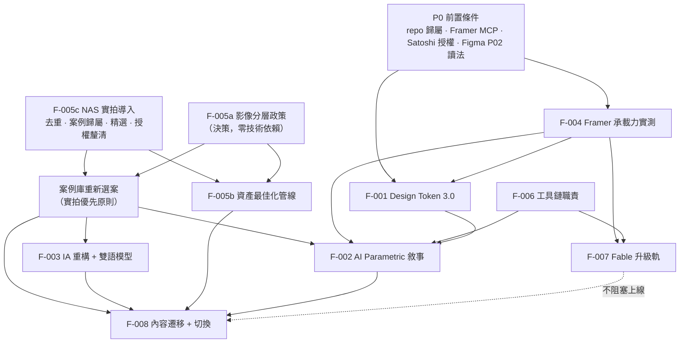

# product-manager 分析 — HQ Design 官網重置

**Session**: WFS-hq-website-reset ｜**角色**: product-manager ｜**日期**: 2026-09-03
**唯一權威前提**: `.brainstorming/guidance-specification.md`（本文件不推翻任何 CONFIRMED 決策）
**新增事實基礎**: `.process/nas-portfolio-inventory.md`（已獨立複驗，見 §2.1）
**主責**: F-005 影像來源分層政策、F-007 Fable 升級軌、階段規劃；**協力**: F-006 工具鏈職責

> **前提兩度變更，本文件依最終事實撰寫**
> 變更一：現行站內作品集影像以渲染圖為主體，非實拍。
> 變更二（**局面反轉**）：NAS 作品集已找到並驗證為真實專業商業攝影。問題**不是缺乏實拍**，而是 **739 張實拍從未上線**。§2 全節、§1 階段規劃與工作量、§6 風險均已依此重寫。

---

## 1. 階段規劃與依賴順序

### 1.1 依賴圖

**平行關係**：`F-005c ∥ F-005a ∥ F-004 ∥ F-006` 四者無交集，MUST 同時啟動。
**新增關鍵節點**：`案例庫重新選案` 是 F-005c 與 F-005a 的匯流點，且**反向約束 F-003 的 IA**（案例分類由選案結果決定，不可先定分類再選案）。這是本次前提反轉後新增的依賴，MUST 納入規格書 §11。
`F-007` 第三種用法（定稿升級）MUST 置於上線後，不得成為 F-008 前置。

### 1.2 建議起點

**主起點 = F-005c NAS 實拍導入 + F-005a 影像分層政策（並行）；並行起點 = F-004 承載力實測。**

F-005c 為最高優先，理由（依強度排序）：

1. **它一次解決三個獨立問題**：旗艦案影像缺口（SECOM 南港總部 gallery 原為 0，NAS 有 154 張）、影像政策風險（渲染圖依賴由結構性問題降為可選擇的敘事手段）、案例庫選案基礎（新增最多 18 個具實拍的候選案例）。沒有其他單一工作項有同等槓桿。
2. **它決定其他項目的工作量級**：選案結果決定 F-003 的案例分類、F-002 的敘事素材、F-005b 的處理張數、F-008 的頁面數。在它完成前，其餘估計皆為區間而非數值。
3. **它是純清點與裁決工作**：無技術依賴、無設計依賴，可由 Claude Code／Codex 執行去重與歸併，人工僅需裁決 6 項待確認事項。啟動成本最低。
4. **授權釐清有外部等待**（見 §6 攝影著作權），越早啟動越好。

F-005a 並行的理由：政策決定 174 張渲染圖與 898 張實拍各自的可用範圍與標示義務；政策未定就啟動精選與修圖，會產出不知能否使用的成品。
F-004 並行的理由：其前置（Framer MCP 連線）需外部動作，且它是唯一能把「大改版」從期望轉為可估成本的實測（見 §6）。

### 1.3 可停止點（舊站仍在服務，各點皆為完整可交付狀態）

| 停止點 | 內容                                                                                                  | 交付物                                                     | 對外狀態               |
| ------ | ----------------------------------------------------------------------------------------------------- | ---------------------------------------------------------- | ---------------------- |
| **S0** | NAS 去重與案例歸屬裁決、影像政策定案、案例庫選案表、F-004 實測報告、F-006 職責書、攝影授權釐清        | 六份決策文件 + 「案例 × 影像類型 × 處置」矩陣              | 舊站不動               |
| **S1** | Token 3.0 落地、Framer template 改造、2 個代表頁型可預覽、實拍精選與修圖完成                          | 內部預覽 URL（全站 `noindex`、非品牌子網域）+ 入選實拍成品 | 舊站不動               |
| **S2** | IA + 雙語模型 + 首頁 + AI Advantage／Parametric／BIM 三頁 + **≥2 案「設計視覺化 vs 完工實景」對照組** | staging 完整可讀，**可用於業主提案與標案簡報**             | 舊站不動               |
| **S3** | 選定案例全部上架、服務與招募上架、資產管線完成、政策 gate 上線                                        | 新站功能完整、與舊站並行                                   | 舊站首頁加一列指向新站 |
| **S4** | SEO 轉址、DNS 切換、舊站封存                                                                          | 新站正式對外                                               | 舊站下線               |
| **S5** | Fable 定稿升級、未辨識的 57 張素材歸屬、13 案渲染圖逐步以實拍替換                                     | 上線後迭代                                                 | 持續                   |

S2 是第一個「有商業價值即可停止」的點：即使不切換 DNS，S2 的 staging 已可作為標案簡報與外商提案的線上材料。

### 1.4 工作量級（估計依據：可數工作單元 × 單元耗時）

**校準基準**：本 repo 已完成的 Phase 1（6 個 JSON Schema + HTML 抽取器 + `parse-*` 測試 + `validate-schemas.ts`）與 Phase 2 importer（含 throttle／backoff／6 項 enum remap），對應遷移計畫 59 個 checkbox 中的 6 個。以此推得「一個含測試的資料層工作單元 ≈ 0.5–0.8 人日」。實體單元數取自實測清點（§2.1）。

| 功能點                          | 人日                          | 主要估計依據                                                                                                                                |
| ------------------------------- | ----------------------------- | ------------------------------------------------------------------------------------------------------------------------------------------- |
| **F-005c NAS 實拍導入（新增）** | **9–13**                      | 見下方分解                                                                                                                                  |
| F-005a 政策                     | 3–4                           | 政策文件 + 案例處置決定表 + CMS 欄位規格 + 偵測流程                                                                                         |
| 案例庫重新選案                  | 2–3                           | 33 個 NAS 目錄 + 21 個站內案例 → 選案表，含客戶授權與範圍陳述核對                                                                           |
| F-004 實測                      | 10–14                         | template 選型 2–3、MCP 0.5、2 個代表 React 元件移植 2–3、4 套 shader 效能與行動端量測 2–3、Satoshi 載入 1、雙語欄位 1–2、逃生路徑 1         |
| F-001 Token 3.0                 | 9–11                          | 三套 token 差異盤點 2、語意層設計 3–4、三端輸出與同步 3–4、字檔導入 1                                                                       |
| F-003 IA + 雙語                 | 9–11                          | 流程鏈 7 段 vs P05 五段對齊 3–4、雙語模型 2、sitemap 與切換規則 2、英文缺口盤點 2–3（不含翻譯撰寫）                                         |
| F-006 工具鏈                    | 3–4                           | 6 工具 × 職責書 + 交接格式 + Claude Code／Codex 邊界                                                                                        |
| F-002 敘事                      | 14–19                         | P05–P09 拆為 8–10 個圖解單元 × 1–1.5 人日 + 雙語文案 4–5                                                                                    |
| F-005b 資產管線                 | 10–13                         | 管線建置 3–4；處理量由 348 張升至約 520 張（348 站內 + 約 170 張入選實拍），含 8688×5792 母檔的尺寸階產生 4–5；政策 gate 實作 2；審核流程 1 |
| F-007 Fable                     | 13–19（建議壓至 8–12，見 §3） | 見 §3.1                                                                                                                                     |
| F-008 遷移切換                  | 9–13                          | 對映腳本改寫 3、Notion 6 DB + relation sub-DB 2–3、影像上網（受 3 req/s 限制）2–3、轉址表與 sitemap 1–2、切換監測 1–2                       |
| **合計**                        | **91–124 人日**               | 單人 ≈ 18–25 週；腳本與資產工作交由 Claude Code／Codex 並行後可壓縮至 12–17 週                                                              |

**F-005c 分解與依據**：

| 工作               | 人日           | 依據                                                                                                                                                                                                                     |
| ------------------ | -------------- | ------------------------------------------------------------------------------------------------------------------------------------------------------------------------------------------------------------------------ |
| 去重與唯一鏡次歸併 | 2–3            | 尺寸分布顯示同批多版本輸出（2000×1333 有 223 張、8688×5792 有 190 張、700×467 有 108 張、1000×667 有 94 張）。**MUST NOT 以 898 為工作量基數**；先依尺寸族群與檔名批次歸併，推估唯一鏡次約 400–500                       |
| 案例歸屬裁決       | 2–3            | 6 項待確認：`照片`／`其他`／`新增資料夾` 共 57 張辨識、匙碗湯 69 張拆 101／台北車站兩店、POPEYES 兩目錄併案、中保總部 154 張歸屬（secom-nangang-complex vs zhongbao-nangang 疑同址重複）、住宅案處置、金普頓承攬範圍核對 |
| 精選               | 3–4            | 目標 15–19 案 × 8–12 張 ≈ 170 張入選；需設計負責人與專案管理負責人共審                                                                                                                                                   |
| 修圖（B 類）       | 1.5–2          | 170 張 × 允許清單操作，以 12–18 張/小時計 ≈ 10–14 小時                                                                                                                                                                   |
| 授權釐清           | 0.5 + 外部等待 | 見 §6；工時低但可能成為時程瓶頸                                                                                                                                                                                          |

估計未涵蓋：英文文案撰寫與校閱、Satoshi 授權採購等待、攝影授權補簽（若需）。此三項 MUST 於 S0 另行估算。

---

## 2. 影像來源分層政策（F-005a）

### 2.1 政策範圍

本政策管制對象為**所有對外呈現的影像資產**，涵蓋網站、標案文件與提案簡報三個出口。政策由七個部分構成：素材事實（§2.2）、判定基準（§2.3）、類型定義（§2.4）、區域分層表（§2.5）、標示義務與 CMS 欄位（§2.6）、政府標案額外要求（§2.7）、案例庫選案與敘事策略（§2.8–§2.9）、紅線（§2.10）、偵測（§2.11）。

政策 MUST 可判定：每一條文皆須能對單一影像資產回答「違規／未違規」。MUST NOT 出現「應謹慎使用」「盡量避免」等無法判定之表述。

### 2.2 已核實的素材事實（兩處來源，皆經我獨立複驗）

**站內現有素材** — `assets/images/projects/`，21 個案例目錄、348 張：

| 前綴          |                                      張數 | 判定                                                                                                        |
| ------------- | ----------------------------------------: | ----------------------------------------------------------------------------------------------------------- |
| `render-*`    |                                       174 | 無相機 EXIF，確為渲染圖                                                                                     |
| `page-*`      | 125（其中 115 集中於 `zhongbao-nangang`） | 簡報頁截圖，含文字與圖框，**非可用案例影像**                                                                |
| `photo-*`     |                                        38 | 僅 6 案有：kimpton 10、soup-spoon-station 11、qijia 8、popeyes 5、soup-spoon-101 3、secom-nangang-complex 1 |
| `floorplan-*` |                                        10 | 可作替代呈現素材                                                                                            |

**NAS 作品集** — `HQ Design Company Profile/作品集-更新版`，7.3 GB、898 張 JPEG、**34 個案例目錄**（盤點表記 33，我實測為 34）：

| 驗證項                 | 我的複驗結果（純標準庫解析 JPEG segment）                                                     |
| ---------------------- | --------------------------------------------------------------------------------------------- |
| 含 `Exif\x00\x00` 標記 | **739 / 898（82%）**                                                                          |
| 相機品牌字串           | **Canon 646**、SONY 31、Panasonic 25、**DJI 10（空拍）**、Apple 7                             |
| ≥40 MP 檔案            | **234 張**；其中 8688×5792 者 190 張（Canon 全片幅 5,000 萬像素級）                           |
| 尺寸族群               | 2000×1333 (223)、8688×5792 (190)、700×467 (108)、1000×667 (94) → 同批多版本輸出，**去重必要** |

**判定確認**：此批為真實專業商業攝影，含空拍素材。盤點表結論成立。

**素材分布的關鍵事實**：

| 分類                                |  案例數 |   實拍張數 | 意義                                                        |
| ----------------------------------- | ------: | ---------: | ----------------------------------------------------------- |
| NAS 有實拍、站內已有案例            |       7 |    **643** | 含旗艦案 SECOM 南港總部 154 張（原 gallery 為 0）           |
| NAS 有實拍、站內**無**此案例        | 最多 18 | **約 255** | 完全未被利用的實績素材                                      |
| 站內有案例、NAS 無對應（100% 渲染） |  **13** |          0 | 共通點為 2025–2026 新完工辦公室案，符合「尚未安排完工攝影」 |

### 2.3 政策的判定基準（本政策最重要的一條）

13 個純渲染案例**並非虛構**：公司對外簡介明列面積、年份與範圍（AIONTECH 825 sqm／2025、LIWEI 350 sqm／2025、C.SUN、SECOM 5,940 sqm／2025 等），為真實完工案件，僅缺完工攝影。政策處理的是「以視覺化填補攝影缺口」，不是「虛構實績」。

政策 MUST 明確區分且不得混為一談：

| 事項                                         | 性質           | 政策立場                                                        |
| -------------------------------------------- | -------------- | --------------------------------------------------------------- |
| **渲染品質的追求**（達到照片級寫實）         | 專業能力展現   | **完全正當，政策不設上限。** 寫實程度 MUST NOT 作為違規判定依據 |
| **呈現時的標示誠實**（業主是否會誤認為實拍） | 信賴與法律風險 | **紅線所在。** 判定基準為標示，非寫實程度                       |

**可判定表述**：渲染圖再寫實，只要標示符合 §2.5 全部要件即為合規；標示不符，再普通的渲染圖亦構成違規。判定者無須也不得對「這張看起來像不像照片」作主觀判斷。

**已知規範缺口（MUST 回報）**：DESIGN.md §6.1 規範攝影、§6.2 規範 AI／數據抽象視覺（wireframe／isometric／point-cloud／floor-plan），§10 negative prompt 含 `no photorealistic scene` —— 但該負向提示的適用對象是品牌圖形與主視覺產出，DESIGN.md **並未定義「真實案件的建築設計視覺化」這一類**。使用者要求的照片級案例渲染落在此缺口內，與 §10 無直接衝突，但 DESIGN.md MUST 補一節（建議 §6.4「案件設計視覺化」）以取得授權依據。此為 ui-designer／F-001 待辦。

### 2.4 影像類型（六類，全部可由檔案與欄位判定）

| 代號  | 類型                      | 判定條件                                                                                               |
| ----- | ------------------------- | ------------------------------------------------------------------------------------------------------ |
| **A** | 實拍                      | 相機原始檔（NAS 739 張帶 EXIF 者為此類主體），未改變空間事實                                           |
| **B** | 實拍修復                  | 僅執行允許清單操作：色偏、曝光、白平衡、去噪、透視矯正、移除臨時物（垃圾、電線、標示、攝影器材、人員） |
| **C** | 設計視覺化 — 對應真實案件 | 有 `project_ref`、`project_status=completed`；渲染或生成，描繪該案空間                                 |
| **D** | 生成式情境 — 無對應案件   | 無 `project_ref`，或案件非 completed                                                                   |
| **E** | 生成式抽象／品牌圖形      | 不描繪具體空間：HQ Mesh、Swiss Pattern、wireframe、isometric、floorplan 圖解                           |
| **F** | 簡報頁截圖                | `page-*`；含文字、圖框、混合解析度                                                                     |

C 類再分兩級（本政策最關鍵的細分）：

| 級別                  | 條件                                                                 | 標示文字                                                       |
| --------------------- | -------------------------------------------------------------------- | -------------------------------------------------------------- |
| **C1 完工視覺化**     | `as_built_verified=true`：經專案管理負責人確認渲染內容與完工結果一致 | `設計視覺化・依完工結果製作 / DESIGN VISUALISATION — AS BUILT` |
| **C2 設計方案視覺化** | `as_built_verified=false`：呈現設計階段方案，未確認等同完工結果      | `設計方案視覺化・非完工紀錄 / DESIGN OPTION — NOT AS-BUILT`    |

未經確認者 MUST 預設為 C2。這解決一個真實陷阱：真實案件的渲染圖仍可能呈現施工變更前的方案。

### 2.5 分層政策表（區域 × 允許類型）

| 網站區域               | A   | B   | C1           | C2                                             | D                                | E              | F        |
| ---------------------- | --- | --- | ------------ | ---------------------------------------------- | -------------------------------- | -------------- | -------- |
| **hero（首頁主視覺）** | 可  | 可  | 可（須標示） | **不可**                                       | **不可**                         | 可             | **不可** |
| **服務頁**             | 可  | 可  | 可           | 可                                             | 可（不得標任何客戶／面積／年份） | 可             | **不可** |
| **流程圖解**           | 可  | 可  | **不可**     | **不可**                                       | **不可**                         | 可（唯一建議） | **不可** |
| **案例列表（縮圖）**   | 可  | 可  | 可（須標示） | 可（須標示，且列表 MUST 顯示「影像類型」標籤） | **不可**                         | **不可**       | **不可** |
| **案例詳情**           | 可  | 可  | 可           | 可（MUST 置於獨立區塊，與 A/B 不同版面容器）   | **不可**                         | 可             | **不可** |
| **關於我們**           | 可  | 可  | 可           | 可                                             | 可                               | 可             | **不可** |
| **招募**               | 可  | 可  | 可           | 可                                             | 可                               | 可             | **不可** |

說明：

- **hero 現在 SHOULD 優先採用 A 類**。前提反轉後 hero 已有 643 張專業實拍可選（含 234 張 ≥40 MP 母檔），無須依賴渲染圖或抽象圖形。E 類降為次選。
- **流程圖解僅允許 E**：圖解功能是說明機制，擬真空間反而降低可讀性，且與 DESIGN.md §6.2 一致。
- **F 類全域禁用**：`page-*`（含 115 張）MUST 僅視為內部素材線索；可用內容 MUST 從原始簡報以原生解析度重新輸出，MUST NOT 直接發佈截圖。

### 2.6 標示義務與形式（可判定）

| 類型   | 視覺標註               | 圖說                                     | alt        | CMS              |
| ------ | ---------------------- | ---------------------------------------- | ---------- | ---------------- |
| A      | 免                     | 免                                       | 一般描述   | 記錄來源與 EXIF  |
| B      | 免（僅限允許清單操作） | 免                                       | 一般描述   | 記錄操作項目     |
| C1／C2 | **必要，燒入影像檔**   | 第一句即標示                             | 開頭即標示 | 全欄位           |
| D      | **必要，燒入影像檔**   | 第一句即標示                             | 開頭即標示 | 全欄位           |
| E      | 免燒入                 | 區塊標籤標示「品牌圖形 / brand graphic」 | 一般描述   | 記錄工具與提示詞 |

**燒入標註的可判定規格**（缺一即違規）：

1. 存在於影像檔本身（像素），MUST NOT 以 CSS 疊層、hover、tooltip、燈箱說明或頁尾統一聲明實現；
2. 位於影像左下角，貼齊 8px 網格；
3. 字高 ≥ 影像短邊 2%；
4. 對比比 ≥ 4.5:1；
5. mono 字體（延續 DESIGN.md §7 製圖標註語彙，使標註成為品牌語言而非補丁）；
6. 中英雙語並列，採 §2.4 表列固定字串，MUST NOT 自行改寫。

規格 1 是核心：標註隨檔案存在，任何轉貼、截圖、下載、匯入標案簡報皆保留標註。這把「呈現誠實」從流程紀律轉為檔案屬性。

**CMS 欄位**（交付 data-architect）：

| 欄位                             | 型別                                       | 必填            | 用途                                                                |
| -------------------------------- | ------------------------------------------ | --------------- | ------------------------------------------------------------------- |
| `provenance`                     | enum A/B/C1/C2/D/E/F                       | 全部            | 分層判定                                                            |
| `project_ref`                    | relation                                   | A/B/C           | D 類 MUST 為 null                                                   |
| `project_status`                 | enum completed / in_progress / design_only | A/B/C           | 「是否為既有實績」唯一依據                                          |
| `as_built_verified`              | bool                                       | C               | 決定 C1／C2；預設 false                                             |
| `verified_by` / `verified_date`  | person / date                              | C1              | 責任可追溯                                                          |
| `capture_date`                   | date                                       | A/B             | 拍攝日（可自 EXIF 自動填入）                                        |
| `photographer` / `usage_rights`  | text / enum                                | **A/B 必填**    | 攝影著作權與授權範圍（見 §6）                                       |
| `restoration_ops`                | multi-select（限允許清單）                 | B               | 超出清單即升格為 C                                                  |
| `gen_tool` / `gen_model_version` | text                                       | C/D/E           | 可追溯產生工具                                                      |
| `gen_prompt`                     | long text                                  | C/D/E           | 含 negative prompt 全文                                             |
| `gen_seed`                       | text                                       | C/D/E（SHOULD） | 可重現性                                                            |
| `label_burned_in`                | bool                                       | C/D             | 非 true 者發佈流程 MUST 阻擋                                        |
| `approved_by`                    | person                                     | C/D             | MUST 非產圖者本人（雙人原則）                                       |
| `tender_exportable`              | bool                                       | 全部            | 預設 false；僅 A/B 且 completed 且 `usage_rights` 允許者方得為 true |
| `pii_cleared`                    | bool                                       | 全部            | 案名與影像不含可識別個人資料（見 R-13）                             |

`tender_exportable` 與 `pii_cleared` 把風險從「人記得」轉為「資料擋住」。

### 2.7 政府標案的額外要求

**已查證之出處**：

| 出處                                    | 內容                                                                                                                                                                                           | 對本專案的意義                                                                              |
| --------------------------------------- | ---------------------------------------------------------------------------------------------------------------------------------------------------------------------------------------------- | ------------------------------------------------------------------------------------------- |
| 政府採購法 §50 I ④                      | 「以不實之文件投標」，開標前發現應不予開標，開標後發現應不決標                                                                                                                                 | 投標文件內影像若被認定不實，直接失格                                                        |
| 政府採購法 §50 II                       | 決標或簽約後發現決標前有前述情形者，**應撤銷決標、終止或解除契約，並得追償損失**                                                                                                               | 風險延伸至已得標案件                                                                        |
| 政府採購法 §101 I ④                     | 「以虛偽不實之文件投標、訂約或履約，**情節重大**者」→ 刊登政府採購公報                                                                                                                         | 「情節重大」為構成要件                                                                      |
| 政府採購法 §103 I ①                     | §101 I 第 1–5 款者，**自刊登之次日起三年**不得參加投標、作為決標對象或分包廠商                                                                                                                 | 對以政府標案為客群者等同三年停業                                                            |
| 投標廠商資格與特殊或巨額採購認定標準 §5 | 實績認定得為「**截止投標日前五年內**完成之同性質或相當契約，單次金額不低於預算 2/5 或累計不低於預算」，並得含「採購機關（構）出具之驗收證明或啟用後功能正常之使用情形證明」                    | **法定實績證明是契約與驗收證明，不是照片。** 影像在資格審查層並非實績本體。**且有五年期限** |
| 公平交易法 §21、§42                     | 不得於商品、廣告或「其他使公眾得知之方法」對足以影響交易決定之事項為虛偽不實或引人錯誤之表示；違反者得限期改正並處 5 萬–2,500 萬元罰鍰；廣告代理業／媒體業明知仍製作或傳播者負連帶損害賠償責任 | **網站本身即屬「其他使公眾得知之方法」**，直接受此條規範，不待進入標案                      |

**查證結果的誠實陳述**：我未能查到任何法規、工程會函釋或政府採購錯誤行為態樣**明文指名「渲染圖」或「示意圖」**用於實績呈現之規範或罰則。以下為保守原則推導，非法條直引：

1. 風險不在「使用渲染圖」，而在「渲染圖被當作完工照片理解」。實績本體是契約與驗收證明（資格標準 §5），渲染圖在資格層不生效力；風險發生在**服務建議書、實績說明與評選簡報**——依工程會採購論壇函釋實務，廠商服務建議書與議價議定書併為契約文件，其內影像因此具契約文件屬性，適用 §50／§101 對「不實文件」的評價。
2. 依實務見解，§101 I ④ 的判斷重心在「是否明顯妨礙採購品質及依約履行目的之確保」。未標示的寫實渲染圖會使評選委員高估實際完工品質，正落在此判斷核心；反之，清楚標示為設計視覺化者，委員判斷基礎完整，難以構成「妨礙」。**這是「標示即防護」的法理依據。**
3. 保守原則（MUST 執行）：
   - 標案文件用影像 MUST 僅取自 `tender_exportable=true`（A/B 類、completed、授權允許）；C／D／E 一律不得進入實績說明章節。
   - 若某案僅有 C 類影像而仍須送件，MUST 以「文字實績 + 契約／驗收證明 + floorplan」呈現，並明示「本案未提供完工攝影」。
   - C 類若出現於簡報「設計能力」章節（非實績章節），MUST 保留燒入標註，且該章節 MUST 有獨立標題與前言說明其為設計視覺化。
   - MUST NOT 以網站截圖作為標案實績材料。
   - **年份門檻**：資格標準 §5 的實績認定限「截止投標日前五年內完成」。NAS 素材中年份較舊者（例如與已停業航空業者相關之案件）**MUST NOT 用於須符合五年期限的標案實績**；作為網站能力敘事仍完全有效。此區別 MUST 由 `project_status` 之外另設年份欄位承接。

### 2.8 案例庫策略反轉：從「補圖」到「重新選案」

**原問題**「如何處置沒有實拍的案例」已失效。新問題是「**重新選擇要展示哪些案例，優先展示有實拍的**」。

有實拍的候選案例數（7 已對應 + 最多 18 未使用 = 最多 25）遠多於站內現有實拍案例數（6）。因此政策 MUST 改採**實拍優先原則**：

| 層級                        | 內容                                                                                                                                                                                                                                                            |      案數 | 主圖類型                                  |
| --------------------------- | --------------------------------------------------------------------------------------------------------------------------------------------------------------------------------------------------------------------------------------------------------------- | --------: | ----------------------------------------- |
| **第一層 旗艦（實拍主導）** | SECOM 南港總部（154）、金普頓（281）、匙碗湯（69，拆兩店）、POPEYES（62）、起家雞（50）、中保無限家生活館（27）、國產系列（41）、復興航棧系列（34）、中興保全接待大廳（20）、Vair 威航（13）、龍騰旅行社（13）、航空貴賓室（15）、部隊鍋（12）、Burger-Ray（9） | **15–19** | A／B                                      |
| **第二層 設計視覺化選錄**   | 自 13 個純渲染案中**選錄 4–6 案**，每案須有明確論述理由                                                                                                                                                                                                         |   **4–6** | C1／C2（全額標示）                        |
| **不建立個別案例頁**        | 其餘 7–9 個純渲染案 + 待辨識素材                                                                                                                                                                                                                                |         — | 改以「1,600+ 件」統計陳述與客戶名單牆承接 |

**13 個純渲染案是否全部保留？建議：不。降為 4–6 案。**

理由：13 案全保留會使案例庫中純渲染案佔比達 13/(13+17)≈43%，即近半數案例頁沒有完工實拍——在機構型客戶與標案情境下是結構性弱點，且與實拍優先原則自相矛盾。降至 4–6 案後佔比降至 19–26%，且每案保留皆有明確理由（建議保留：`hq-office` 支撐「自有辦公室即實驗場」；`aiontech`／`csun`／`liwei` 已載於簡介 P15–P17，支撐 P07 參數化多方案論述；中保系列擇一以避免同客戶重複）。

**這個降幅是 §2.9 策略反轉能否成立的關鍵**：4–6 案的渲染圖是「刻意選來論證參數化能力」，13 案的渲染圖是「因為沒照片只好用」。同樣的檔案，因選案密度不同而具備完全不同的說服結構。

**航空貴賓室與航空周邊實績的優先級：建議列為第一層，並獨立成一個案例分類。**

| 判準                  | 評估                                                                                                                                                                                           |
| --------------------- | ---------------------------------------------------------------------------------------------------------------------------------------------------------------------------------------------- |
| 定位契合              | 品牌定位強調服務外商品牌來台落地；航空貴賓室客戶為國際航空業者，是「外商 HQ」客群的直接對應。素材含泰航貴賓室 9 張、復航貴賓室 6 張，加上復興航棧系列（零售／航空周邊，含大園、春日兩店）34 張 |
| 能力交叉印證          | 貴賓室涉及高規格材料、營運不中斷施工、保全與通關動線協調，正對應簡介 P12 SECOM 案主打的「分區施工／保全與營運整合／品質驗收移交」三項能力。**兩案互為佐證，強於任一單案**                      |
| 邊際成本              | 近乎為零——素材已存在，僅需授權與精選                                                                                                                                                           |
| 網站現況              | **完全未呈現**，是最大的未利用資產                                                                                                                                                             |
| **限制（MUST 標明）** | 相關航空業者已於 2016 年停業，案件年份較舊，**MUST NOT 用於須符合資格標準 §5 五年期限的標案實績**；作為網站能力敘事有效。年份 MUST 明示，MUST NOT 隱去                                         |

建議：新增「航空與交通樞紐」案例分類（第一層），但案例頁 MUST 標示年份，且該分類 MUST NOT 出現在「近五年實績」類的呈現脈絡中。

### 2.9 策略反轉評估：公開標示是否為能力證明

**評估結論：是。前提反轉後可行性顯著提高，建議採用，並以「同案對照」為核心手法。**

支持（皆有素材依據）：

1. **與定位一致**：品牌定位為「AI × Design 的未來實驗場」，主標語為 `AI parametric × Construction EXECUTION`。簡介 P06 明言「AI 不只畫圖，而是提升整個交付」、P07 為 `ONE CHANGE. MULTIPLE VERIFIED OPTIONS.`。在此定位下，擁有自製設計視覺化本身就是 P07 主張的物證。
2. **隱藏才是自相矛盾**：若一家以「參數化多方案」為核心主張的公司需要把參數化產出偽裝成攝影，等於承認參數化產出不足以說服業主——這直接否定 P06／P07。**標示不是揭露弱點，隱藏才是自我否認。**
3. **同案對照現在可行，且直接論證 P08**：有實拍的 7 案（含站內已有 `render-*` 又在 NAS 有實拍者，如 `zhongbao-showroom` render 17 + NAS 27 張、`kimpton`、`popeyes`、`qijia`、`匙碗湯`）可做「設計視覺化 → 完工實景」同案並列。簡介 P08 BIM ADVANTAGE 的主張是「**設計意圖可被建造**」——同案對照是這句話唯一的直接視覺證據形式。這是舊站與同業網站皆不具備的內容，且**無法被沒有實拍的同業複製**。
4. **治理成熟度訊號**：同業普遍以未標示渲染圖充作完工照。HQ 主動標示，在法遵嚴格的外商 HQ 與上市公司眼中是正向訊號，且直接降低 §2.7 曝險。

三項執行限定（不做則反轉失敗）：

1. **MUST 以「能力」語氣而非「免責」語氣**。標示 MUST 為 `DESIGN VISUALISATION — AS BUILT`／`DESIGN OPTION` 這類專業術語，MUST NOT 使用「僅供參考」「非實際完工」等免責式措辭——後者把能力陳述降格為法律免責，適得其反。
2. **MUST 於 S2 交付 ≥2 組同案對照**，其中至少 1 組為辦公／企業空間（`zhongbao-showroom` 為最佳候選：站內有 17 張 render、NAS 有 27 張實拍）。無對照組則敘事只是渲染圖的辯解；有對照組才成為「我們畫得出來也做得出來」的證明。此為 S2 的交付條件，非選配。
3. **MUST NOT 用於標案實績章節**：即使敘事成立，§2.7 保守原則不因敘事而鬆綁。

風險與處置：

- **業主觀感風險**：部分業主仍偏好實拍。處置——案例列表提供「僅顯示含完工實拍之案例」篩選（第一層 15–19 案），把選擇權交給業主，而非替業主隱藏。
- **敘事失敗風險**：若限定 2 未達成，MUST 退回低調標示版本，MUST NOT 強推反轉敘事。
- **DESIGN.md 授權缺口**：見 §2.3，MUST 先補 DESIGN.md §6.4。

### 2.10 紅線清單（共 14 條，MUST NOT）

| #        | 紅線                                                                                                                                                                                      |
| -------- | ----------------------------------------------------------------------------------------------------------------------------------------------------------------------------------------- |
| R-01     | MUST NOT 以 C2、D 類影像作為 hero 或案例列表縮圖                                                                                                                                          |
| R-02     | MUST NOT 以任何需互動才可見的方式（hover、tooltip、燈箱、頁尾聲明）作為 C／D 類的唯一標註                                                                                                 |
| R-03     | MUST NOT 發佈 `label_burned_in≠true` 的 C／D 類影像                                                                                                                                       |
| R-04     | MUST NOT 在 `provenance`、`project_status` 或（C 類）`as_built_verified` 為空時發佈影像                                                                                                   |
| R-05     | MUST NOT 將 `as_built_verified=false` 的影像標示為完工視覺化（C1）                                                                                                                        |
| R-06     | MUST NOT 於 B 類修復中新增、移除或改變固定裝修元素（牆體、隔間、天花、地坪、櫃體、燈具、門窗、材質）                                                                                      |
| R-07     | MUST NOT 於同一版面容器（gallery／carousel／grid 皆屬同一容器）內混排 A/B 與 C2/D，**但 §2.9 的「同案對照」為唯一例外**：對照組 MUST 使用專屬版面元件，兩側各自標示，且 MUST 明示其為對照 |
| R-08     | MUST NOT 對未簽約、未開工或已終止之案件建立對外案例頁                                                                                                                                     |
| R-09     | MUST NOT 呈現與合約及驗收證明不一致之客戶名稱、面積、年份或範圍                                                                                                                           |
| R-10     | MUST NOT 將 C／D／E 類影像置入標案實績章節，或以網站截圖作為標案實績材料                                                                                                                  |
| R-11     | MUST NOT 使用他方（業主、建築師、攝影師、同業）影像充作 HQ 實績；**承攬範圍非全案者 MUST NOT 表述為全案設計施工**                                                                         |
| R-12     | MUST NOT 發佈 F 類簡報頁截圖作為案例影像                                                                                                                                                  |
| **R-13** | **MUST NOT 以含客戶姓氏之案名（如「○宅」）呈現任何案例；住宅案 MUST 去識別化或排除。MUST NOT 發佈可識別個人之影像（人臉、名牌、桌面文件、門牌）**                                         |
| **R-14** | **MUST NOT 發佈 `usage_rights` 未確認之攝影作品；授權範圍不含公開傳輸者 MUST NOT 上網站**                                                                                                 |

**R-09 已有既有違規（實測發現，非假設）**：公司簡介內部面積不一致——SECOM／中興保全南港總部於里程碑頁記 2,500 sqm、於案例頁與 P12 記 5,940 sqm；C.SUN 於作品頁記 700 sqm、於案例頁記 560 sqm。MUST 於 S3 前逐案對合約與驗收證明核定唯一值並回寫簡介；核定前該欄位 MUST 空值上站。

**R-11 的具體適用**：盤點表註明金普頓案為外部設計、HQ 承攬公共區與客房走廊施工。該案影像量最大（281 張），若以「全案設計施工」表述即構成 R-11 違規。範圍陳述 MUST 於 S0 逐案核對合約。

**R-13 的具體適用**：NAS 目錄中有 1 筆住宅案（9 張，目錄名含客戶姓氏）。**建議直接排除**，理由：住宅案與 HQ「1,600+ 件商業空間」定位不符，去識別化後說服力低，保留成本高於效益。本文件亦不記載該姓氏。

### 2.11 違規偵測

| 檢查           | 執行者                             | 檢查內容                                                                                               | 時點                          | 判定                 |
| -------------- | ---------------------------------- | ------------------------------------------------------------------------------------------------------ | ----------------------------- | -------------------- |
| Schema gate    | 自動（擴充 `validate-schemas.ts`） | 欄位完整性與交叉規則（R-03/04/05/08/13/14）                                                            | 每次 commit 與 Framer sync 前 | 任一 fail → 阻擋發佈 |
| 區域配置 lint  | 自動                               | 影像 id × 頁面區塊 id 比對 §2.5 表（R-01/07/12）                                                       | 每次發佈                      | fail → 阻擋          |
| 燒入標註抽查   | 人工，設計負責人                   | 隨機 20% C／D 類：角標存在、字高、對比、字串正確（R-02/03）                                            | 每次上架批次                  | 缺一即整批退回       |
| 實績與範圍對帳 | 人工，專案管理負責人               | 全案例的客戶名稱／面積／年份／**承攬範圍**對合約與驗收證明；`as_built_verified` 逐案確認（R-05/09/11） | 上站前一次 + 每季             | 不符即下架該案例     |
| 授權與個資覆核 | 人工，行政支援                     | `photographer`／`usage_rights`／`pii_cleared` 三欄逐張核對（R-13/14）                                  | 實拍入庫時                    | 未核對者不得進入 CMS |
| 標案匯出覆核   | 自動 + 人工，投標負責人            | 匯出清單 MUST 全為 `tender_exportable=true`，且完工年份符合五年期限（R-10）                            | 每次送件                      | 不符即不得送件       |
| 產圖／核可分離 | 流程                               | `approved_by ≠ gen_tool 操作者`                                                                        | 每張 C／D                     | 同一人即退回         |

---

## 3. Fable 設計升級軌的成本結構（F-007）

### 3.1 三種用法

| 用法                  | 介入時點                | 輸入                                                | 產出格式                                          | 耗時                      |
| --------------------- | ----------------------- | --------------------------------------------------- | ------------------------------------------------- | ------------------------- |
| **U1 探索期風格提案** | S0→S1，Token 3.0 定案前 | DESIGN.md §2/§3/§10、Figma P02 截圖、3 個方向 brief | 每方向 3–5 張靜態 key visual + 1 頁風格說明       | 3–4 人日（3 方向 × 2 輪） |
| **U2 平行對照組**     | S1→S2，頁型設計期       | 已定 IA 的 2 個代表頁型 wireframe + Token 3.0       | 每頁型 2 版高保真版面（同尺寸、同內容、同 token） | 5–7 人日                  |
| **U3 定稿升級**       | **S4 之後**             | 已上線頁面之實際截圖／DOM                           | 逐頁差異對照圖 + 具體 token／版面修改清單         | 4–6 人日（8–10 頁）       |

**成本結構（誠實陳述）**：U2 是純加成本項——它不產生新交付物，只產生「選擇」；同一頁型做兩版，第二版有約 50% 機率被丟棄，該部分成本 100% 沉沒。U3 是把 S2–S3 已完成的設計再做一遍。三者合計 13–19 人日，佔全案 91–124 人日的 **13–18%**，其中 5–7 人日（U2）在最佳情況下也不會進入交付物。

### 3.2 平行對照組的評比標準

MUST 採「事前權重 + 強制排序」，MUST NOT 採評分平均。權重 MUST 於產出前定案，MUST NOT 在看到方案後調整。

| 判準       | 權重 | 可觀察證據（非主觀感受）                                                                                                      |
| ---------- | ---- | ----------------------------------------------------------------------------------------------------------------------------- |
| 敘事可讀性 | 30%  | 非設計背景受測者 n≥3（含 ≥1 位 B2B 採購或機構客戶側）於 60 秒內**能否**口述 ≥2 項 HQ 與同業流程差異。記錄能／不能，不記錄分數 |
| 品牌合規   | 25%  | 對 DESIGN.md §3 色彩比例（55/25/10–15/5–10）、§2 角度族、§4 無襯線逐條 pass/fail。**任一 fail 即該版不得入選**                |
| 技術可承載 | 20%  | 以 F-004 實測結論判定可否在 Framer 實作、行動端是否達標。pass/fail                                                            |
| 實作成本   | 15%  | 計數：需新增幾個 code component、幾張新素材。非印象                                                                           |
| 差異化強度 | 10%  | 與 5 個同業網站並排盲測，受測者**能否**指出哪一個是「AI 整合」定位                                                            |

**判定者**：MUST 為單一決策者（使用者本人）做最終取捨。受測者只提供第 1、5 項的事實資料，MUST NOT 投票。
**反「都不錯」機制**：MUST 強制輸出「淘汰理由」而非「入選理由」；MUST 於 24 小時內完成，逾時視為先產出版本勝出。

### 3.3 縮減優先序

**先砍 U2，次砍 U3，保留 U1。**

- **U1 保留**：唯一在「尚無基準」時提供資訊的用法，產出直接餵 Token 3.0 與 ui-designer，成本最低（3–4 人日）而槓桿最高。
- **U2 先砍**：其資訊價值取決於「兩版真的不同」，但兩版同受 Token 3.0、DESIGN.md §2/§3/§10（含固定 negative prompts）與單一字體約束，可分歧空間已壓縮至版面配置與圖解手法；若兩版差異小於品牌合規檢查的粒度，評比不具鑑別力。
- **U3 次砍**：置於 S4 之後，可延後、可分批、可隨時停止，不砍亦不阻塞上線。

### 3.4 划算性判斷

**三種全採不划算，具體不划算的是 U2。**

1. **分歧空間已被約束吃掉**（見 §3.3）。
2. **缺少基線導致無從判優**：規格 §1.4 判準偏質性，目前無流量、無轉換、無現況基線（見 §5），U2 只能靠主觀偏好裁決——而主觀偏好用 U1 的 3 個方向已可取得，成本為 U2 的一半。
3. **注意力機會成本明確**：5–7 人日約等於 F-005c NAS 實拍導入（9–13 人日）的一半。無硬期限下工期不是稀缺資源，**決策者注意力才是**。前提反轉後 S0–S2 的決策負荷已顯著增加（新增：案例庫選案、承攬範圍核對、攝影授權、住宅案處置、6 項 NAS 歸屬裁決）；決策疲勞恰好會產生 U2 意圖避免的「都不錯」。

**建議**：U1 保留全額；U3 降為上線後選配；**U2 縮為單一頁型單次對照**（僅 AI Advantage 對照頁，1 次，1.5–2 人日），作為「Fable 是否值得再投入」的一次性檢驗。若該次對照的勝出版本在第 1 項判準（60 秒可讀性）上無法取得差異，MUST 終止 Fable 平行對照用法。此建議把 F-007 由 13–19 人日壓至 8–12 人日，且不動用「探索」與「上線後升級」兩項真正有增量價值的用法。

---

## 4. 工具鏈職責定位（F-006 協力）

| 工具              | 做什麼                                                                                                                    | 不做什麼                                                                                                          | 產出交給誰                                             |
| ----------------- | ------------------------------------------------------------------------------------------------------------------------- | ----------------------------------------------------------------------------------------------------------------- | ------------------------------------------------------ |
| **Figma**         | Token 3.0 視覺權威編輯與 variables、頁型高保真定稿、元件庫、圖解版面、**同案對照組的專屬版面元件設計**                    | 不做內容管理、不發佈、不作為 token 最終機讀來源                                                                   | → Framer（版面依據）、→ system-architect（token 匯出） |
| **Framer**        | 唯一發佈層、CMS 消費端、code component 承載、SEO 與轉址                                                                   | 不作為 authoring 介面（authoring 在 Notion）、不產生素材、不存原始高解析影像（8688×5792 母檔 MUST NOT 進 Framer） | → 對外網站；→ Unframer git 快照                        |
| **Higgsfield**    | E 類品牌抽象素材、案例走查與品牌短片（規格 §8.3 用途 4）、**NAS 實拍的影片化（Ken Burns／走查）**                         | MUST NOT 產出 D 類（無對應案件的擬真空間情境）；任何 C 類產出 MUST 回傳 `gen_prompt`／`gen_seed`                  | → 資產管線（附完整來源欄位）                           |
| **flora.ai**      | 節點畫布式**批次**產出：同一 prompt 骨架 × 多尺寸／多語言／多密度變體（對應 DESIGN.md §10.3–§10.8 六套 pattern 的規模化） | 不做單張精修、不做最終合成、不做影片                                                                              | → 資產管線；→ Figma（pattern 圖層）                    |
| **Claude Design** | Token 3.0 程式端實作（CSS custom properties）、9 個 React 元件與 4 套 shader 維護、DESIGN.md 規範單一來源（含待補 §6.4）  | 不做視覺定稿判斷、不直接發佈                                                                                      | → Framer code component；→ Figma（token 同步）         |
| **Weavy**         | 見下方建議                                                                                                                | —                                                                                                                 | —                                                      |

**前提反轉對工具鏈的影響**：生成式工具的角色從「填補案例影像缺口」降為「品牌圖形、影片與抽象圖解」。規格 §8.3 用途 2（補齊拍攝不足的案例情境圖）的實際需求量從 14 案降至 4–6 案，且皆為既有渲染圖的再精修而非新生成。**這是本次反轉最大的成本節省，MUST 反映在 F-006 的工具配額規劃中。**

### Weavy 職責建議（規格 §8.3 未解事項）

**建議：條件性採用，且以「不採用」為預設。**

理由：四種用途已被既有工具完全覆蓋（Higgsfield → E 類、影片與精修；flora.ai → 批次變體；Figma → 定稿；Claude Design → 規範）。Weavy 差異化價值僅在「多模型並排 + 版本族譜」。本專案唯一真正需要族譜的，是 §2.6 要求的 `gen_tool`／`gen_model_version`／`gen_prompt`／`gen_seed` 稽核紀錄——此需求亦可由資產管線的 sidecar JSON 以零額外訂閱成本滿足。**且反轉後生成式素材需求量已大幅下降，更不足以支撐新增一個工具面。**

執行規則：

- 若 F-005b 能自動寫入 sidecar JSON（由 system-architect 判定 Higgsfield／flora API 是否回傳完整 prompt 與 seed），Weavy **MUST NOT 納入**。
- 若無法自動寫入，Weavy **MAY** 作為「生成式影像稽核來源」納入，職責限此一項，MUST NOT 擴張為產圖主力。
- **決定期限：S0 結束前**（與 F-006 職責書同時定稿）。

---

## 5. 成功指標

| 指標                                           | 量測方式                                                                                        | 現況基線                                                                        | 目標                                                                 |
| ---------------------------------------------- | ----------------------------------------------------------------------------------------------- | ------------------------------------------------------------------------------- | -------------------------------------------------------------------- |
| **流程差異理解度**（規格 §1.4 第一項的可測化） | 5 位非設計背景受測者（含 ≥2 位 B2B 採購或機構客戶側）看首頁 90 秒後口述，記錄能否說出 ≥2 項差異 | **無基線** → MUST 於 S0 對現行上線站做同一測試（1 人日）建立                    | 5 人中 ≥4 人                                                         |
| **實拍覆蓋率**                                 | 有 ≥1 張 A/B 類影像之對外案例數 ÷ 對外案例總數                                                  | **6/21 = 28.6%**（已實測）                                                      | **S3 ≥75%**（依 §2.8 選案：第一層 15–19 案／總 19–25 案）；長期 ≥85% |
| **旗艦案影像完整度**                           | 簡介 PDF 五個 Case Study 各自的 A/B 類影像張數                                                  | SECOM 1 張、其餘 4 案 0 張                                                      | 每案 ≥8 張（SECOM 已有 154 張候選）                                  |
| **雙語對等性**                                 | 自動比對每筆 CMS 記錄 zh/en 非空比例；人工抽查 10% 英文非機器直譯                               | `index.html` 為 `lang="en"`、其餘 4 頁 `lang="zh-TW"`，無獨立中文版；基線約 20% | 非空率 100%、人工合格率 ≥95%                                         |
| **影像政策合規**                               | §2.11 自動 gate 通過率與人工抽查退回率                                                          | 無（政策尚未存在）                                                              | 自動 gate 阻擋率 100%、人工抽查退回率 0                              |
| **授權完備率**                                 | `usage_rights` 與 `pii_cleared` 皆已確認之對外影像比例                                          | **0%**（欄位不存在）                                                            | 100%（低於 100% 即 R-14 違規）                                       |
| **敘事頁參與度**                               | Framer Analytics 或 GA4：AI Advantage／Parametric／BIM 三頁 scroll depth ≥75% 比例與平均停留    | 無（舊站無此頁）→ 以舊站服務頁為代理基線                                        | 三頁 scroll ≥75% 比例 ≥40%                                           |
| **同案對照的說服效果**                         | 看過對照組 vs 未看過的兩組受測者（各 n≥3），記錄能否說出「HQ 的設計圖與完工結果一致」           | 無（對照組尚不存在）                                                            | 看過組 ≥2/3 能說出，未看過組作對照                                   |
| **詢價品質**（非數量）                         | 表單增設「案件類型／面積級距／來源頁面」三欄，統計附有面積與時程之詢價佔比                      | 無 → MUST 於 S1 前先在舊站表單加同樣三欄，收集 ≥8 週                            | 合格佔比高於基線且絕對數不低於基線                                   |
| **效能與可及性**                               | Lighthouse mobile 每次發佈自動跑：LCP、CLS、Accessibility                                       | 未量測 → MUST 於 S0 對舊站量測（含 525MB 資產下實際 LCP）建立                   | mobile LCP ≤2.5s、CLS ≤0.1、A11y ≥90                                 |
| **招募**（規格 §5.2 受眾之一）                 | 招募頁投遞數，及投遞者提及 AI／BIM／parametric 之比例                                           | 現有 4 個職位頁，無投遞統計                                                     | 建立可統計基線即為第一階段成功                                       |

註：詢價指標僅蒐集案件類型與面積級距，不涉及金額，符合保密範圍。

---

## 6. 風險與取捨（產品層面補充）

| 風險                                         | 產品層面的具體形態                                                                                                                                                                                                                                                                                       | 建議處置                                                                                                                                                                                                                                                                                                                                                                                                                                                                                                                                            |
| -------------------------------------------- | -------------------------------------------------------------------------------------------------------------------------------------------------------------------------------------------------------------------------------------------------------------------------------------------------------- | --------------------------------------------------------------------------------------------------------------------------------------------------------------------------------------------------------------------------------------------------------------------------------------------------------------------------------------------------------------------------------------------------------------------------------------------------------------------------------------------------------------------------------------------------- |
| **攝影著作權與使用授權（新增，優先級最高）** | 739 張為專業商業攝影。依著作權法 §12，出資聘請他人完成之著作，除契約約定外**以受聘人為著作人**；著作財產權未約定歸屬者**歸受聘人享有**，出資人僅「得利用該著作」。實務多認為該利用權限於出資目的範圍。若當年委任目的為作品集或簡報，**網站公開傳輸可能超出範圍**；且部分素材可能由業主方委任而非 HQ 委任 | MUST 於 S0 逐批（依攝影批次而非逐張）釐清三件事：委任方是誰、有無書面約定、授權是否含公開傳輸。無法證明者 MUST NOT 上網站（R-14）。處置順序：(a) 有書面約定 → 依約；(b) 無約定但 HQ 出資 → 依 §12 III 主張利用權，但 MUST 取得攝影師書面確認公開傳輸範圍；(c) 業主方委任 → MUST 取得業主與攝影師雙方同意。**此項工時低（0.5 人日）但可能成為最長的外部等待，MUST 最先啟動**                                                                                                                                                                         |
| **業主曝光同意（新增）**                     | 33 個 NAS 目錄含可辨識客戶（含上市公司、國際飯店品牌、國際航空業者）。案例上網站等同對外揭露客戶關係                                                                                                                                                                                                     | 簡介 PDF 已公開者（SECOM、C.SUN、AIONTECH、LIWEI、眾寶保經、DXC、金普頓、起家雞、匙碗湯、POPEYES）視為已具同意基礎；**NAS 新增的 18 案 MUST 逐案取得業主書面同意**，未取得者 MUST NOT 建立案例頁。此為 S0 → S3 的並行工作                                                                                                                                                                                                                                                                                                                           |
| **住宅案個資（新增）**                       | NAS 有 1 筆住宅案（9 張，目錄名含客戶姓氏），姓氏屬個人資料                                                                                                                                                                                                                                              | **建議直接排除**（見 R-13）。若使用者仍要保留，MUST 去識別化案名、MUST 取得業主書面同意、MUST 移除所有可識別個人之畫面元素                                                                                                                                                                                                                                                                                                                                                                                                                          |
| **空拍素材合規（新增）**                     | 10 張 DJI 空拍。部分案件位於機場周邊（大園），可能落在民航禁限航區                                                                                                                                                                                                                                       | MUST 於 S0 確認拍攝當時是否取得許可。無法確認者 MUST NOT 上網站——並非因影像本身違規，而是公開發布可能反證未經許可之飛行                                                                                                                                                                                                                                                                                                                                                                                                                             |
| **舊站長期並行的品牌風險**                   | 兩站同時可被搜尋；舊站視覺（deep navy #1C2B3A + Inter）與無 AI 敘事，與新站主張相反；業主在標案簡報前搜到舊站，形成「說一套、網站另一套」                                                                                                                                                                | S1 起新站 MUST 全站 `noindex` 且置於非品牌子網域；S3 起舊站首頁 MUST 加一列指向新站（不改舊站樣式）；S4 一次性 301 全量轉址。**MUST NOT 讓兩站同時可被索引超過 2 週**；並行期上限 MUST 訂為「S3 完成後 4 週內完成 S4」                                                                                                                                                                                                                                                                                                                              |
| **「大改版」期望 vs「少即是多」約束**        | 驗收直覺易落在首屏視覺衝擊，而 DESIGN.md 明令留白為主角、橘紅克制、禁霓虹與玻璃擬態 → 首屏守約束容易被判定「看起來沒改」                                                                                                                                                                                 | 期望管理 MUST 前置至 S1 交付前，把驗收證據從「首屏觀感」改寫為**四項可展示事實**：(a) 舊站無 AI 敘事頁、新站有 3 頁；(b) 舊站中英斷裂、新站欄位層對等；(c) 舊站主色與品牌規範不符、新站符合；(d) **舊站實拍覆蓋 28.6%、新站 ≥75%，且旗艦案由 1 張增至 ≥8 張**。第 (d) 項是反轉後新增的最強證據——它是純事實、可計數、與美學判斷無關。改版強度 SHOULD 由動態與資訊密度承擔（shader、參數化互動圖解、對照表逐步揭露），MUST NOT 由色彩飽和度承擔。若 F-004 判定 shader 不可承載，MUST 立即回報並重新協商期望，MUST NOT 改用違反 DESIGN.md 的高飽和方案 |
| **承攬範圍表述（R-11）**                     | 金普頓案影像量最大（281 張），但盤點表註明為外部設計、HQ 承攬公共區與客房走廊施工                                                                                                                                                                                                                        | MUST 於 S0 逐案核對合約範圍，案例頁 MUST 精確標示承攬範圍（例：「公共區與客房走廊施工」而非「全案設計施工」）。此案影像量大且屬國際飯店品牌，是最有價值也最易誤述的案例                                                                                                                                                                                                                                                                                                                                                                             |
| **既有面積不一致（已實現）**                 | SECOM 2,500 vs 5,940 sqm；C.SUN 700 vs 560 sqm（見 R-09）                                                                                                                                                                                                                                                | MUST 於 S3 前對合約與驗收證明核定唯一值並回寫簡介；核定前空值上站                                                                                                                                                                                                                                                                                                                                                                                                                                                                                   |
| **7.3 GB 素材的管線壓力**                    | 站內 525 MB + NAS 7.3 GB；234 張 ≥40 MP 母檔                                                                                                                                                                                                                                                             | 母檔 MUST NOT 進 Framer。MUST 建立「母檔留在 NAS／git-lfs 外、僅發佈衍生尺寸階」的分離架構。此為 F-005b 與 system-architect 共同項                                                                                                                                                                                                                                                                                                                                                                                                                  |
| **五類受眾單站服務**                         | 政府標案看實績與資格、外商 HQ 看流程與英文、招募看團隊與技術棧                                                                                                                                                                                                                                           | 首頁 MUST 只服務機構型客戶一類；其餘四類 MUST 以獨立入口分流。MUST NOT 於首頁平鋪五類受眾入口                                                                                                                                                                                                                                                                                                                                                                                                                                                       |
| **決策者單點**                               | 反轉後 S0 決策點增加（選案、承攬範圍、授權、住宅案、6 項 NAS 歸屬）                                                                                                                                                                                                                                      | 每個可停止點 MUST 收斂為「一次會議、一組是／否問題」；**S0 的決策點已超過 5 個，MUST 拆為兩次會議**：第一次僅決政策與紅線（U-3～U-5），第二次決選案與授權（U-6～U-9）。此亦為 §3.4 建議縮減 U2 的理由之一                                                                                                                                                                                                                                                                                                                                           |
| **Notion 雙語欄位量**                        | 案例數 × 雙語 × 多欄位，受 property 上限與 3 req/s 約束（ADR-001 已載）                                                                                                                                                                                                                                  | 案例的 `location`／`area`／`year`／`scope` SHOULD 以結構化值 + 前端字典呈現，MUST NOT 逐案雙語手填                                                                                                                                                                                                                                                                                                                                                                                                                                                  |
| **既有 cms/data 部分作廢**                   | 21 個 project JSON 的影像欄位將全面重寫；且選案後可能有 7–9 案不再建立頁面                                                                                                                                                                                                                               | 內容值（名稱、面積、年份、範圍、文案）MUST 沿用，**包括不再上站的案例**——其文字內容仍可支撐「1,600+ 件」的客戶名單牆。影像區塊 MUST 視為需重建，並於 F-008 對映策略中明列為「無法自動對映」欄位                                                                                                                                                                                                                                                                                                                                                     |

---

## 7. 需使用者決定的項目

| #        | 決定事項                                                                                                                                                        | 期限                          | 不決定的後果                                 |
| -------- | --------------------------------------------------------------------------------------------------------------------------------------------------------------- | ----------------------------- | -------------------------------------------- |
| **U-1**  | repo 歸屬（`chr1st1anw0w` vs `aiadminhq`）與 Framer 帳號歸屬                                                                                                    | **S0 開始前**                 | 無法建立 MCP 與發佈權，F-004 無法執行        |
| **U-2**  | **攝影著作權與網站使用授權**：委任方、有無書面約定、是否含公開傳輸（見 §6 首項）                                                                                | **S0 開始前**（最長外部等待） | 739 張實拍全部不得上網站，整個反轉失效       |
| **U-3**  | §2 影像分層政策與 14 條紅線是否照案採用                                                                                                                         | **S0 結束前**                 | F-002、F-005 皆無法啟動                      |
| **U-4**  | §2.9 策略反轉是否採用（公開自信標示設計視覺化，並以同案對照論證 P08）                                                                                           | **S0 結束前**                 | 敘事骨架與文案全文方向不明                   |
| **U-5**  | **13 個純渲染案是否照建議降為選錄 4–6 案**（我建議：是，並指定保留哪幾案）                                                                                      | **S0 結束前**                 | 案例頁數與 IA 分類無法定案                   |
| **U-6**  | **NAS 新增 18 案的業主曝光同意**：逐案是否可上網站                                                                                                              | S0→S3 並行                    | 第一層旗艦案數不確定，實拍覆蓋率目標無法承諾 |
| **U-7**  | 6 項 NAS 歸屬裁決：57 張無名目錄辨識、匙碗湯店別拆分、POPEYES 併案、中保總部 154 張歸屬（secom vs zhongbao-nangang 疑同址）、住宅案處置、金普頓承攬範圍         | S0 結束前                     | 去重與精選無法完成                           |
| **U-8**  | 航空與交通樞紐是否新增為第一層案例分類（含年份標示與不用於五年期限標案的限制）                                                                                  | S0 結束前                     | 49 張差異化實績繼續閒置                      |
| **U-9**  | 住宅案（1 筆 9 張）是否排除（我建議：排除）                                                                                                                     | S0 結束前                     | R-13 個資風險未消除                          |
| **U-10** | Weavy 採用與否（依 §4 條件）                                                                                                                                    | S0 結束前                     | 工具面數量不確定，F-006 交接格式無法定稿     |
| **U-11** | Satoshi 商用授權與字檔來源                                                                                                                                      | S0 結束前                     | F-001 無法定案，規格 D-009 失效              |
| **U-12** | Fable U2 是否照建議縮為單一頁型單次對照                                                                                                                         | S1 結束前                     | 5–7 人日投入方向不明，S2 決策點增加          |
| **U-13** | 「大改版」驗收證據四項是否認可（§6，含新增的實拍覆蓋率一項）                                                                                                    | S1 交付前                     | 驗收基準缺失，S2／S3 可能反覆重做            |
| **U-14** | 雙語主從關係：DESIGN.md §0.6「中文為主英文為輔」vs 規格 §5.3「完整對等」以何者為準（建議：內容欄位完整對等，hero 與敘事頁視覺主序為中文，英文同級並列而非附屬） | S2 開始前                     | F-003 雙語模型與 F-002 版面同時受阻          |
| **U-15** | 既有面積不一致的核定值（SECOM 2,500 vs 5,940；C.SUN 700 vs 560）                                                                                                | S3 開始前                     | 案例頁無法上站（違反 R-09）                  |
| **U-16** | 舊站並行上限（建議 S3 完成後 4 週）與舊站首頁橫幅是否加掛                                                                                                       | S3 開始前                     | 品牌訊息不一致期無限延長                     |

---

## 附錄：新引入術語（MUST 回寫規格書 §2）

| 術語                                        | 定義                                                                                                  |
| ------------------------------------------- | ----------------------------------------------------------------------------------------------------- |
| 設計視覺化（Design Visualisation）          | 對應真實完工案件之渲染或生成影像，分 C1（as-built 已確認）與 C2（設計方案，未確認等同完工）           |
| 生成式情境（Generative Scenario）           | 無對應真實案件之擬真空間影像（D 類）                                                                  |
| 燒入標註（Burned-in Label）                 | 存在於影像像素、隨檔案傳遞的來源標註；不得以 CSS 或互動方式實現                                       |
| 同案對照（Same-Project Pairing）            | 同一案件的設計視覺化與完工實景並列呈現，用以論證簡介 P08「設計意圖可被建造」；R-07 的唯一例外         |
| 實拍優先原則（Photography-First Selection） | 案例庫選案原則：優先展示具完工實拍之案例，設計視覺化案例限選錄                                        |
| 標案可匯出（tender-exportable）             | 影像得作為政府標案實績材料之布林旗標，僅 A/B 類、completed、授權允許、且完工年份符合五年期限者為 true |
| 可停止點（Stoppable State）                 | 舊站並行前提下，工作進行至此即構成完整可交付狀態的階段界線                                            |

**出處**：

- [政府採購法 §50](https://law.moj.gov.tw/LawClass/LawSingle.aspx?pcode=A0030057&flno=50)
- [政府採購法 §101](https://law.moj.gov.tw/LawClass/LawSingle.aspx?pcode=A0030057&flno=101)
- [政府採購法 §103](https://law.moj.gov.tw/LawClass/LawSingle.aspx?pcode=A0030057&flno=103)
- [投標廠商資格與特殊或巨額採購認定標準 §5](https://law.moj.gov.tw/LawClass/LawSingle.aspx?pcode=A0030099&flno=5)
- [公平交易法 §21](https://law.moj.gov.tw/LawClass/LawSingle.aspx?pcode=J0150002&flno=21)
- [著作權法 §12](https://law.moj.gov.tw/LawClass/LawSingle.aspx?pcode=J0070017&flno=12)
- [§101 I ④「虛偽不實文件」認定範圍實務見解](https://www.lexology.com/library/detail.aspx?g=d9341af2-d2d6-444f-97f2-56ea50e14566)
- [服務建議書與議定書併為契約文件（工程會採購論壇函釋實務）](https://www.pcc.gov.tw/ForumList1.aspx?n=7F220D7E656BE749&sms=273035CFAD9754C3&s=EFD0F031C1385D0E&c=AAAE571211176F30)
