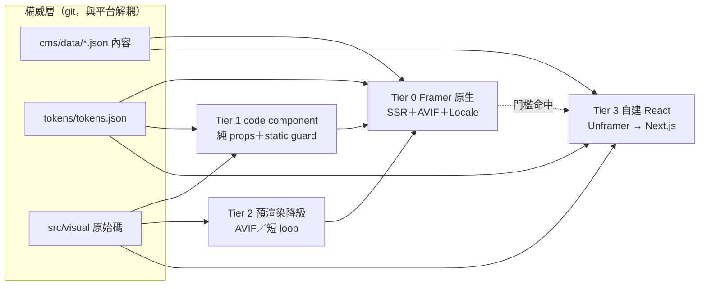
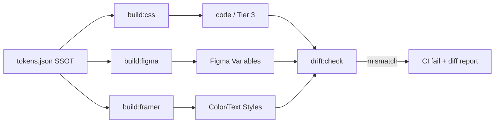

# system-architect 分析 — HQ Design 官網重置

**Session** WFS-hq-website-reset ｜ **主責** F-004、F-006 ｜ **協力** F-001／F-005／F-008
**前提** `guidance-specification.md` 為唯一權威，MUST NOT 推翻其 CONFIRMED 決策。
**證據標記** `[D]` 官方文件 ｜ `[L]` 本機檔案 ｜ `[V]` 需實機驗證（附步驟）｜ `[S]` 二手來源，須以一手文件覆核
**限制** Framer MCP **已連線並經本人直接呼叫覆核**（見 §1.4）；`[V]` 為尚未實測項，MUST 補測後才可當結論。
**MCP 身分（重要）** 端點為 `mcp.unframer.co`，即 **Unframer 社群專案**而非 Framer 第一方服務；22 工具中**無 localization 工具**。見 §9。

---

## 1. Framer 能力邊界調查（§6.3）

### 1.1 (a) Code component

| 項目 | 結論 | 等級 |
|---|---|---|
| npm 套件 | **高風險**。FAQ：npm 匯入屬 experimental，「Most packages typically don't work unless they were built specifically for Framer」；多重依賴有衝突；僅收 ES Module | `[D]` /developers/faq |
| Bundle 上限 | 有 `module too large` 發佈中斷機制，但**官方未公布數值** | `[D]` 機制／`[V]` 數值 |
| SSR | 「Server-side rendered React」；高流量頁發佈時 pre-render，其餘首次請求時 render 後全球快取 | `[D]` /help/…/hosting-infrastructure/ |
| React／Canvas 凍結 | MUST React 18 相容；用 `useIsStaticRenderer()`（優先）或 `RenderTarget.current()` | `[D]` /developers/components-{introduction,reference} |
| 讀 CMS | **不支援**：code component／override 不可存取 collection | `[D]` /help/…/issues-with-code-components-accessing-the-cms/ |

**架構後果**：code component MUST 純 props 驅動；`window`／WebGL 存取 MUST 置於 `useEffect` 並防護 SSR。
**`[V]` bundle 門檻**：`probe-bundle.tsx` 以字串常數階梯加壓 100/250/500/1000/2000KB 逐階發佈，記首次出現 `module too large` 的體積。**門檻**：單一 code file MUST < 實測值 60%。

### 1.2 (b) WebGL / canvas / Three.js

- **WebGL2 可行** `[D]`：marketplace 上架 shader 元件明載以 WebGL2 運行並內建 resolution scaling 與 frame capping。
- **Three.js / R3F 不建議** `[D]`：屬 FAQ 警示的「非為 Framer 設計的大型 library」；本專案四套 shader 為原生 WebGL2、零依賴（§2.3 `[L]`），**無引入必要**。
- **官方無 fps／GPU 預算數值**，故 **`[V]` 效能實測**：`mesh-shader.js` 改 code component → 發佈 staging → 桌機 DevTools Performance 錄 10 秒量 fps 中位數與 GPU frame time → iPhone(iOS Safari)＋Android 中階機遠端除錯量同指標並記 60 秒電池掉幅。**門檻**：桌機 fps ≥ 55、行動端 ≥ 30 且 frame time ≤ 12ms、電池掉幅 ≤ 1%。四套逐一測，`beams` 優先。

### 1.3 (c) Satoshi 字體 — **風險已解除**

**`[D]` 本人實測 `searchFonts("Satoshi")`**：Satoshi 為 **Framer 內建字體**，selector 前綴 `FS;`（Fontshare 官方整合），12 個變體（light／regular／medium／bold／black 各含 italic，另有 `FS;Satoshi-variable`）。用法 `<Text font="FS;Satoshi-regular">`。

- **MUST 直接用內建 `FS;Satoshi-*`，MUST NOT 上傳字檔**——**§12.3 前置條件可劃掉**（無需取得字檔、無需託管、無需轉檔）。
- ITF FFL v2.0（2026-08-17）§01 已允許自行託管（先前查到的禁止條文屬 v1.x），§02 禁止未經同意的 subsetting 與轉檔——但用內建字體時我方不觸及字檔，此義務不成立。**僅 Tier 3 自建時**需自行託管，屆時 MUST 用官方原檔且 MUST NOT subset 或轉檔。
- `font` 與 `inlineTextStyle` 互斥（`[D]` 工具契約）：套字體前 MUST 先移除節點的 `inlineTextStyle`。
- **中文字體亦已確認** `[D]`（本人實測 `searchFonts("Noto Sans TC")`）：**同為內建**，selector 前綴 `GF;`（Google Fonts），weight 100–900 共 9 級＋`GF;Noto Sans TC-variable-regular`。**故 F-001 的字體層全部解除封鎖，兩套字體皆無需上傳、無需授權處理。**

### 1.4 (d) CMS localization 與欄位層雙語

| 項目 | 結論 | 等級 |
|---|---|---|
| 模型 | Locales／Localization Groups／Localization Sources 三層 | `[D]` /developers/plugins-localization |
| 欄位層 per-locale | **支援，但只能經 Localization Plugin API**：CMS item 有 `valueByLocale`、`altByLocale`；另有 `framer.getLocales()`、`getLocalizationGroups()`、`setLocalizationData()` | `[D]` |
| 欄位上限與型別 | **最多 30 個 custom field**、id ≤ 64 字元 | `[D]` /developers/cms |
| `array` 型別 | **存在**。本人實測模板 `Articles.Gallery`／`Projects.Gallery` 皆 `type:"array"`；`getCMSItems` 取回值為 `[{id, fieldData:{<fieldId>:{type,value}}}, …]` | `[D]` **本人直呼 MCP 覆核** |
| **schema 二分法** | **`managedBy:"user"` 的 collection，MCP 無法新增或修改欄位**（契約原文「You cannot update or add fields to existing user-managed collections」）；而 `createCMSCollection` 的 plugin-managed collection **型別 enum 不含 `array`**。**故 array 與程式化 schema 管理無法並存於同一 collection** | `[D]` **關鍵約束** |
| 無刪 collection 工具／無 localization 工具 | 僅 `deleteCMSItem`；22 工具中無任何 localization——`valueByLocale` 只能由 Framer plugin runtime 呼叫 | `[D]` |
| 官方 Notion plugin | 支援自動／一鍵同步，涵蓋 rich text、images、references、galleries；**官方頁面完全未提 localization** | `[D]` /marketplace/plugins/notion/ ／`[V]` |
| 方案 | locale：Free 1／Basic 與 Pro 最多 20（超出每個 US$20）。CMS items 1,000／2,500／40,000。Pages Basic 30／Pro 150 | `[D]` /pricing |

**「15 個邏輯欄位」舊判斷已作廢**：array 可承載不定長度巢狀物件，可重複結構全部內縮，欄位數不再隨內容量成長。實算 projects 平攤 zh/en：語言雙份文字 6×2＝12＋語言中性 8（slug／year／size／category／heroImage／featured／sortOrder／en_reviewed）＋array 3（gallery／specs／process）＝**約 23 欄，餘裕 7**。

**路線重新評估（A／B 互換）**：
- **路線 B（現為建議）**：zh/en 平攤於**預設 locale 的一般欄位**，`upsertCMSItem` 可完整寫入，**全自動化可行**。代價：無原生 localized paths 與 hreflang，切換須自建。
- **路線 A（改為次選）**：走原生 locale，可得 hreflang；但 MUST 自建並上架 Framer plugin，且 en 值無法由 git 自動推送。

**`[V]` 最高優先待驗**：**array 能否容納「多個」不同型別的巢狀欄位？** 模板實例僅一個 image 巢狀欄位（`ucye9moEF`），官方文件亦稱 array「僅支援單一 image field」，但工具契約註解為複數「nested field data」——兩者矛盾。**測法**：於 Framer UI 對某 array 欄位加 `altZh`(string)／`altEn`(string)／`role`(enum)，以 `getCMSItems` 讀回驗型別，再以 `upsertCMSItem` 帶 `type:"array"` 寫回。**門檻**：三者皆可讀可寫。**不通過則** specs 與 process MUST 改獨立 collection ＋ `multiCollectionReference`（MCP 可建），欄位數仍約 23。

### 1.5 (e) 資產、圖片最佳化與 CDN

`[D]`：依最長邊產 **512／1,024／2,048／4,096px** 四階、**永不 upscale**；主格式 **AVIF q80** 退回 **WebP q90**；自動產 `srcset`＋`sizes`；約 1,000px 以下加 `lazy`。影片**不壓縮、以原解析度提供**。上傳 Free 5MB；頻寬 1／50／100GB；static files 僅 Pro。
**決定性事實**：最大變體 4,096px 且不 upscale，8688px 母檔超出部分全數浪費（管線見 §6）。**ADR-001 MUST 修正**：其記載 Basic，但 Basic 無 static files 且僅 30 pages／50GB——**SHOULD 升 Pro**。

---

## 2. 既有 React 元件與 shader 遷移評估

### 2.1 元件事實 `[L]`（全掃 9 檔 `.jsx`）

- **零 `import`／`export`**：靠 Babel inline 轉譯掛 `window.X = X`（`Hero.jsx:93`、`InnerViews.jsx:322-324`），`TopNav.jsx:2` 解構全域 `React`。
- **零外部套件**：`framer-motion`／`gsap`／`three`／`lottie`／`fetch(` 皆 0 命中。**此為最有利事實**，正好避開 npm experimental 雷區。
- 樣式靠 **13 個 CSS var**＋大量 inline style（`InnerViews.jsx` 74 個）；`kit.css:1` `@import` `colors_and_type.css`（約 110 個 custom property）。導覽以 `setRoute` prop 由 `index.html:107-123` 頂層 `useState` 串下，**非真實路由**；內容全硬編碼，中文僅為 `cjk-gloss` 註腳，**非欄位層雙語**。

### 2.2 分層建議

| 層 | 元件 | 工時 |
|---|---|---|
| **不搬**（Framer 原生 nav／footer／form／collection list 已覆蓋且自帶 SSR） | TopNav、ContactCTA/Footer、ProjectsView/AboutView/ContactView | — |
| **直接搬**（無狀態、無 `window`；加 `export default`＋`addPropertyControls`） | TrustedBy、WhyHQ | 各 0.5 日 |
| **改寫**（MUST 以 Link control 取代 `setRoute`；硬編碼陣列改 property control 或綁 CMS；佔位塊換真實照片） | Hero、Services、FeaturedProjects、ForeignHQSection | 各 1–1.5 日 |
| **視覺重做**（§1.1＋§4.3 要求重建；9 檔價值在內容值與 token 用法） | 版面骨架 | — |

前置：13 個 CSS var MUST 對映 Framer Color/Text Styles。合計 **5–7 人日**（不含重做）。

### 2.3 Shader 事實 `[L]`

四檔皆 IIFE、原生 **WebGL2（`#version 300 es`）**、零依賴、DPR 上限鎖 2、用 `ResizeObserver`，以 `querySelectorAll("canvas[data-*-shader]")` 掛載。

| 檔案 | 行數 | 離屏暫停 | reduced-motion | WebGL1 fallback | 風險 |
|---|---|---|---|---|---|
| mesh | 169 | ✅ IO | ❌ | ❌ | 低（無迴圈） |
| grid-scan | 234 | ✅ IO | ❌ | ❌ | 中（14 uniform） |
| pattern | 226 | **❌ 無** | ❌ | ❌ | 中高（常駐耗電） |
| beams | 256 | ✅ IO | ❌ | ❌ | **最高**（fragment 含 `for(int i=0;i<4;i++)` fbm） |

**三項 MUST 修補**：(1) 四檔全加 `prefers-reduced-motion` 檢查（現 0/4），命中時只畫一幀後停 rAF；(2) `pattern-shader.js` 補 IntersectionObserver；(3) 加 `getContext("webgl2")` 回 null 的降級路徑，並以 `useIsStaticRenderer()` 凍結 canvas／export。
**分層**：`mesh` 直接搬；`grid-scan`、`pattern` 修補並通過 §1.2 門檻後有條件搬（為「參數化」敘事的天然視覺語言）；**`beams` 行動端一律預渲染**，僅桌機即時。

---

## 3. 逃生路徑（§6.3.5）



三個 SSOT MUST 留在 git（影像另存 NAS，§6），故逃生非重做而是換渲染層，**內容重抽風險 0**。
**schema 供裝依賴（`[D]`）**：含 `array` 的 collection **只能在 Framer UI 手動建**，建立後 MCP 永遠無法改其 schema 且無刪除工具。故上線前 MUST 由 Codex 在 UI 一次性建妥完整 schema，之後 MCP 只寫 item 層；schema 變更 MUST 視為人工且不可自動回滾。

| 觸發器（可判定） | 門檻 | 動作 | 切換成本 |
|---|---|---|---|
| T-1 shader | 行動端 fps < 30 或 60 秒電池掉幅 > 1% | 行動端降 Tier 2 | 0.5–1 日／shader（算圖交 `hqws`） |
| T-2 bundle | 發佈出現 `module too large` | 拆分，仍命中則降 Tier 2 | 0.5 日 |
| T-3 雙語 SEO | 選路線 B 後，en 頁面無法取得 localized path 與 hreflang，且自建切換的 SEO 檢測不通過 | 雙語 SEO 關鍵頁升 Tier 3 | 3–5 日／頁 |
| T-4 欄位 | 單一 collection 邏輯欄位需求 > 30（實算約 23，餘裕 7） | 拆 relation collection（MCP 可建）；仍超則 Tier 3 | 1–2 日 |
| T-5 MCP 供應 | `mcp.unframer.co` 停止服務、改為付費牆或 API 破壞性變更 | 退回 Framer UI 手動維護；逃生路徑同時失效，MUST 立即改自建匯出 | 5–10 日 |
| T-6 效能 | 資產管線與 shader 降級後仍 Lighthouse mobile < 70 或 LCP > 2.5s | 首頁升 Tier 3 | 3–5 日 |
| T-7 額度 | 頁數超上限或月頻寬達 80% | 先升 Pro，仍不足則 Tier 3 | 費用決定 |
| 全站 Tier 3 | — | — | 20–30 日 |

**單點依賴警示（`[D]` 工具契約）**：**主線自動化**（`mcp.unframer.co` 的 CMS／code／style 工具）與**逃生路徑**（`unframer` CLI）**同屬 Unframer 一個第三方專案**，且 `exportReactComponents` 說明提及需沿用既有**訂閱**——兩者會同時失效。**緩解 MUST**：(i) Phase 3 做本地 Next.js SSR spike 並 pin CLI 版號；(ii) 定期 `getProjectXml` 匯出結構存 git 作離線備份；(iii) 確認訂閱歸屬。

---

## 4. 代理人分工（§6.4）

**判斷準則**：任務是否**必須看見或操作 GUI 視窗**？是 → Codex；否 → Claude Code。

| 任務 | 歸屬 |
|---|---|
| repo 讀寫、schema 設計、token 管線、腳本、git、`ssh hqws` 批次算圖；Framer CMS item／code file／style 的 MCP 操作；Figma 檔案與 variable 讀取 | Claude Code |
| **在 Framer UI 建立含 `array` 巢狀欄位的 CMS schema、刪除實驗性 collection** | **Codex（唯一路徑——MCP 無此能力）** |
| Framer template 瀏覽／試套；Figma desktop 目視與匯出；Lighthouse／DevTools 實機量測 | Codex |
| **NAS 選片（去重後約 391 張母體）、品質判斷、案例歸屬消歧** | **Codex**（量最大的單一 GUI 任務） |
| Higgsfield／flora.ai 生成 | Codex 主，批次化由 Claude Code 走 MCP 輔助 |

**交接格式**：一律經檔案，MUST NOT 憑口述。
```
.handoff/inbox/codex/<NNN>-<slug>.md    ← Claude Code 寫
.handoff/inbox/claude/<NNN>-<slug>.md   ← Codex 寫
.handoff/done/  ·  .handoff/artifacts/<NNN>/  ·  .locks/<資源>.lock
```
front matter MUST 含 `id｜from｜to｜created｜status｜resource｜acceptance｜evidence`；**`done` MUST 附 `evidence`**。
**NAS 選片交接**：Codex MUST 以 `.handoff/artifacts/<NNN>/selection.csv` 回交（`source_path,case_slug,role,rank,keep,note`），`source_path` MUST 為絕對路徑供 `sha256` 回溯；Claude Code 讀入後才縮放與 `assets:probe`，**MUST NOT 自行選片**。

**衝突避免**：
- 同一 Framer 專案 MUST 單一寫入者，取得 `.locks/framer-project.lock`（owner／UTC 時間／task id）才可寫；逾 60 分鐘視為過期，**過期鎖 MUST 由人確認後才可清除，MUST NOT 自動搶鎖**。
- Codex 產出 MUST 只寫 `.handoff/artifacts/`，MUST NOT 直接改 `cms/`、`tokens/`、`src/`；Claude Code 走 feature branch。
- Framer 為即時共編、鎖檔對真人無效：寫入前 MUST 存 `getProjectXml()` 快照並於寫入後比對（同 §8.5）。

**適合交給 Codex 的任務**：① 開啟 Framer MCP plugin 並截圖回報；② 挑 3–5 個 template 候選，各截圖首頁／列表／內頁並列出其 CMS collection 結構；③ 取得 ITF FFL 全文 PDF；④ 授權確認後上傳 Satoshi WOFF2；⑤ Figma desktop 開 `3viWBkQGZAEQnJntysBxZ7` 的 P02（`590:276`）逐區截圖（§4.4 已驗證整頁 metadata 失敗）；⑥ NAS 選片；⑦ staging 行動端量測＋Lighthouse mobile；⑧ 發佈前 375／768／1440 三視埠巡檢。

---

## 5. Design Token 3.0 三端同步（§9）

**SSOT** `tokens/tokens.json`，採 W3C DTCG（`$value`／`$type`），分 primitive（沿用 `colors_and_type.css` 既有 10 階色票與 `#D64518`）與 semantic 兩層；§4.1 要求重建的層級／間距／字型階／動態／語意層落在 semantic 與 `space.*`／`font.*`／`motion.*` 群組。



**Framer 端形式**：Color／Text Style（MCP `manageColorStyle`／`manageTextStyle`，已確認存在）為推薦路徑；code component 內 CSS custom property 可行；**無 token 匯入端點**；間距／動態能否成為全域變數 `[V]` 需以 `getProjectXml` 檢視。
**MUST 告知使用者的天花板**：色彩與字體可自動同步；**間距與動態只能「Framer 端人工遵守、程式端以 CSS var 強制」**，MUST NOT 承諾三端全自動一致。
**觸發與漂移**：`tokens.json` 變更時 pre-commit 跑 `build:css`；`build:figma`／`build:framer` 人工觸發。CI 每日以 Figma `get_variable_defs` 與 Framer `getProjectXml` 回讀比對，不一致 MUST 使 CI 失敗且 MUST NOT 自動修正（否則「哪端是權威」失效）。舊 `DESIGN.md` v1.0 與 `colors_and_type.css` v2.0 MUST 標 deprecated 唯讀，上線版 `style.css` MUST 廢棄。

---

## 6. 資產管線（§7.5，規模前提已修正）

**待處理資產有兩來源，非僅 §7.5 所載的 525MB** `[L]`：
- `hq-design-website/assets/images/`：**525MB／347 JPG**，86% 集中於 38 個大檔，**348 檔已 commit 進 git（`size-pack: 512.89 MiB`）**；含 174 張無 EXIF 的渲染圖。
- `…/作品集-更新版`：**7.3GB／898 JPEG，但僅 391 個唯一 basename**（本人已核）——約 **56% 為同影像的多尺寸副本**（最大案例目錄「154 張」實為 77 張唯一 ×2 尺寸；另有一 `照片` 目錄本機 0 張影像）。739 張含 EXIF（82%），Canon 646／SONY 31／Panasonic 25／DJI 5，**190 張 8688×5792**——**真實專業商業攝影，網站主力來源**。

**尺寸階**：hero **2560**（2× retina 覆蓋 1280 版面，**MUST NOT 超過**）／gallery **1600**／縮圖 **800**／OG **1200×630**（固定裁切，MUST 單獨產出）。

**儲存策略（建議）**：
7.3GB 原始檔 **MUST NOT 進 git**、**SHOULD NOT 用 Git LFS**（配額成本高、clone 仍需拉取）；NAS／Dropbox 為 **archive of record**，`assets/manifest.json` 每筆 MUST 記 `source_path`＋`sha256`＋`pixel_w/h` 使衍生版可回溯。**交付版亦 SHOULD NOT 進 git**：直接上傳 Framer，NAS 留 `deliverables/` 供 Tier 3 取用；git 內 `assets/` 僅留 OG image 與必要靜態檔，**MUST ≤ 20MB**。既有 513MB pack SHOULD 以 `git filter-repo` 縮減（**破壞性，MUST 經使用者確認**）。

**多版本去重**：另有 2000×1333（223）／1000×667（94）／700×467（108）衍生版。**建議以 8688px 原始重產完整尺寸階**，既有衍生版僅作缺漏 fallback——其階數與本管線及 Framer 四階皆不吻合且壓縮品質不明；190 張批次縮放在 `hqws` 為分鐘級。

**自動來源判定（MUST）**：新增 `assets:probe`，解析 JPEG segment（`Exif\x00\x00`、相機品牌、長寬比）預填 `provenance`。**MUST NOT 單方面決定上線**：帶 EXIF → 預填 `photo` 待人工確認；無 EXIF → 標 `generative` 並 fail-closed（§8.4）。

**格式**：走 Framer 者上游 SHOULD 只做「降尺寸＋JPEG q85」，轉檔交 Framer（其主格式已是 AVIF q80，上游先出 AVIF 反致二次有損）；**僅 Tier 3 需自建 AVIF q55–65**。**命名** `<case-slug>/<角色>-<序號>-<長邊>.jpg`，角色 `hero｜interior｜detail｜plan｜render｜aerial｜process`。

**修正後量級（以 391 唯一影像重算）**：扣除圖紙、重複視角與品質不足者，估上網 **200–300 張**（33 案例 × 6–10），2560px／q85 約 400–700KB → **交付總量 90–190MB**（先前 150–250MB 以 898 為基數而高估）。**逐頁門檻**：首頁 ≤ 1.2MB、案例頁 ≤ 2.0MB、單檔 ≤ 800KB。
**去重前置（MUST）**：選片前 MUST 先以 basename 分組、每組留最大尺寸者，否則 Codex 會對同一張照片重複評選。
**影片** `[D]`：**MUST NOT 直接放 Framer**（不壓縮）；loop MUST < 5MB，長片走 YouTube／Vimeo。

## 7. 錯誤處理與可觀測性

| 失敗模式 | 偵測 | 回復 |
|---|---|---|
| **Notion rate limit**（3 req/s，超限回 429；單次上限 1000 blocks／500KB，rich text 2000 字元、陣列 100 元素 `[D]`） | 攔 429 | MUST 限速 ≤ 2.5 req/s＋指數退避（≤5 次）＋可續跑 checkpoint；**長度與陣列上限 MUST 於送出前驗證** |
| **Framer 發佈失敗**（含 module too large） | 以 `getProjectWebsiteUrl` 取線上頁比對關鍵字串 | MUST 保留上一版可用發佈；失敗的 collection／page 名稱 MUST 記入 `.handoff/artifacts/`，命中即走 T-2 |
| **Unframer 快照失敗** | CI exit ≠ 0 | MUST pin 版號、保留最後成功快照；**MUST NOT 阻斷 Framer 主線發佈**（快照是逃生準備，非依賴） |
| **MCP 斷線／Figma 回應超限** | 工具回錯 | 斷線 MUST 停止並產生 Codex 交接單，**MUST NOT 以推測值續行**；超限 MUST 改分層讀取或 `get_screenshot` |
| **Token 漂移** | 每日 `drift:check` | CI 失敗＋差異報告，MUST 人工裁決 |
| **額度逼近／`assets:probe` 誤判** | 每週查用量；抽樣覆核 | 額度達 80% MUST 通知使用者（升級 MUST 由其確認）；無 EXIF 一律標 `generative`（fail-closed），MUST 由人確認才可改 `photo` |

**最小可觀測集**：發佈寫 `logs/publish-<ts>.json`（版本、發佈者、token hash、manifest hash、Lighthouse）；同步寫 `logs/notion-sync-<ts>.json`（成功／失敗筆數、429 次數、耗時）。

---

## 8. 邊界情境

1. **欄位需求超過 30**：實算約 23 欄有餘裕，但若 array 無法容納多巢狀欄位（§1.4 `[V]`），specs 與 process MUST 改獨立 collection ＋ `multiCollectionReference`（ADR-001 已預見「需拆 relation DB」）。
2. **shader 在 iOS Safari 低階機**：`getContext("webgl2")` 回 null（舊機／省電）→ 現況四檔失效且無替代畫面。MUST 三段降級：WebGL2 → 靜態預渲染圖 → CSS 漸層；`prefers-reduced-motion` 直接進第二段。
3. **雙語只填一半**（ux-expert 已驗證 21/21 案例 `nameEn` 為空）：Auto Translate 可能填機器譯文。**紅線**：機構型客戶與政府標案文案 MUST NOT 以未審譯文上線。MUST 加 `en_reviewed` boolean，為 false 者 MUST 排除顯示。
4. **生成圖來源欄位為空**：`validate-schemas.ts` MUST 視空 `provenance` 為失敗（非警告）；渲染層 MUST 對缺來源影像**不顯示**（fail-closed），MUST NOT 把未標註預設為實拍（§8.2 紅線）。13 個案例現為 100% 渲染圖，此為常態。
5. **Framer 被他人同時編輯**：鎖檔對真人無效。寫入前 MUST 存 `getProjectXml` 快照並於寫入後比對，差異超預期即停止待確認。
6. **同一案例在 NAS 有多目錄**（POPEYES 兩、起家雞三、中保總部同址疑重複）：**MUST 由人裁決併案**（含於 Codex 選片），MUST NOT 由檔名自動歸併。
7. **schema 建錯無法回滾**：無 `deleteCMSCollection`，實驗性 collection 只能在 UI 手刪。故探測性 schema 操作 MUST 由 Codex 在 UI 執行並自行清理，MUST NOT 由 MCP 大量建 collection 試錯。

---

## 9. 未解事項與建議

**已解除前置條件**：§12.1 MCP 連線、§12.3 Satoshi 字檔與授權（內建 `FS;Satoshi-*`）。

| 項次 | 建議 | 需使用者決定 |
|---|---|---|
| **雙語路線（§5.3）** | **選路線 B**（平攤於預設 locale，全自動化）並自建切換，代價是無原生 localized paths 與 hreflang；若雙語 SEO 為硬需求則改 A，但須自建 plugin 且 en 值無法自 git 推送 | **是（最高優先）** |
| 中英主從 | **zh-TW 為預設 locale、en 為次**（DESIGN.md §0.6） | **是** |
| Unframer 訂閱 | `exportReactComponents` 需沿用既有訂閱，MUST 確認帳號歸屬 | **是**（費用） |
| Framer 方案 | **升 Pro**（Basic 僅 30 pages／50GB／無 static files；Pro 150／100GB／5 個） | **是**（費用） |
| Weavy 職責（§8.3） | **本次不使用**（與 flora.ai 重疊） | **是** |
| repo 歸屬（§12.2）／shader 門檻 | 前者釐清前停止 push 與 CI；後者建議桌機 fps ≥ 55、行動端 ≥ 30、電池 ≤ 1% | **是** |
| git 瘦身與影像儲存 | `git filter-repo` 移除 513MB 歷史；原始檔與交付檔皆不進 git，NAS 為 archive of record（§6） | **是**（破壞性） |
| 其他 | array 多巢狀欄位、Noto Sans TC 是否內建、bundle 門檻依 §1 實測取得；生成圖標註文案屬 product-manager 職權 | 否 |

**最高風險（已更新）**：**Unframer 單點集中**。舊判斷（雙語撞 30 欄上限）**已作廢**——array 經實測存在，實算約 23 欄有餘裕。新最高風險為主線自動化與逃生路徑同屬一個第三方專案且部分需訂閱，會同時失效，正好侵蝕讓「押注 Framer」可被接受的安全網。緩解 MUST 於 Phase 3 完成（§3）。
**次高（forced trade-off，非平台風險）**：雙語的「自動化維護」與「原生 SEO」無法同時取得，需使用者裁決。
