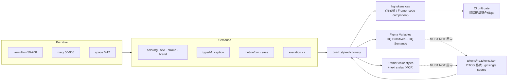

# ui-designer 分析 — HQ Design 官網重置

**Session**: WFS-hq-website-reset ｜ **角色**: ui-designer ｜ **日期**: 2026-09-03
**唯一權威前提**: `.brainstorming/guidance-specification.md`（不推翻任何 CONFIRMED 決策）
**主責**: F-001 `design-token-3-0`、F-002 視覺方案 ｜ **協力**: F-004、F-007

---

## 1. 三套 token 的實際差異比對（實際讀檔）

**讀取來源**
- **A** `HQ Design - Design System/Claude Design/DESIGN.md`（548 行）
- **B** `HQ Design - Design System/colors_and_type.css`（378 行；`Claude Design/_ds_manifest.json` 索引為 135 個 token）
- **C** `hq-design-website/assets/css/style.css`（911 行）
- **D（規格未列，本次新發現）** Figma team library `HQ Design` 的 variable collections（見 §2）

| 項目 | A · DESIGN.md v1.0 | B · colors_and_type.css v2.0 | C · 上線版 style.css | 判定 |
|---|---|---|---|---|
| 品牌主色 | `#D64518` | `--vermillion-400: #D64518` | `--accent: #C8410F` | **實作漂移**（色相偏移，非決策） |
| 深色 | Navy 700 `#1F2A36` | `--navy-700 #1F2A36`，但 `--hq-navy` 指向 `--navy-600 #2A3744` | `--brand: #1C2B3A` | **實作漂移**＋B 內部別名不一致 |
| 主背景 | White；「米白不超過 5%，不作數位主背景」(§3.5) | `--paper #FFFFFF`／`--bg-sunken #F1F5F9`（冷） | `--bg: #F8F8F6`（暖灰） | **實作漂移**（違反 A §3.5） |
| 色階結構 | 6 核心色 + 6 階 vermillion + 9 階 navy | 8 階 vermillion + 10 階 navy + 語意層 + 2 個 surface theme | 10 個扁平變數，無色階、無語意層 | B **有意演進**；C 漂移 |
| 英文字體 | Neue Haas Grotesk（建議）／fallback Hanken Grotesk | Aeonik 400/700（本機有 ttf） | Inter 300–800（Google CDN） | C 漂移；B 有意演進；三者皆將被 Satoshi 取代 |
| 中文字體 | 信黑體，fallback Noto Sans TC | Noto Sans TC 300–700 | Noto Sans TC 300–700 | **三套唯一一致項** |
| Mono | IBM Plex Mono；「mono 是品牌訊號」(§4.1) | Geist Mono | **無 mono 定義** | C 漂移且**丟失品牌訊號**；A/B 選字不同需裁決 |
| 字型階 | H1 64/1.05/-1%；H2 40/1.1；H3 28/1.3；Body 16/1.6；Caption 13/1.4/+2% | 15 階 `--fs-xs…--fs-display-2xl`；H1 `clamp(56,8vw,120)` lh **1.0** ls -0.025em | H1 `clamp(44,6vw,80)`，全硬編碼 | B **有意演進**（deck-first 1920、100% lh），但與 A 的絕對 px 表**不相容** → §3 裁決 |
| 間距 | 8px 節奏（8/16/24/32/48/64） | 4px base、13 階（4→256）＋`--section-y: clamp(64,9vw,144)` | **無 spacing token**，`.section { padding: 96px 0 }` 等硬編碼 | A→B **有意演進**（4px base 相容 8px 節奏）；C 漂移 |
| 版面網格 | 12/8/4 欄、gutter 24 | `--container 1320`／`--container-wide 1480`／`--gutter 24` | `.container { max-width: 1160; padding: 0 32px }` | **實作漂移**（1160 ≠ 1320） |
| 圓角 | 印記 9.8%；icon「圓角半徑 0（或極小）」 | `--r-0…--r-5` + pill，`--r-3: 5px` 註明「照 Danelec」 | `--radius: 4px` 單值 | B 引入**外來慣例**（Danelec 5px），非 HQ DNA |
| 陰影 | 未定義；logo 禁陰影 | 4 階 + `--shadow-deck`（Danelec 原值） | `--shadow`、`--shadow-lg`＋hover `translateY(-1px)` | B 帶外來值；C 的 hover 位移違反 A §9「冷靜」語氣 |
| 動態 | **未定義** | `--dur-fast 140/base 220/slow 420`；`--ease-out cubic-bezier(.2,.6,.2,1)`、`--ease-in-out (.4,0,.2,1)`（`preview/motion.html` 已驗證同值） | `--transition: 0.22s ease` 單值 | B **有意演進**；C 的 easing 為瀏覽器 `ease`，非品牌曲線 |
| 層級 / z-index | 無 | 無 | `.nav { z-index: 100 }` 硬編碼 | **三套皆缺**；Token 3.0 MUST 新建 |
| 語意層 | 無 | 有（`--bg`/`--fg1..3`/`--border`/`--success`…） | 無 | B **有意演進** |
| 斜向角度 | 僅 0/30/60/90/120/150（§5.1.6「不使用其他角度」） | 未定義 | 未定義 | 見下方缺陷 4 |

**四項可驗證的實作缺陷（非判斷，皆已實測）**

1. `Claude Design/styles.css` 第 12 行 `@import url("./colors_and_type.css")`，但 `ls Claude Design/colors_and_type.css` → **No such file**（該檔位於上一層 `HQ Design - Design System/`）。`_ds_manifest.json` 的 `globalCssPaths` 與全部 135 個 token 的 `definedIn` 都指向該不存在路徑 → **以 `styles.css` 為入口的消費端，token 層實際載入失敗**。對照：`ui_kits/website/kit.css` 用 `../../colors_and_type.css`（正確）；`preview/*.html` 有一支用 `../`（正確）、一支用 `./`（錯誤）。
2. `ui_kits/website/kit.css` 自帶硬編碼漂移：`.eyebrow` letter-spacing `0.16em`（token 為 `--ls-eyebrow: 0.14em`）；`.btn` `border-radius: 4px`（未用 `var(--r-2)`）；`.section-head h2` `font-weight: 400`（B 的 `h2` 為 `--fw-bold` 700）；`.num-display` letter-spacing `-0.03em`（token 為 `-0.025em`）。
3. `ui_kits/website/components/Hero.jsx` 使用 `fontStyle: "italic"`，但 `Claude Design/fonts/` 僅 `Aeonik-Regular.ttf`／`Aeonik-Bold.ttf`，**無斜體字檔** → 瀏覽器合成假斜體。**此缺陷於遷移 Satoshi 後自然消滅**：`Satoshi_Complete/Fonts/WEB/fonts/` 含 10 個真 Italic 靜態檔（Light／Regular／Medium／Bold／Black × Italic）＋`Satoshi-VariableItalic`。同檔另標示「31 Years」，與簡介 PDF P01「30+ / EST. 1995」不一致（見 §9）。
4. `Claude Design/brand-guide/pattern-shader.js` 第 10、183 行預設 `data-angle = -18`；全 `Claude Design/` 目錄實際使用值為 `data-angle="-18"`、`data-rotation="-20"`、`data-rotation="-30"` → **全部落在 HQ 角度族之外，違反 DESIGN.md §5.1.6**。

---

## 2. Figma 視覺元素盤點

**方法與成敗（逐項回報）**
- **P02 `590:276`**：`get_screenshot` **成功**（原始畫布 49,898 × 47,798 px）。`get_metadata` 整頁**失敗**，失敗模式為 MCP **傳輸層截斷**（`Failed to parse SSE message … EOF while parsing a string at line 1 column 48436`）。此為硬失敗，**取不到任何子節點 id**，故規格建議的「分層讀取」在缺 id 下不可執行。備援嘗試 framelink `get_figma_data`（depth=2）→ **403 `Token expired`**。
- **P01 `0:1`**：`get_metadata` **成功**（783 節點；輸出超單次上限但已落檔於 `~/.claude/projects/.../tool-results/mcp-…get_metadata-1788422711582.txt`）。
- **P03 `112:3034`**：`get_metadata` **成功**。
- **`get_variable_defs`**：對 page id（`0:1`／`590:276`）皆回 `You currently have nothing selected`；對目前選取節點 `925:103707` 回 `{}`（該節點未綁定 variable）。→ **該工具只對「Figma 內當前選取」有效，無法用 nodeId 遠端取值。**

**新視覺元素（P02，來自截圖）**
4 條完整長捲網頁 mock（各約 1,780 px 寬），皆為白底＋**滿版橘紅 header 帶 60° 斜線 hatch**；4 張 `A-001` CAD 圖框 title block；多組**等角／軸測空間線圖**（正是 DESIGN.md §6.2「wireframe / isometric / floor-plan」語言的成品）；一套 "Design Portfolio" 模板 deck。經 `get_metadata(925:103707)` 確認，該 deck 內文為外部模板殘留（"Website Redesign for DEF Organization"），**非 HQ 內容**。P01 亦發現 Danelec 原文殘留（node `555:274`，"maritime industry"）→ 模板未清稿。

**與本機資產的關係**
- P01 `251:981` `Logo - Wordmark` 為**已建好的元件集**，10 個變體：`Color = Default | Mono-Black | Mono-White | Brand-Orange` × `Background = Transparent | Light | Dark`，另有 `251:982` `Clear Space`。→ **DESIGN.md §2.3「★核心交付」的 wordmark 已在 Figma 完成，本機 `assets/HQ-logo-wordmark.svg` 為其單一輸出**。
- P01 含 `shader` 框／實例（`238:942`、`238:946`、`247:3250`）與 `pattern` 框（`198:1794`，hidden）→ 與 `Claude Design/brand-guide/*-shader.js` 為同一視覺語言的兩種載體。
- P03 為 logo 構成頁：`guide_line` + `Grid`（100×100 群組、內部 20 單位細格），logo 向量筆畫寬 **60 單位**、字構佔 **860 × 660**。→ **實測「筆畫 = 3 個 20 單位格」，與 DESIGN.md §2.2「12×12 方格、線寬 = 1 格」為兩套不同構成數據**。

**Figma 已有 design tokens（規格未載，關鍵）**
`get_libraries` 顯示本檔已訂閱 team library **`HQ Design`**。`search_design_system` 回傳兩個 variable collection：
- **`HQ Primitives`**：`color/brand-gradient/colorA`–`colorE`
- **`HQ Semantic`**：`color/bg/page`、`bg/primary`、`bg/secondary`、`surface/sunken`、`text/primary`、`text/tertiary`、`brand/hover`、`brand/muted`、`brand/subtle`、`stroke/card`、`stroke/input`、`stroke/focus`、`status/info`、`gradient/cool`
- 另有 library **`HQ - Buisness Card`** 的 `Skywalk` collection：`Brand Color/Punch|Cognac|Tide|Ebb|Kabul|Pampas|Westar|Dorado|Swirl|Trout 8%|Gray|Black|White`（命名體系與 HQ 品牌語彙完全無關；library 名稱拼字錯誤）。
- 以 `query: "spacing scale"` 限縮 `HQ Design` library → `{"variables": []}`：**Figma 端只有色彩 variables，無 spacing／radius／type／motion variables。**

**對 Token 3.0 的影響**
規格 §4.1 假設要收斂三套；實際為**五套**（＋Figma `HQ Semantic`、＋`Skywalk` 名片色）。且 Figma 的語意命名法 `category/role/variant` 與 B 的 `--fg1/--bg/--border` 為兩套不同體系。**建議以 Figma 的斜線命名為權威**——它是 Figma variables 的原生格式，可 1:1 映射 CSS 自訂屬性與 Framer color styles，三端無需翻譯層。

---

## 3. Design Token 3.0 提案

三層架構：**Primitive → Semantic → Component**。命名 `hq.<tier>.<category>.<role>[.<state>]`，CSS 前綴 `--hq-`。Primitive MUST NOT 被元件直接引用。



```css
:root{
  /* ---- Primitive（不得被元件直接引用）---- */
  --hq-p-vermillion-050:#FDEDE5; --hq-p-vermillion-100:#FACDB6;
  --hq-p-vermillion-300:#ED6D45; --hq-p-vermillion-400:#D64518; /* 唯一英雄色 */
  --hq-p-vermillion-500:#BA3A12; --hq-p-vermillion-600:#8E2A09; --hq-p-vermillion-700:#6B1E05;
  --hq-p-navy-050:#F1F5F9; --hq-p-navy-100:#E1E8F0; --hq-p-navy-300:#C0C8D2;
  --hq-p-navy-400:#6B7785; --hq-p-navy-500:#3F4E60; --hq-p-navy-700:#1F2A36;
  --hq-p-navy-800:#131B25; --hq-p-navy-900:#0A1118; --hq-p-white:#FFFFFF;

  /* ---- Semantic · 色彩 ---- */
  --hq-color-bg-page:var(--hq-p-white);
  --hq-color-bg-sunken:var(--hq-p-navy-050);      /* 取代上線版暖白 #F8F8F6 */
  --hq-color-bg-inverse:var(--hq-p-navy-700);
  --hq-color-bg-immersive:var(--hq-p-navy-900);
  --hq-color-text-primary:var(--hq-p-navy-700);
  --hq-color-text-secondary:var(--hq-p-navy-500);
  --hq-color-text-tertiary:var(--hq-p-navy-400);
  --hq-color-text-inverse:var(--hq-p-white);
  --hq-color-stroke-hairline:var(--hq-p-navy-100);
  --hq-color-stroke-ink:var(--hq-p-navy-700);
  --hq-color-stroke-focus:var(--hq-p-vermillion-400);
  --hq-color-brand-base:var(--hq-p-vermillion-400);
  --hq-color-brand-hover:var(--hq-p-vermillion-500);
  --hq-color-brand-pressed:var(--hq-p-vermillion-600);
  --hq-color-brand-subtle:var(--hq-p-vermillion-050);
  --hq-ratio-brand-max:0.10;   /* 稽核用：單頁橘紅像素上限，對映 DESIGN.md §3.5 */

  /* ---- Semantic · 字型（雙軌：Latin / CJK 分離）---- */
  --hq-font-en:"Satoshi Variable","Satoshi",system-ui,sans-serif;
  --hq-font-cjk:"Noto Sans TC","PingFang TC","Microsoft JhengHei",sans-serif;
  --hq-font-sans:var(--hq-font-en),var(--hq-font-cjk);  /* Latin 走 Satoshi，CJK 逐字回退 */
  --hq-font-mono:"Geist Mono","SF Mono",Menlo,monospace;
  --hq-num-tabular:"tnum" 1,"lnum" 1;                   /* Satoshi 提供 tabular lining */
  /* 字重：變數字體 300-900 連續；靜態檔僅 300/400/500/700/900（無 600） */
  --hq-fw-body:400; --hq-fw-medium:500; --hq-fw-semibold:600; /* 600 需變數字體 */
  --hq-fw-bold:700; --hq-fw-black:900;
  --hq-type-h1-weight:var(--hq-fw-bold);      /* DESIGN.md §4.2 = 700 */
  --hq-type-h2-weight:var(--hq-fw-semibold);  /* §4.2 = 600；靜態檔時退回 500 */
  --hq-type-h1-size:clamp(56px,9vw,144px);
  --hq-type-h1-lh-en:1.02;   --hq-type-h1-lh-cjk:1.24;
  --hq-type-h1-ls-en:-0.025em; --hq-type-h1-ls-cjk:0;
  --hq-type-h2-size:clamp(40px,5vw,72px); --hq-type-h2-lh-en:1.06; --hq-type-h2-lh-cjk:1.28;
  --hq-type-h3-size:clamp(24px,2.4vw,32px);--hq-type-h3-lh-cjk:1.35;
  --hq-type-body-size:18px;  --hq-type-body-lh-en:1.55; --hq-type-body-lh-cjk:1.75;
  --hq-type-caption-size:13px;--hq-type-caption-ls:0.02em;
  --hq-type-eyebrow-ls:0.14em;
  --hq-cjk-size-adjust:0.94; /* CJK 於混排中光學縮放，補 Satoshi 偏高 x-height */
  --hq-cjk-ls:0.02em;
  --hq-latin-gap:0.25em;     /* DESIGN.md §4.3 四分空 */

  /* ---- Semantic · 間距與網格（4px base，8px 節奏）---- */
  --hq-space-1:4px;  --hq-space-2:8px;  --hq-space-3:12px; --hq-space-4:16px;
  --hq-space-5:24px; --hq-space-6:32px; --hq-space-7:48px; --hq-space-8:64px;
  --hq-space-9:96px; --hq-space-10:128px; --hq-space-11:192px; --hq-space-12:256px;
  --hq-container:1320px; --hq-container-wide:1480px; --hq-gutter:24px;
  --hq-cols-desktop:12; --hq-cols-tablet:8; --hq-cols-mobile:4;
  --hq-section-y:clamp(72px,8vw,160px);

  /* ---- Semantic · 圓角（廢除 Danelec 5px 與 12px）---- */
  --hq-radius-none:0; --hq-radius-hair:2px; --hq-radius-control:4px;
  --hq-radius-mark:9.8%;  /* 僅印記 */

  /* ---- Semantic · 動態 ---- */
  --hq-dur-instant:90ms; --hq-dur-fast:140ms; --hq-dur-base:220ms;
  --hq-dur-slow:420ms;   --hq-dur-deliberate:720ms;
  --hq-ease-out:cubic-bezier(.2,.6,.2,1);
  --hq-ease-in-out:cubic-bezier(.4,0,.2,1);
  --hq-ease-drafting:cubic-bezier(.16,1,.3,1); /* 製圖式揭示：線先畫、面後填 */
  --hq-motion-distance-max:12px;               /* 禁 bounce / overshoot / >12px 位移 */

  /* ---- Semantic · 層級（三套 token 全缺，新建）---- */
  --hq-z-base:0; --hq-z-raised:10; --hq-z-sticky:100; --hq-z-nav:200;
  --hq-z-overlay:300; --hq-z-modal:400; --hq-z-toast:500;
  --hq-elev-0:none;
  --hq-elev-1:inset 0 0 0 1px var(--hq-color-stroke-hairline); /* 以描邊代替陰影 */
  --hq-elev-2:0 8px 24px -12px rgba(31,42,54,.18);
}
@media (prefers-reduced-motion:reduce){
  :root{--hq-dur-fast:0ms;--hq-dur-base:0ms;--hq-dur-slow:0ms;--hq-dur-deliberate:0ms}
}
```

**三端同步（對接 system-architect）**
`tokens/hq.tokens.json`（DTCG）為 git 內單一權威 → style-dictionary 產出：(a) `hq.tokens.css` 供程式碼與 Framer code component；(b) Figma Variables 匯入（命名對齊既有 `HQ Primitives`／`HQ Semantic`，避免再建第六套）；(c) Framer color/text styles（經 Framer MCP `manageColorStyle`／`manageTextStyle`）。同步 MUST 為單向；Figma 與 Framer MUST NOT 反向成為權威。CI MUST 設 drift gate：掃描 `#[0-9a-f]{6}` 與裸 px，違規即 fail（此規則可直接抓出 §1 的四項缺陷）。

---

## 4. Satoshi 遷移的實務問題

**字檔已在本機**：`HQ Design - Design System/Satoshi_Complete/`（OTF 10 檔、TTF 2 檔含 Variable、WEB 含 woff2／woff／ttf／eot，另附 `License/FFL.txt`）。

**字重與字符集（實際清點）**

| 來源 | 可用字重 | 斜體 | 600 是否可得 |
|---|---|---|---|
| **靜態檔**（OTF／WOFF2 各 10） | 300／400／500／700／900 | 10 個**真 Italic** | ✗ 無 |
| **變數字體** `Satoshi-Variable` | `wght` 軸 **300–900 連續**（`Fonts/WEB/README.md` 明載） | `Satoshi-VariableItalic` | **✓ 可得** |

→ **修正先前結論**：DESIGN.md §4.2 的 **H1 = 700、H2 = 600 皆可執行，字重規定不需鬆綁**（§5 需鬆綁者僅字級 px 表，與字重無關）。字重對映確定為 H1 = 700、H2 = 600、H3/H4 = 500、eyebrow／label = 500、body = 400、數據 = 500；若設計上偏好更輕的大標，H1 MAY 降至 400，但屬美學選擇而非技術限制。
→ 字符集含 **tabular lining figures、numerators／denominators**，以及 `a`／`g` 單層替代與 `G`／`t` 異體字。**tabular figures 解決數據對齊，但不等於 DESIGN.md §0.6「技術／數據標籤用等寬字體」的 monospace 語境**——兩者是不同需求（故本節末仍保留 mono）。

**靜態檔 vs 變數字體：載入策略與 Framer 差異（MUST 據此決策）**

| 面向 | 靜態檔（5 重＋5 斜） | 變數字體（2 檔） |
|---|---|---|
| 可用字重 | 5 個離散值 | 300–900 連續，含 600 |
| 網路請求 | 需要幾重就載幾檔 | 1–2 檔涵蓋全部 |
| Framer 自訂字體 | 每個 weight／style 各佔一個上傳 slot，行為可預期 | **變數軸支援度未知，MUST 實測** |
| 定位 | **Framer 端的保底方案** | **自架／code component 的首選** |

→ **決策規則**：若 system-architect 實測 Framer 能吃變數字體並正確解析 `wght`，採變數字體（H2 = 600 直接成立）；若不能，Framer 端退回靜態 5 重，**此時且僅此時** H2 改用 500，並在交付說明中註明此為平台限制而非品牌規範變更。

**廠商 CSS 不可直接使用（已讀檔驗證）**：`Fonts/WEB/css/satoshi.css` 把每個樣式宣告為**獨立 family**（`Satoshi-Light`、`Satoshi-Bold`、`Satoshi-Variable`…），無法以 `font-weight` 驅動，與 token 體系不相容。Token 3.0 MUST 自行撰寫 `@font-face`，把全部字重收斂為單一 family `Satoshi`：
```css
@font-face{font-family:"Satoshi";
  src:url("../fonts/Satoshi-Variable.woff2") format("woff2-variations");
  font-weight:300 900; font-style:normal; font-display:swap}
@font-face{font-family:"Satoshi";
  src:url("../fonts/Satoshi-VariableItalic.woff2") format("woff2-variations");
  font-weight:300 900; font-style:italic; font-display:swap}
```
撰寫 `@font-face` 規則屬 FFL §01 的正常使用（未改動字檔本身）；**MUST NOT** 為此重新產生或改寫任何字檔（見下方限制 (a)）。

**與 Noto Sans TC 混排**：Satoshi x-height 偏高、字腔開放；Noto Sans TC 為方框中宮、視覺重心偏低。可執行對策：
1. CJK 於混排段落套 `--hq-cjk-size-adjust: 0.94`（或 `font-size-adjust: ex-height 0.51`）。
2. CJK 行高比 Latin **加 0.15–0.25**（已寫入 §3 的 `-lh-cjk` token）。
3. CJK 字距 `+0.02em`；同段內 Latin 字距歸零。
4. 字重對映 400→400、500→500、700→700；**MUST 避免 600**（Satoshi 無此重、Noto 有，會造成中英粗細跳階）。
5. 中英同行標題 MUST 用 `align-items: baseline`＋對 CJK 單獨 `translateY`，**MUST NOT** 用 flex `center`（CJK 會視覺下沉）。
6. 四分空（§4.3）：`text-autospace` 支援度不足 → MUST 於 CMS 撰寫規範要求 `&thinsp;` 或以 build step 插入。

**商用授權：已據本機授權全文結案（修正先前結論）**

權威來源為**本機字體包內的授權全文**：`Satoshi_Complete/License/FFL.txt` — **ITF Free Font License (FFL) Version 2.0, 17 Aug 2026**。先前引用的 `indiantypefoundry.com/licensing`「不得 link／不得轉檔供 web 使用」屬 **FFL v1.x 舊條文，v2.0 已改寫**；Fontshare 為 JS 渲染 SPA 導致線上取證失敗，反而取到過時資訊。

- **§01 明文允許自架 webfont**：*"You may self-host the Font Software on your own servers or infrastructure for use on your own websites and applications, including through standard webfont technologies such as CSS @font-face. Self-hosting by end users is permitted and recommended for greater control, reliability and performance. Use of the Fontshare API is optional and is not required for web use."*
- **§02 結尾免疑義條款**：*"For the avoidance of doubt, nothing in this Section 02 restricts the self-hosting, embedding or other use of the Font Software by the Licensee for the Licensee's own websites, applications or other permitted uses under Section 01."*
- **結論**：Satoshi 於 hqdesign.tw 自架使用**授權無虞**。原「三步查證」與 **Hanken Grotesk 退路已移除**；Fontshare API 亦非必要。規格 §12.3 的字體前置條件**解除**。

**但 v2.0 有兩條更精確的新限制，MUST 納入執行規範**

**(a) 禁止未經書面同意的 subsetting 與格式轉換。** §02：*"You may not modify… This includes modifying or replacing glyphs, subsetting, format conversion, or altering font names, copyright information, ownership information or other metadata."*（`Derivative Work` 定義亦明列 `subsetting, format conversion`）
- 實務後果：**MUST NOT** 對 Satoshi 做 subset 以縮減檔案；**MUST NOT** 自行轉檔。所幸官方已備妥五格式（`Fonts/WEB/fonts/` 含 woff2／woff／ttf／eot，另有 OTF 目錄），**不需轉檔**。
- **MUST 實測（與 system-architect 的 Framer 清單對接）**：**Framer 上傳自訂字體時是否會自動 subset 或轉換格式？** 若會，即落入本條限制，須改走 code component 內以 `@font-face` 指向自架字檔的路徑，或向 ITF 取得書面同意。此項 MUST 在字體正式上線前有明確答案。
- 附帶影響：因不可 subset，中英雙語站的字檔傳輸量無法用 subset 壓縮 → MUST 以 `font-display: swap`、變數字體（2 檔取代 10 檔）與 `preload` 關鍵字重控制載入成本。

**(b) 禁止透過 design tool／template editor／SaaS 讓第三方使用該字體。** §02：*"You may not host, serve, embed or otherwise make the Font Software available for use by third parties through any website, application, online service, SaaS platform, design tool, template editor or similar service. This includes making the Font Software available as a selectable font for third-party users to create, edit, customize or generate their own content."*
- **界線（MUST 明確遵守）**：惠強團隊在**自己的** Framer 專案內使用 Satoshi 建置**自己的**網站 → 屬 §01 允許，Framer 僅是建置工具。
- **但**：若把含 Satoshi 的 Framer 專案／模板交付給外部客戶，讓客戶在編輯器內把 Satoshi 當可選字體使用 → **違反 §02**。
- 實質限制：未來若要把 Framer 模板作為交付物給客戶（或開放外部人員在該專案內編輯），MUST 先移除 Satoshi，或要求對方自 Fontshare 各自取得授權（§02 亦明文 *"Any third party wishing to use the Font Software must obtain their own copy directly from Fontshare"*）。此點 SHOULD 寫入交付文件。

**前提補充（ux-expert 交叉事實）**：現況英文內容覆蓋率為 **0**（21/21 `nameEn` 為空）。因此本節的中英混排規則是**規範性**而非描述性——它將成為英文文案產出時的第一份排版依據，MUST 在英文文案動工前先凍結，避免文案與排版互相等待。

**Geist Mono 去留**：**建議保留**，但降級為單一用途 token `--hq-font-mono`，僅用於規格／編號／座標／數據／AI 標籤（DESIGN.md §4.1）。理由：mono 是明文品牌訊號，Satoshi 的 tabular figures 只解決對齊、不提供製圖語境；且 Geist Mono 為 SIL OFL，**可 subset**——恰好補上 Satoshi 因 FFL §02 不可 subset 的載入成本缺口。**MUST 統一為單一 mono**，MUST NOT 同時保留 IBM Plex Mono（A）與 Geist Mono（B）。

---

## 5.「大改版」與「少即是多」的張力處理

| # | 手段 | 可執行內容 | 是否需鬆綁 |
|---|---|---|---|
| 1 | **版面尺度躍升** | container 1160 → 1320／1480；`section` padding 96px 固定 → `clamp(72,8vw,160)`。改尺度不改元素量 | 不需 |
| 2 | **字級跳躍比** | H1 `clamp(44,6vw,80)` → `clamp(56,9vw,144)`；body 16 → 18；H1:body 比值由 5× 拉到 7–9× | **需鬆綁 DESIGN.md §4.2 的字級（px）表**。取捨：改寫為比例制（H1 = 7–9× body），保留層級意圖、放棄絕對值。**§4.2 的字重規定（H1 700／H2 600）不在鬆綁範圍**——變數字體已可提供 600（見 §4） |
| 3 | **非等距留白節奏** | 以 60° 斜向軸決定相鄰 section 的起始欄位錯位（差 1–2 欄），形成製圖圖框節奏 | 不需（在 §7 網格內） |
| 4 | **色塊面積策略：橘紅只做「章節門」** | 全站僅 3–4 處滿版 vermillion 章節封面（§8.5 已允許「極少數章節封面」），單處滿版但總面積仍 ≤10%（§3.5）。「稀有但巨大」＝大改版感 | 不需 |
| 5 | **shader 質地取代裝飾** | grid-scan（丈量掃描）＋pattern（規則生成）作 section 底層，grain 3–8%（§3.4 上限）。**MUST 把角度由 -18/-20/-30 改為 60°** | 不需（反為修正 §1 缺陷 4） |
| 6 | **製圖式動態語彙** | 所有進場動畫改為「線先畫、面後填」（`stroke-dashoffset` → 面積 fade），位移 ≤12px、無 bounce，使用 `--hq-ease-drafting` | 不需（DESIGN.md 未定義動態，屬新增） |
| 7 | **深色沉浸章節** | 2–3 個 Navy 900/800 全幅章節與白底章節交替，建立強節奏（§3.1、§8.5 允許） | 不需 |
| 8 | 暖白底章節（#F8F8F6） | 用暖白降低純白的醫療感 | 會鬆綁 §3.5「米白不作數位主背景」。**建議不鬆綁**，改用 `--hq-p-navy-050 #F1F5F9` 達成相同「非純白」效果且符合 §3.1 冷灰定位 |

| 9 | **全幅真實攝影＋充足留白**（**最低風險的主要手段**） | NAS 作品集已驗證有 190 張 8688×5792 專業攝影（`.process/nas-portfolio-inventory.md`）。單張全幅照片佔 `min(88vh, 3/2)`、上下各留 ≥`--hq-space-9`、僅配一行 mono 標註（案名／面積／年份）。DESIGN.md §6.1 已明訂攝影方向（自然側光、低彩度、建築式正視、大量負空間），現有素材需**篩選**而非改造 | 不需 |
| 10 | **航空貴賓室與空拍視角作為稀有視覺事件** | 航空貴賓室 49 張（復興航棧 34＋泰航 9＋復航 6）與 DJI 空拍 5 張為網站完全未用的素材；空拍俯視是唯一與 logo 平面圖語彙同視角的攝影。全站限用 1–2 次 | 不需 |

**結論：10 項手段中僅 1 項必須鬆綁（§4.2 字級表）**；§3.5 米白評估後建議不鬆綁。
**主要手段的優先序 MUST 為：手段 9（全幅真實攝影＋留白）→ 1、2、4（尺度／字級／色塊面積）→ 5、6（shader 質地與製圖式動態）。** 理由：真實攝影的空間細節是 shader 無法替代的說服力，且它是唯一「零規範風險、零技術風險」的大改版手段；shader 屬 Level C，MUST NOT 承擔主要視覺重量。

---

## 6. 視覺方案：AI × 參數化敘事與真實影像的分工

### 6.1 素材前提變更與分工原則

**素材前提已變更**：`.process/nas-portfolio-inventory.md` 已驗證 NAS 作品集含 898 張 JPEG、**739 張帶相機 EXIF（82%）**（Canon 646、SONY 31、Panasonic 25、DJI 5 空拍、Apple 7），其中 **190 張為 8688×5792**、系統性 3:2。原先「影像資產不足 → 視覺重量倚賴 shader」的假設**不成立**：問題不是缺乏實拍，而是 739 張實拍從未上線。

**MUST 採用的分工**

| 承擔對象 | 載體 | 理由 |
|---|---|---|
| **實績說服力** | 真實攝影（全幅、大尺度、3:2） | 機構型客戶（外商 HQ／飯店集團／上市公司／政府標案）的信賴基礎是實績真實性；空間細節無法由 shader 產生 |
| **抽象流程與參數化概念** | 四套 shader ＋ SVG 軸測線圖 | P06/P07/P08 論述的對象是「看不見的流程」，攝影無法表達 |
| **品牌秩序** | Swiss Slicing Pattern、monoline、製圖標註 | 貫穿兩者的連結層 |

- shader MUST 僅出現在「流程／能力／AI 論述」章節，**MUST NOT 出現在案例頁照片區**（兩者競爭注意力，違反 §3.4 精神）。
- **分層仍恰當，但權重調整**：主要手段既已改為攝影，Level C 由「理想方案」降為「加分項」。新增硬性上限——即使 shader 實測全通過，全站 canvas MUST ≤3（首頁／AI Advantage／Parametric 各 1），單一高度 MUST ≤60vh。

### 6.2 三個論述的視覺方案

技術依賴等級：**A** = 純 CSS/SVG（Framer 必可承載）｜**B** = code component（React）｜**C** = WebGL shader（承載力待 system-architect 實測）。每一論述**皆已附 Level A 降級方案**。

**P06 THE HQ AI ADVANTAGE（一般流程 vs HQ AI-Integrated 對照）**
- **C**：`grid-scan-shader` 作兩欄對照表底層——左欄掃描線來回停滯（＝反覆重畫），右欄掃描一次即定案。
- **B**：React「同步對照器」：單一輸入滑桿，左欄累加「重畫次數 +1」，右欄顯示「3 方案同步更新」。
- **A（降級）**：純 CSS monoline 兩欄表；左欄每列前置 60° 角度族的 `↻` SVG，右欄前置實心 vermillion 短 slash。沿用簡介 PDF 已驗證的對照表修辭（規格 §1.3 明文要求）。

**P07 PARAMETRIC ADVANTAGE（ONE CHANGE. MULTIPLE VERIFIED OPTIONS.）**
- **C**：`pattern-shader`（角度改 60°）以 `u_density` 綁定滑桿，密度漸變即「一個條件改變、整套同步」的直接隱喻。
- **B**：React「參數滑桿 + 三張軸測平面圖 SVG morph」：滑桿為「座位 20→60」，三張圖同步換 variant，右側數據列（面積／座位／走道寬）以 `--hq-num-tabular` 同步更新。
- **A（降級）**：`<input type="radio">` 三段（20/40/60）＋ `:checked ~` 切換三組預繪 SVG 軸測圖與數據列。零 JS；亦可直接用 Framer 原生 variant + interaction 實作。

**P08 BIM ADVANTAGE（在進場前把問題先解決）**
- **C**：`beams-shader` 作「跨專業圖層穿透」的光束質地，衝突點以 vermillion 節點閃現。
- **B**：React「圖層堆疊檢視器」：4 個可切換圖層（建築／MEP／設備／現場），疊加後衝突點以 vermillion 圓點標記並可展開說明。
- **A（降級）**：SVG 靜態疊層圖（沿用 DESIGN.md §2.1「疊層穿插」語彙）＋ CSS `opacity` hover 逐層顯示；素材可直接沿用 Figma P02 已有的軸測線圖。

**共同約束**：三個論述 MUST 為欄位層雙語標籤；每一技術主張 MUST 附業主效益句（§1.3）。**降級閘門**：system-architect 實測回報行動端 shader < 30 fps 或掉幀 → 自動降 Level B；code component 不可用 → 降 Level A。此設計確保 shader 實測失敗時視覺方案不作廢。

### 6.3 「設計視覺化 vs 完工實景」對照 ★全站最有力的單一視覺論證

7 個案例同時具備渲染圖與實拍（kimpton 281／secom 154／匙碗湯 69／popeyes 62／qijia 50／zhongbao-showroom 27）。同案對照直接證明簡介 PDF P08 的「設計意圖可被建造」——這是唯一能用**自家素材**證明核心主張的視覺裝置。

**三種呈現方式比較後的選擇**

- ✗ **滑動比較器（slider wipe）**：渲染與實拍的相機位置幾乎不可能重合，wipe 會沿分隔線暴露對位誤差；且需主動互動，機構客戶多為被動觀看。
- ✗ **前後切換（toggle／crossfade）**：切換瞬間的視差會被讀成「兩個不同空間」，反傷可信度。
- ✓ **採用：製圖式並置 Drafting Diptych**。左「DESIGN INTENT／設計意圖」、右「AS BUILT／完工實景」，兩張同寬同高，以 1px `--hq-color-stroke-ink` 分隔線隔開；分隔線在中央**斷開一段**（DESIGN.md §2.1「製圖留白」語彙），斷口置一枚 60° 短 slash 作為「對應」符號。兩側上緣各一行 mono 標籤（`RENDER · 2025.08`／`PHOTO · 2026.03`），下方一行對照結論（例：「立面分割與收邊位置與設計圖一致」）。並置的誠實勝過 wipe 的技巧：對位誤差在並置下不是缺陷。

**技術依賴等級**
- **Level A（採用）**：CSS grid 兩欄＋1px 分隔線＋mono 標籤。零 JS，Framer 必可承載。行動端改上下堆疊，分隔線轉 90°、slash 改 30° 補角（仍在 HQ 角度族內）。
- **Level A+（加分）**：hover 時對側浮現 2–3 條 60° 對位標註線，指向可驗證的對應細節。純 CSS `:hover` + SVG 即可，不需 code component。
- **Level C（不建議）**：WebGL 對位變形——對位誤差無法自動消除，投入報酬過低。

**素材要求**：每案 MUST 挑選 1–3 組**真正同角度**的 render／photo 配對，MUST NOT 用不同角度硬湊。挑選為人工作業，SHOULD 先完成 secom（旗艦案）與 kimpton（影像量最大）各 3 組作為樣板。

**CMS 承載能力（coordinator 經 Unframer MCP 實測，推翻 `template-cms-diff` 的假設）**
Framer CMS **有 `array` 型別**——模板專案的 `Projects` 與 `Articles` collection 皆已有 `type: "array"` 的 `Gallery` 欄位（註解為「JSON array － Array of objects with nested field data」）。
- **對 Diptych 的意義**：對照組**不受固定 `Image 1…Image N` slot 數限制**。Diptych MUST 設計為 `Gallery` 陣列中的一種 item 型別，每個 item 攜帶 `{ render, photo, renderDate, photoDate, note, provenance }`，張數不定；§6.7 的 `data-provenance` 標示可直接由 item 欄位驅動，不需另建欄位。
- **既有 `Projects` collection（11 欄）承載評估**：`Hero Image`(image)、`Gallery`(**array**)、`Project name`、`Short text`、`Heading`、`Text`(formattedText)、`Year`、`Location`、`Scope`、`Size`、`Category` — **足以承載本文件全部視覺元件**（`Size` 對映面積、`Category` 對映業種 tag、`Gallery` 承載 Diptych 與影像來源）。
- **MUST 新增的欄位僅 3 項**（皆為雙語與稽核所需，非視覺元件所需）：① 各文字欄位的 `_en` 對偶（欄位層雙語，D-010）；② `heroProvenance`（列舉 photo／render／ai，供 §6.7 標示 Hero Image）；③ `diptychReady`（boolean，標記該案是否已完成同角度配對，供編輯端篩選）。
- **MUST NOT** 為 Diptych 新增固定 slot 欄位——`array` 型別已使其成為反模式。

### 6.4 影像調性統一

739 張橫跨 Canon／SONY／Panasonic／DJI／Apple 與多個年份，色溫與對比必然不一致。

1. **建立單一色彩分級 preset，目標值可量測**：白平衡校到中性偏暖 **6200–6800K**；飽和度較原檔 **−8～−15%**（對映 §6.1「暖中性、低彩度」）；保留 highlight roll-off（§6.1 明文禁 HDR）；陰影不壓死（最暗值保留 8–12%）。
2. **與 `#D64518` 共存的關鍵規則**：品牌橘紅在攝影中 MUST 只作畫面內單一重音（§6.1：一張椅、一面牆、一道光）。因此分級時 MUST 對**橙紅色相區（約 10–30°）選擇性去飽和 −10～−20%**，避免照片內的木色／磚色／暖燈與品牌橘紅在同頁互相競爭。UI 上的 vermillion（CTA、標籤）MUST NOT 疊在照片的暖色區，MUST 疊在冷灰／中性區，或直接跳出影像放在留白區。
3. **執行方式**：MUST 為「批次 preset ＋ 單張微調」，MUST NOT 逐張自由調色（否則製造新的不一致）。
4. **驗收方式**：把同一頁所有照片縮為 200px 縮圖排成一列，肉眼檢查色溫是否呈階梯跳動；並抽樣 5 張量測中性灰區 RGB 差值，MUST ≤6/255。
5. **例外**：Apple 拍攝的 7 張 SHOULD 僅作內部參考，MUST NOT 上正式版面。

### 6.5 空拍素材（DJI 5 張）的使用時機

僅限以下用途，且全站合計 MUST ≤2 次：
1. **首頁「30+ 年 · 1,600+ 件」信任區塊的背景**——俯視都市尺度呼應「規模」。
2. **案例詳頁的「基地與周邊」開場**——僅在該案確有空拍時。
3. **平面圖 → 真實空間的對位**：空拍俯視是唯一與 logo 平面圖語彙同視角的攝影，MUST 與 SVG 平面線圖並置（同尺寸、同裁切），作為「空間被數據化」（DESIGN.md §6.2）最直白的一次表達。

MUST NOT 作為章節裝飾——僅 5 張，重複使用會立刻顯得素材匱乏。

### 6.6 3:2 原生比例與版面網格的相容性（已驗算）

DESIGN.md §7 為桌面 12 欄、gutter 24px；Token 3.0 取 container 1320px。
- 單欄寬 = (1320 − 11×24) / 12 = **88px**。
- **8 欄**圖寬 = 8×88 + 7×24 = 872px → 872 / 1.5 = **581.3px**，落在 8px 節奏外（581 ≠ 8n）→ 不採用。
- **9 欄**圖寬 = 9×88 + 8×24 = 984px → 984 / 1.5 = **656px = 8×82** → **完全貼合 8px 基線節奏**。

**結論**：3:2 影像 MUST 以 **9 欄（桌面）／6 欄（平板 8 欄制）／4 欄滿寬（手機）** 配置。
- 全幅 hero MUST 用 `aspect-ratio: 3/2` 並以 `max-height: 88vh` 收邊，**MUST NOT 以 16:9 硬裁**——16:9 會切掉 3:2 原生上下各約 12%，而商業空間攝影的天花板整合與地坪收邊細節正落在該區。
- 需要非 3:2 時，唯一允許的第二比例為 **1:1**（3:2 中央方裁，資訊損失最小），用於卡片網格。MUST NOT 引入 4:5、16:9、圓形或有機蒙版（後者亦違反 §5.4 的 HQ Nexus 直線切片規則）。

### 6.7 與品牌視覺語言相容的來源標示樣式

影像分層政策由 product-manager 決定；本節只提供**標示的視覺樣式**，並論證「標示不會破壞版面」。

```html
<figure class="hq-fig" data-provenance="render">
  
  <figcaption class="hq-fig__cap">
    <span class="hq-fig__slash" aria-hidden="true"></span>
    <span class="hq-fig__label">DESIGN VISUALISATION</span>
    <span class="hq-fig__zh">設計視覺化</span>
  </figcaption>
</figure>
```
```css
.hq-fig__cap{
  display:flex; align-items:baseline; gap:var(--hq-space-2);
  font-family:var(--hq-font-mono); font-size:var(--hq-type-caption-size);
  letter-spacing:var(--hq-type-caption-ls); text-transform:uppercase;
  color:var(--hq-color-text-tertiary);
  margin-top:var(--hq-space-2); padding-left:var(--hq-space-3);
  border-left:1px solid var(--hq-color-stroke-hairline);   /* 製圖標註的引線 */
}
.hq-fig__slash{width:10px;height:1px;background:currentColor;
  transform:rotate(-60deg);transform-origin:center}         /* 60° 角度族 */
[data-provenance="photo"]  .hq-fig__cap{border-left-color:var(--hq-color-stroke-ink)}
[data-provenance="render"] .hq-fig__slash{background:var(--hq-color-text-tertiary)}
[data-provenance="ai"]     .hq-fig__slash{background:var(--hq-color-brand-base)}
```
三種來源以**引線顏色**與 **slash 顏色**區分，不用色塊、不用 badge、不遮蓋影像。雙語標籤文案：`AS BUILT PHOTOGRAPH／完工實景`、`DESIGN VISUALISATION／設計視覺化`、`AI-ASSISTED VISUAL／AI 輔助生成`。

**為何不破壞美感**：DESIGN.md §7 已明訂「標籤用 mono 字置於模組角落，像製圖標註」——來源標示與該規則**同一語彙**，是版面秩序的一部分，而非附加的免責聲明。這即是本方案在「13 個案例仍為 100% 渲染圖、必須標示」前提下仍成立的理由。

---

## 7. Framer template 的視覺篩選條件

**必要區塊型別（≥90% 命中才進入視覺評比）**：滿版章節封面（可置色塊／canvas 背景）｜兩欄對照區塊（comparison / before-after）｜時間軸（1995→2026.4）｜編號流程步驟（01–05）｜大數字統計列（3–4 欄）｜案例卡片網格＋案例詳頁 CMS template（含面積、業種 tag）｜服務清單（10 項，可兩欄）｜組織／團隊區塊｜語言切換 + CMS 多語欄位。

**結構條件（MUST）**：12 欄格線且 gutter 可設 24px、container 可設 1320/1480｜**全站使用 Framer color styles 與 text styles**（非逐節點硬編碼，否則 Token 3.0 無法一次替換）｜支援 **Code Component slot**（否則 Level B/C 全滅）｜具備 CMS collection（非純靜態）｜**SHOULD** 提供 4 段 breakpoint。

**應避免的特徵**：卡片圓角 ≥12px 或 pill 化 UI（與直角網格 DNA 衝突、改造成本高）｜內建霓虹／玻璃擬態／多彩漸層（違反 §3.4，需逐節點拆除）｜以襯線體為 display（違反 D-009，且字體常綁在 text style 內）｜大量內建 3D／parallax（違反 §9 冷靜語氣且行動端耗能）｜圓形或有機形攝影蒙版（HQ Nexus 切片為 60° 直線）｜無 CMS 的 one-pager｜免費 template（通常無 code component 與 CMS）。

---

## 8. Fable 平行對照的視覺評比標準

同一份 checklist 盲評，每項 0–3 分，**MUST NOT 以「哪個比較美」作結論**。

| 維度 | 判定方式 | 門檻 |
|---|---|---|
| Token 遵循率 | 抽樣 30 個視覺屬性，計「使用 Semantic token」比例（檢視匯出 CSS／Framer style） | ≥90% |
| 角度族合規 | 解析所有斜線 SVG path／量角，是否 ∈ {0,30,60,90,120,150} | 違規數 = 0 |
| 橘紅面積比 | 對 hero + 3 個 section 截圖跑像素計數 | ≤10%，理想 5–8% |
| 留白率 | 同上，非內容像素比 | ≥45% |
| 字級跳躍比 | computed style 取 H1／body | 7–9× |
| 中英混排缺陷 | 計數：基線不齊、四分空缺失、假粗／假斜 | 0 |
| 敘事命中率 | 3 位非設計背景人員盲測，能否一句話說出 P06/P07/P08 各區塊主張 | 3/3 |
| 無障礙 | 自動掃描文字對比 | AA 100%、正文 AAA |
| 效能 | Lighthouse mobile | LCP ≤2.5s、CLS ≤0.1 |
| 可維護性 | 實測把 5 個欄位改成 1.5 倍長的中文，是否破版 | 0 破版 |

**縮減規則**：若 Fable 與 Claude Code 版總分差 <10%，MUST 保留 Claude Code 版（成本較低），Fable 僅保留「定稿後視覺升級」一種用法。

---

## 9. 未解事項與需使用者決定的項目

| # | 事項 | 建議 | 需誰決定 |
|---|---|---|---|
| 1 | ~~Satoshi webfont 自架授權~~ | **已結案**：本機 `Satoshi_Complete/License/FFL.txt`（FFL v2.0, 2026-08-17）§01 明文允許自架 `@font-face`，§02 免疑義條款再次確認。規格 §12.3 前置條件解除；Hanken Grotesk 退路移除 | 無需決定 |
| 1a | **Framer 上傳自訂字體是否會自動 subset／轉檔** | FFL v2.0 §02 禁止未經書面同意的 subsetting 與 format conversion。若會，改走 code component 內自架 `@font-face`，或向 ITF 取得書面同意 | **system-architect 實測（阻塞字體上線）** |
| 1b | **Framer 是否支援變數字體 `wght` 軸** | 決定 H2 能否用 600。支援 → 用 `Satoshi-Variable`；不支援 → 靜態 5 重、H2 退回 500 並註明為平台限制 | system-architect 實測 |
| 1c | Framer 模板若交付給外部客戶 | FFL v2.0 §02 禁止透過 design tool／template editor 讓第三方使用該字體。MUST 於交付前移除 Satoshi，或要求對方自 Fontshare 各自取得授權；SHOULD 寫入交付文件 | 使用者（未來決策） |
| 2 | Figma variables 實際色值無法讀取 | 請在 Figma 選取一個綁定 `HQ Semantic` 的節點後由 ui-designer 重讀 `get_variable_defs`；或以 Tokens Studio 匯出 JSON | **需使用者操作** |
| 3 | P02 子節點 id 無法列舉（SSE 傳輸層截斷） | 請在 Figma 分別選取 4 條網頁 mock，提供含 `node-id` 的 URL，即可逐一 `get_design_context` | **需使用者操作** |
| 4 | logo 構成網格兩套並存（§2.2 的 12×12／線寬 1 格 vs P03 的 20 單位格／筆畫 60） | 以 P03 實際向量為準（可量測），並回寫 DESIGN.md §2.2 | 使用者裁決 |
| 5 | `Skywalk` 名片色票（Punch/Cognac/Tide…）為第五套色彩 | 明確標示**廢止**，不納入 Token 3.0；library 名稱拼字 `Buisness` SHOULD 修正 | 使用者確認 |
| 6 | DESIGN.md §0.6「中文為主、英文為輔」vs D-010「完整對等雙語」 | 視覺層建議「**內容對等、版面主從**」：zh／en 皆完整，同區塊內中文在上、英文在下且英文字級為中文 80–85% | ux-expert ＋使用者 |
| 7 | 字型階裁決（§4.2 絕對 px vs v2.0 clamp） | 改採比例制並鬆綁 §4.2（§5 手段 2） | 使用者確認鬆綁 |
| 8 | Weavy 職責未定義（規格 §8.3） | **建議不使用**：flora.ai 已覆蓋節點式生成、Higgsfield 覆蓋主視覺與影片；多一套只會讓影像 provenance 欄位多一個需追溯的工具 | 使用者確認 |
| 9 | 上線版暖白背景 #F8F8F6 | 廢止，改 `--hq-p-navy-050 #F1F5F9`（§5 手段 8） | ui-designer 決定（已定） |
| 10 | 內容不一致：`Hero.jsx` "31 Years" vs 簡介 PDF「30+ / EST. 1995」 | 統一為 `EST. 1995 · 30+ YEARS`，以簡介 PDF P01 為準 | 使用者確認 |
| 11 | Figma P01／P02 殘留外部模板文案（Danelec "maritime industry" node `555:274`；"DEF Organization" node `925:103707`） | 進入實作前 MUST 清稿，避免誤入正式資產 | ui-designer 執行 |
| 12 | 攝影著作權與網站使用授權（inventory §4.6） | 專業商業攝影通常另有授權範圍；MUST 於任何照片上線前逐案確認網站使用權 | 使用者（阻塞項） |
| 13 | 一件住宅案的 NAS 目錄名含客戶姓氏 | 視覺角度建議**直接排除**：住宅案與「商業空間 design & build」定位不符，且去識別化後案名亦失去說服力 | product-manager ＋使用者 |
| 14 | render／photo 同角度配對挑選（§6.3） | 人工作業。建議先完成 secom 與 kimpton 各 3 組作為 Drafting Diptych 樣板，再決定是否擴及其餘 5 案 | ui-designer 執行（需素材存取） |
| 15 | 色彩分級 preset 的建立與驗收（§6.4） | 建議由 Codex 於 macOS GUI（Lightroom／Capture One）執行批次，ui-designer 提供目標值與驗收清單 | system-architect 分工確認 |
| 16 | 英文內容覆蓋率為 0（ux-expert 已驗證 21/21 `nameEn` 空） | 本文件的中英混排字型階將是英文內容的第一份規範；MUST 先凍結 §3 的 `-lh-en`／`-ls-en` token，避免文案與排版互相等待 | ux-expert ＋使用者 |

**保密聲明**：本文件未引用任何客戶個人資料、未簽約報價或合約金額、員工薪資與績效資料。所引用之案例名稱與面積僅取自對外公開之公司簡介。
