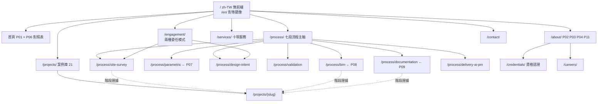

# ux-expert 分析 — HQ Design 官網重置

**主責**：F-003 `ia-restructure-bilingual`、F-002 `ai-parametric-narrative` 資訊結構｜**協力**：F-005 影像政策使用者感知面
**唯一前提**：`guidance-specification.md`（本文 MUST NOT 推翻其 CONFIRMED 決策）
**修訂 R1（NAS 影像前提反轉）**：依 `.process/nas-portfolio-inventory.md` 更新 §2.2、§2.4（新增）、§6-J3、§7、§8。

---

## 1. 核心矛盾的處理：兩條流程鏈的落差

### 1.1 事實更正：實存三條鏈

除規格 §5.1 兩條外，`cms/data/services.json` 的 `process` 另有第三條（需求評估→設計提案→施工執行→完工驗收→保固維護），為現行上線版所用，MUST 廢止。

### 1.2 判定依據：P05 是「協作流程」，非 HQ 完整流程

P05 自證身分：標題「協作流程」、導語「**由外部設計意圖出發**」、頁眉 `FROM SCHEMATIC DESIGN TO SITE DELIVERY`。它描述的是**設計意圖來自外部**時 HQ 的技術執行角色；使用者鏈以 site survey 與 parametric design 起頭，描述的是**設計意圖由 HQ 產出**。

兩者不是同一段的不同說法，而是**兩種委任模式**，且資料證實兩者都在營運：`kimpton.json` 明載「由惠強承攬公共區域與客房走廊施工」，其餘 20 案為「全案設計施工」。

### 1.3 對映表

| 使用者陳述鏈 | P05 對應 | 關係判定 | 網站處置 |
|---|---|---|---|
| site survey | 無 | **新增前端** | 新設階段 01；取 P03「2026.4 AI 識圖丈量、CAD→BIM」 |
| parametric design | 無（P07 為能力頁，非流程段） | **新增前端** | 新設階段 02；內容取 P07 全頁 |
| schematic design | 01 Design Intent Review | **鏡像**：同一產物，行為相反（產出 vs 審閱） | 同一節點，依委任模式切換文案 |
| — | 02 Technical Validation | **使用者鏈缺口** | MUST 補回；缺此段則「AI 多方案」無人驗證可建造性 |
| — | 03 BIM Coordination | **使用者鏈缺口** | MUST 補回；P08 已有完整論述 |
| 設計資產 | 無單一對應（P06「可複製的空間系統」為其效益句） | **非流程段** | MUST NOT 畫成第 4 段；改為橫跨全鏈的資產層 |
| construction drawing | 04 Construction Documentation | **完全同段** | 合併；子結構用 P09 六步 |
| AI construction management／PM | 05 Site Delivery（人工版）＋P04-02 專案管理 | **同段升級主張** | 併為階段 07；MUST 標示成熟度（§8.5） |

### 1.4 主結構決定

網站 MUST 以**使用者鏈為主骨架**：(a) 規格 §1.2 主軸為「AI 深度整合設計流程」，P05 完全不含 AI 前端，以其為主結構等於刪掉差異化本身；(b) §1.4 要求業主理解「與同業的流程差異」，而差異正落在 P05 沒有的那兩段。

P05 MUST 保留兩項作用：**第二委任模式**（設計已定、找執行夥伴）的入口敘事；階段 03–06 的英文術語來源——它是唯一已發佈的英文流程措辭，重譯會與簡介 PDF 不一致。

**定案七段**：01 現況掃描 → 02 參數化方案 → 03 設計意圖定案 → 04 技術驗證 → 05 BIM 協調 → 06 施工圖說 → 07 交付與 AI PM；**設計資產層**橫跨 02–07。

---

## 2. 資訊架構提案

### 2.1 業主如何定位關注點

業主問的是「我的案子會怎樣」，不是「你們的流程有幾段」。因此：

- 階段頁 MUST 以第二人稱決策問題開頭（「這階段你要決定什麼」），MUST NOT 以 HQ 能力開頭。
- `/process/` 總覽 MUST 提供「你現在在哪裡」分流：評估選址／已有設計找執行／已發包找監造，分落 01、03（技術夥伴模式）、07。
- 階段頁 MUST 標示輸入與產出（業主給什麼、拿到什麼），使流程可作為合約範圍對照表使用。

### 2.2 案例池：從「21 案固定、缺圖待補」到「可選擇展示什麼」

NAS 盤點使前提反轉：候選池為 **39 案**（網站 21 ＋ NAS 獨有 18），影像狀態為實拍 25 案、純渲染 13 案、無影像 0 案。案例仍非 IA 主軸，仍以**切片為階段證據**嵌入（階段頁 MUST 各嵌 2–3 張證據卡：案名＋面積＋該階段實做了什麼＋可驗證數值），但選案原則 MUST 改寫：

1. **正交性優先於數量**：MUST 以「客戶類型 × 空間型別 × 營運限制」三維覆蓋選案，MUST NOT 以面積或年份排序。現行 21 案在此三維高度重疊（16 office、13 南港），再加同型案邊際資訊量趨近零。
2. **有實拍者優先佔導覽路徑**：25 個實拍案 MUST 優先佔首頁精選與階段證據位；13 個純渲染案 SHOULD 降至 `/projects` 目錄層，可瀏覽、不主推。
3. **流程證據與廣度證據分軌**：僅 2024 年後案件 MAY 作 `/process/*` 階段證據；更早案件 MUST NOT 進階段頁——否則業主誤認舊案採用 AI 流程，觸及 §8.2 紅線。
4. **去識別化**：NAS「台北市林宅」為住宅案、名稱含客戶姓氏，MUST 去識別化後方可納入或直接排除。

**呈現改為三層**：首頁 4–6 件精選（實拍且正交性最高）／階段證據（散於 `/process/*`）／完整目錄。案例總數 SHOULD NOT 作為指標——「1,600+」已承擔數量敘事。`/projects/` MUST 新增「流程階段」與「影像類型」兩個篩選維度。

**航空貴賓室：建議納入，優先於補齊 13 個純渲染辦公案。** 泰航 9 ＋ 復航 6 ＋ 復興航棧群組 34 ＋ 威航 13 ≈ 62 張實拍，是唯一能證明「服務國際航空／運輸業客戶」的實績，現行 21 案完全沒有；三維度全與既有案例正交，邊際資訊量最高，且落在影像政策安全區。**但 MUST NOT 新開 `/projects` 分類**：其最強主張是「在營運中且受管制的場域施工」，與 SECOM「零停業干擾」同屬階段 07，應作為階段 07 的第二則證據與 SECOM 並列（企業總部 × 機場管制區）。**約束**：威航（V Air）已停止營運，該案年份必早於 2017，MUST 依原則 3 排除於階段頁外，僅作廣度證據。

### 2.3 十項服務：不做清單牆

`services.json` 已有 `categoryGroup`（design 4／build 3／consulting 1／tech 1／aftercare 1）。服務頁 MUST 改以**流程階段**為主軸、`categoryGroup` 降為次分類：consulting→01–02、design→02–03、build→05–07、tech→06–07、aftercare→07 之後。入口軸為「你在哪一階段找我們」，MUST NOT 以 01–10 編號組織。

### 2.4 「Intent → Built」同案對照：位置與敘事價值

**事實修正**：可獲得實拍的 7 案中，僅 `zhongbao-showroom` 同時持有渲染（17 張）與實拍（NAS 27 張）；其餘 6 案（kimpton、secom、popeyes、匙碗湯 ×2、qijia）原即為實拍案、無渲染可對照。**故此對照目前僅 1 案具備條件，不是 7 案。**

**敘事價值高**：這是 P08「設計意圖可被建造」與 P07 參數化主張唯一可被**視覺驗證**的證據形式。文字主張無法證偽；同機位並置讓業主自己比對，屬自證主張。

**IA 位置**：MUST 置於階段頁而非案例頁。放案例頁只是「這案有兩種圖」；放 `/process/design-intent`（階段 03）頁尾與 `/process/bim`（P08）才構成「流程能把意圖蓋出來」的論證。案例頁 SHOULD 反向連回。

**執行約束（交 F-005）**：對照 MUST 同機位同視角，MUST NOT 以不同角度冒充——角度不同會暴露落差而非證明一致。每案 2–3 組即足。此要求反向約束完工攝影：13 個純渲染案 SHOULD 於攝影前提供「渲染機位表」，否則無法規模化。

---

## 3. 業主可讀性設計

三概念 MUST 沿用 PDF 修辭骨架並補量化錨點，MUST NOT 重新發明。

| 概念 | 業主真正在意的問題 | 視覺化形式 | 一句話效益 |
|---|---|---|---|
| Parametric design | 「我改了會不會又要等兩週、又要加錢？」 | **1 互動元件**：單參數滑桿（人數 40→60）同步更新平面色塊＋座位數／會議室數／面積使用率；**1 張三幀靜態回退圖** | 「條件改一次，方案與圖面一起更新，不必從頭重畫。」（P07） |
| BIM coordination | 「進場後才發現撞管，誰付錢、誰延誤？」 | **2 張靜態圖**：before/after 剖面二格＋衝突清單（衝突數、發現階段、若在現場才發現的後果） | 「衝突在模型裡被找到，不在工地被找到。」 |
| Construction documentation | 「這疊圖跟我有什麼關係？」 | **1 張時間軸**：P09 六步對應「你會拿到什麼」（樣板、竣工圖、操作手冊、保固書） | 「你收到的不只是完工，是可稽核的一整套文件。」 |

**既有修辭的評估與強化**

- P06 對照表 MUST 保留為首頁核心區塊；惟三對句皆為狀態描述，SHOULD 各加一量化欄位（方案數、改版工時、衝突發現階段），否則可被同業原句複製。
- P07 三點措辭精準，MUST 保留；「不必多等待」MUST 補時間錨點。
- P08 三點過於抽象，MUST 以一件具名案例的衝突計數取代至少一點。
- P09 六步骨架完整，但全以「我們做什麼」書寫，MUST 改寫為「你會拿到什麼」。

---

## 4. 五類受眾的分流策略

| 受眾 | 分層 | 處置 | 理由 |
|---|---|---|---|
| 商辦／企業客戶（含外商在台拓點） | **Tier A：IA 主導** | 主導覽全部欄位為其而設 | 16/21 案 office；`homepage.json` 已鎖 foreign-HQ |
| B2B 工程採購 | **Tier A：IA 主導** | 專屬材料層（可轉發摘要、範圍對照、資格頁），共用同一 IA | 實際決策執行者；與上者需求互補而非衝突 |
| 政府標案 | **Tier B：有頁無導覽位** | `/credentials/`，footer 與 `/about` 末端入口 | 無政府案實績可證；`globals.json` 6 項認證已足以組頁。佔主導覽位會削弱商辦訊息 |
| 展會觀眾 | **Tier C：降級，移出常設 IA** | 每場活動一支 campaign landing（`/x/{event}`），活動後下架 | 停留數十秒、需求是「掃 QR 拿東西」，與需縱深閱讀的 Tier A 反向 |
| 資深設計師招募 | **Tier C：降級為單頁** | `/careers/`，footer 入口，MUST NOT 進主導覽 | 訊息互相稀釋：客戶要「風險低」，人才要「敢實驗」，同頁並陳兩邊失焦 |

---

## 5. 雙語 UX

### 5.1 未解事項 §5.3：主從關係建議

**建議：zh-TW 為權威語（authoring source、canonical、預設無前綴），en 為對等呈現語（欄位 100% 對等、可獨立導覽、hreflang 對稱）。** 此建議不違反「完整對等雙語」CONFIRMED——對等指**呈現與欄位覆蓋**，主從指**內容權威**，兩者可並存。依據：

1. **客戶組成**：21 案客戶皆為在台法人；國際品牌（Kimpton、Popeyes、Soup Spoon、DXC）採購仍由在台窗口執行。英文頁目的是「被轉發後讀得懂」，非自然搜尋獲客。
2. **SEO**：中文關鍵字（辦公室裝修、設計施工統包、南港辦公室）搜尋量與轉換皆高於英文對應詞；英文頁 SHOULD 以直接連結與轉發流量為主。
3. **維護成本**：現況英文覆蓋率為 **0**（21/21 `nameEn`、10/10 `titleEn` 皆空）。en 若與 zh 同權威，將產生雙倍審稿義務且無人負責。

**可執行定義**：欄位層 MUST 100% 對等（無缺欄）；衝突時以 zh 為準；en 缺值 MUST 顯示 zh 原文並標註 `(ZH)`，MUST NOT 留空或用未標註的機器翻譯。

### 5.2 語言切換互動模型

- **位置**：主導覽最右、與 CTA 視覺分離的 `ZH / EN` 雙態切換（僅兩語言，MUST NOT 用下拉）。
- **狀態保持**：MUST 保留路徑、anchor、案例篩選與表單已填內容。
- **記憶**：寫入 cookie（1 年）；再訪直接進入該語言，MUST 顯示一次「切回」提示條。
- **URL**：zh 無前綴（`/process/bim/`）、en 前綴（`/en/process/bim/`）；hreflang 雙向對稱，`x-default` 指向 zh 根。MUST NOT 用 query string 或純 JS 切換——不可被索引，轉發後無法正確開啟。

### 5.3 中英並置層級

沿用 `preview/bilingual-headline.html` 的三層結構（eyebrow / headline / gloss），但 MUST 依語言反轉主從：

- **zh 版**：TC headline（display）＋ EN eyebrow／gloss（mono 11px、tracking .16em、`--fg3`）；**en 版**：EN headline（display）＋ TC gloss（14px、`--fg3`）。
- 同一頁 MUST NOT 讓兩語言取得同一字級，否則產生雙標題閱讀成本。
- 技術標籤（BIM、MEP、Parametric、sqm）兩版 MUST 保留英文原文，符合 DESIGN.md §0.6。

---

## 6. 關鍵使用者旅程

**J1 — 機構型採購決策者（多人決策、需可轉發材料）**
進入點：英文搜尋或客戶轉介 → `/en/`。決策點 A：能否證明「營運不中斷」→ `/en/process/delivery-ai-pm` ＋SECOM 階段證據（154 張實拍）。決策點 B：需說服主管與財務 → 需可轉發材料。轉換：取得 4 頁摘要（流程＋兩則同型案例＋資格）並留窗口。流失點：只有 21 頁整份簡介可下載、表單欄位過多。要求：階段頁與案例頁 MUST 具穩定 deep link 與 OG 卡；SHOULD 提供「以此頁產生可轉發摘要」動作。

**J2 — 外商在台拓點設施主管（首次在台發包）**
進入點：`/en/` hero。決策點：不確定該找設計師還是統包 → `/en/engagement/`；時程與許可風險 → `/en/process/site-survey`。轉換：預約 30 分鐘技術通話。流失點：七段流程被讀成「你們的流程」而非「我的案子」——本 IA 最大流失風險，緩解見 §2.1。

**J3 — 本地上市公司總務窗口（比價）**
進入點：中文搜尋 →`/projects/` 篩選（南港／辦公／2025）。決策點：同區同型有無實績 → 13 件南港案為最強證據；圖是渲染還是實景 → 無標註即生疑。轉換：現場拜訪或報價邀請。流失點：13 個純渲染案若未標註來源，業主會把「效果圖」讀成「你們還沒蓋過」。要求：案例卡 MUST 常駐顯示影像類型標籤。

---

## 7. 導覽與內容模型的對應（交 data-architect）

所有文字欄位 MUST 為 `{zh, en}` 對，並具 `enFallback: "show-zh-tagged"`。

| 型別 | 狀態 | 必要欄位 |
|---|---|---|
| `ProcessStage` | 新增 | `id`, `order`, `name`, `ownerQuestion`（業主視角問題）, `benefitStatement`, `inputFromClient`, `outputToClient`, `p05Mapping`(same\|mirror\|new-front\|new-back\|gap-filled), `diagramType`(interactive\|static\|timeline), `diagramAssets[]`, `serviceRefs[]`, `evidenceRefs[]` |
| `EngagementModel` | 新增 | `id`(full-design-build\|technical-partner), `entryStageId`, `includedStageIds[]`, `excludedStageIds[]`, `caseRefs[]` |
| `StageEvidence` | 新增·關聯型 | `projectRef`, `stageRef`, `claim`, `metricValue`, `metricUnit`, `verifiable` |
| `Project` | 修改 | 補 `nameEn`（21/21 空）、`areaSqm`／`areaPing`（數值化）、`engagementModelRef`、`stageEvidenceRefs[]`、`operationalContinuity`、`parentProjectRef`、`processEra`(pre-ai\|ai-integrated) |
| `ProjectImage` | 修改 | `src`, `kind`(photo\|photo-retouched\|render\|generated), `captureDate`（與 `year` 分離）, `tool`, `prompt`, `alt`, `usageZone`(hero\|gallery\|diagram), `gallerySection` |
| `RenderPair` | 新增 | `projectRef`, `cameraId`, `intentImageRef`, `builtImageRef`, `stageRef` — 支援 §2.4 同機位對照 |
| `Service` | 修改 | 補 `titleEn`（10/10 空）、`stageRefs[]`（升為主軸）；`categoryGroup` 降為次分類 |
| `Credential` | 新增·由 `globals.certifications` 升級 | `code`, `label`, `issuer`, `validUntil`, `evidenceDoc` |
| `ForwardablePacket` | 新增 | `pageRef`, `pdfAsset`, `includedSections[]`, `locale` |

---

## 8. 未解事項與需使用者決定的項目

1. **§5.3 主從關係**（規格標示未解）→ 建議見 §5.1：zh 權威、en 對等。
2. **面積數字矛盾**（SECOM 2,500／5,940／756 坪；C.SUN 700／560／215 坪）與**英文覆蓋率為 0** — 已交整合階段裁決清單。IA 側僅要求：對外 MUST 只出一組數字，統一以 `cms/data` 坪數換算（1 坪 = 3.3058 sqm）。
3. **154 張歸屬與併案裁決（最高優先）**：`secom-nangang-complex`（中保集團、6 空間、756 坪、7F–14F）與 `zhongbao-nangang`（6 辦公空間、9F–11F、同址、同記分層分區同步施工）樓層互相包含（9F–11F ⊂ 7F–14F），極可能是同一標的的兩種粒度紀錄。**IA 建議：先併為單一 Project，以 `gallerySection` 保留樓層／區域粒度**——(a) 一個 756 坪旗艦案的規模說服力高於兩個中型案，拆案會切碎最強證據；(b) 174 張（154 ＋ 接待大廳 20）遠超單一 gallery 容量，MUST 分段為接待大廳／開放辦公／會議／主管區，正對應 P12 三項主張；(c) 併案可逆，拆案後再併會產生轉址與 SEO 成本。若 9F–11F 確為獨立承攬批次，則設 `parentProjectRef` 為子案，IA 仍單一入口，MUST NOT 在案例格出現兩張卡。
4. **旗艦案影像缺口——已解決**：NAS「中保總部 2026」154 張實拍已補上，`/projects/secom-*` 不再是空頁。剩餘待決為**授權與年份**：739 張專業攝影通常另有授權範圍，網站使用權 MUST 於上線前確認；且目錄名記 2026、兩筆網站紀錄記 2025 完工，需確認 2026 為拍攝年——`captureDate` 與 `year` MUST 分離（§7）。
5. **AI 專案管理成熟度（協力 F-005 紅線）**：P03 標示 2026.4 才導入。網站 MUST 標示為「試行中」或「常態交付」。建議以「已在 N 件案中試行」具名陳述；若 N=0 則只陳述能力與方法，MUST NOT 用完成式。
6. **影像感知（協力 F-005）**：分佈修正為實拍 25 案／純渲染 13 案／無影像 0 案，可同案對照者 1 案。案例卡 MUST 於縮圖角落常駐顯示 `實景／渲染` 標籤（非僅 hover）；13 個純渲染案 MUST 在 gallery 首位聲明「設計階段視覺，完工攝影尚未安排」；生成式影像 MUST NOT 出現於 `/projects/`，僅可用於 `/process/` 圖解且 MUST 標註。
7. **受眾降級需確認**：§4 對展會觀眾與招募的降級屬建議，非 CONFIRMED。
8. **專名固定**：「眾寶保經」與「中保集團」英文皆易寫成 Zhong Bao。en 版 MUST 固定 SECOM Group 與 Zhong Bao Insurance Services 兩組專名，MUST NOT 由譯者逐案決定。

### 風險最高的假設

**「七段流程鏈可以直接作為業主的導覽主軸。」** 七段鏈是供給端結構；業主要的是「我的案子會怎樣」。若階段頁未以業主決策問題開頭並附可驗證證據，此 IA 會退化為一份華麗的內部流程圖，轉換率可能低於現行案例導向架構。緩解手段為 §2.1 三項要求與 §3 的量化錨點，且 SHOULD 於上線後以「總覽→階段頁」點入率驗證。
